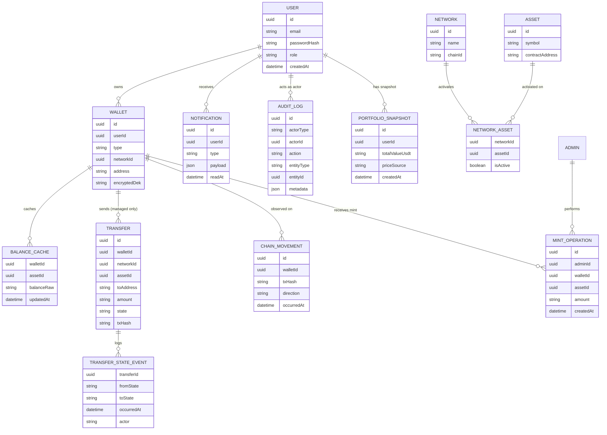
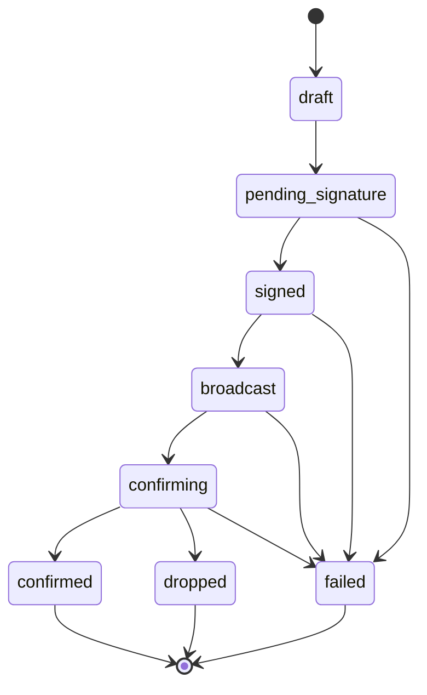

# 01. Domain Modeli — Vault

## İçindekiler

1. Domain Sözlüğü
2. Entity Kataloğu
3. Entity İlişkileri
4. İş Kuralları
5. State Machine'ler
6. Hesaplanan / Türetilmiş Alanlar

---

## 1. Domain Sözlüğü

| Terim (TR) | Terim (EN) | Tanım |
| --- | --- | --- |
| Hesap birimi | `quote_asset` / `QuoteCurrency` | Portföyün toplam değerinin ifade edildiği network-agnostic birim; sabit olarak USDT. Bir *varlık* değildir, hiçbir ağda kontratı yoktur. |
| Varlık | `Asset` | Bir ağ üzerinde var olan somut token/coin instance'ı (ör. Sepolia USDT ve Tron USDT birbirinden bağımsız iki `Asset` kaydıdır, ayrı kontrat adresleri taşırlar). |
| İzleme-amaçlı cüzdan | Watch-only wallet | Private key'i sistemde tutulmayan, yalnızca bakiye ve hareket takibi yapılan harici adres. Transfer başlatılamaz. |
| Yönetilen cüzdan | Managed wallet | Sistemin HD wallet türetmesiyle ürettiği, private key'i şifreli sakladığı, transfer yapabilen cüzdan. |
| Zincir hareketi | Chain movement | Zincirde gerçekleşen, worker tarafından indexlenen ham transfer kaydı; hem watch-only hem managed cüzdanlarda oluşur. |
| Sistem içi transfer | System transfer | Uygulama üzerinden başlatılan, kendi durum makinesi olan gönderim; yalnızca managed cüzdanlardan yapılabilir. |
| Ağ | Network | Sepolia, BSC Testnet, Tron Shasta gibi bir blok zinciri ağı; her biri testnet'tir. |
| Kullanıcı | `User` | Kendi cüzdanlarını yöneten, transfer başlatan standart rol. |
| Yönetici | `Admin` | Network/varlık kataloğunu yöneten, mock token dağıtan, tüm kullanıcı verisini salt-okunur gören tek seviyeli yönetici rolü. |

---

## 2. Entity Kataloğu

### 2.1 User

**Sorumluluk:** Kimlik doğrulama ve rol taşıyıcısı; cüzdanların, transferlerin ve bildirimlerin sahibi.
**Sahiplik:** Kendi kendine sahiptir (root entity).
**Yaşam döngüsü:** Kayıt ile oluşur (varsayılan rol `User`), silinmez (soft-delete veya silme akışı MVP'de yoktur). `Admin` rolü yalnızca seed veya doğrudan veritabanı müdahalesiyle atanır.

### 2.2 Network

**Sorumluluk:** Desteklenen bir blok zinciri ağını temsil eder (Sepolia, BSC Testnet, Tron Shasta).
**Sahiplik:** Master data; yalnızca Admin panelinden yönetilir.
**Yaşam döngüsü:** Sistemin desteklediği sabit ağ kümesiyle sınırlıdır; yeni ağ eklemek kod değişikliği (yeni `IChainProvider` implementasyonu) gerektirir, Admin panelinden yalnızca var olan ağ/varlık çiftlerinin aktivasyonu yönetilir.

### 2.3 Asset

**Sorumluluk:** Bir ağ üzerindeki somut token/coin'i temsil eder (native veya kontrat tabanlı).
**Sahiplik:** Master data; `Network` ile N-N ilişkisi `(network_id, asset_id)` üzerinde `is_active` bayrağı taşıyan bir join kaydıyla kurulur.
**Yaşam döngüsü:** Admin tarafından eklenir/aktif-pasif yapılır. Pasif yapılan bir `(network, asset)` çiftinde mevcut cüzdanlar salt-okunur kalır (bakiye görünür, yeni cüzdan/transfer engellenir). Native varlıkta `contract_address` alanı `NULL`'dur; mock token'larda kendi deploy edilen kontrat adresi tutulur.

### 2.4 Wallet

**Sorumluluk:** Bir kullanıcının bir ağdaki adresini temsil eder; watch-only veya managed tipinde olur.
**Sahiplik:** `User`'a aittir; sahiplik kontrolü (resource ownership) her erişimde zorunludur.
**Yaşam döngüsü:** Watch-only cüzdan, kullanıcının adres girip format doğrulamasından geçmesiyle anında oluşur. Managed cüzdan, HD wallet'tan bir sonraki index türetilip private key şifrelenerek oluşur. Wallet silinmez; yalnızca "aktif ağ/varlık" durumuna bağlı olarak işlevsel kısıtlanır.

### 2.5 BalanceCache

**Sorumluluk:** Bir cüzdanın belirli bir varlıktaki güncel bakiyesinin, worker tarafından periyodik güncellenen veritabanı önbelleğidir.
**Sahiplik:** `Wallet`'a aittir.
**Yaşam döngüsü:** Cüzdan oluşturulduğunda ilk kez sıfır/başlangıç değeriyle oluşur; sayfa yüklemesinde asla doğrudan RPC ile hesaplanmaz, yalnızca worker tarafından güncellenir ve UI bu önbellekten okur.

### 2.6 Transfer

**Sorumluluk:** Yalnızca managed cüzdanlardan başlatılan, zincire imzalı işlem gönderen sistem içi transferi ve onun durum makinesini temsil eder.
**Sahiplik:** Gönderen `Wallet` (dolayısıyla `User`) üzerinden sahiplenir.
**Yaşam döngüsü:** `draft` durumunda başlar, merkezi `TransferStateMachine` servisi üzerinden ilerler, `confirmed`/`failed`/`dropped` terminal durumlarından biriyle sona erer (bkz. §5).

### 2.7 TransferStateEvent

**Sorumluluk:** Bir transferin her durum geçişinin append-only denetim izini tutar.
**Sahiplik:** `Transfer`'a aittir; hiçbir zaman güncellenmez veya silinmez.
**Yaşam döngüsü:** Her durum geçişinde bir kayıt eklenir; geçmiş kayıtlar değiştirilmez.

### 2.8 ChainMovement

**Sorumluluk:** Zincirde gerçekleşen, indexleme worker'ı tarafından tespit edilen ham transfer kaydını temsil eder (watch-only dahil tüm cüzdanlarda).
**Sahiplik:** `Wallet`'a aittir; kaynağı sistem değil zincirin kendisidir.
**Yaşam döngüsü:** Worker (Alchemy webhook veya TronGrid polling ile) yeni bir hareket tespit ettiğinde oluşur, sonradan değiştirilmez. Bir sistem transferi `confirmed` olduğunda aynı `txHash`'e sahip `ChainMovement` kaydıyla eşleştirilip hareket geçmişinde tekilleştirilir.

### 2.9 Notification

**Sorumluluk:** Kullanıcıya gösterilecek in-app bildirimi temsil eder (tx confirmed, tx failed, gelen transfer tespit edildi).
**Sahiplik:** `User`'a aittir.
**Yaşam döngüsü:** Tetikleyici olay gerçekleştiğinde oluşur, kullanıcı okuduğunda `readAt` doldurulur; otomatik silme yoktur.

### 2.10 MintOperation

**Sorumluluk:** Admin'in bir kullanıcı cüzdanına mock ERC-20/TRC-20 test bakiyesi dağıtma (mint) işlemini temsil eder.
**Sahiplik:** İşlemi yapan `Admin`'e ve hedef `Wallet`'a bağlıdır.
**Yaşam döngüsü:** Admin panelinden tetiklenir, ilgili mock kontratın `mint()` fonksiyonu çağrılır, sonucu loglanır. Bu bir `Transfer` kaydı değildir, ayrı bir varlıktır.

### 2.11 AuditLog

**Sorumluluk:** Sistemdeki denetlenebilir olayların (login/login-failed, admin aktivasyon değişiklikleri, mint işlemleri, managed cüzdan oluşturma, transfer durum geçişleri) merkezi kaydı.
**Sahiplik:** Bağımsız bir denetim entity'sidir; `actorType` (`user`/`admin`/`system`) ile kim tarafından tetiklendiği tutulur.
**Yaşam döngüsü:** Olay gerçekleştiğinde append-only oluşur, hiçbir zaman güncellenmez veya silinmez; otomatik retention/silme politikası yoktur (demo veri seti küçük kalır).

### 2.12 PortfolioSnapshot

**Sorumluluk:** Bir kullanıcının belirli bir andaki toplam portföy değerini (USDT), o anki fiyat kaynağıyla birlikte dondurup saklar; §4'teki "Portföy geçmiş grafiği" bu kayıtlardan okunur.
**Sahiplik:** `User`'a aittir; denetim (audit) entity'si değildir — `AuditLog`'un aksine "kim ne yaptı" değil "değer o anda neydi" sorusunu cevaplar.
**Yaşam döngüsü:** `portfolio-snapshot` worker'ı tarafından periyodik olarak oluşturulur, hiçbir zaman güncellenmez veya silinmez; geçmiş grafiği sorgu anında yeniden hesaplanmaz.

---

## 3. Entity İlişkileri

- `User 1──N Wallet` — zorunlu; bir cüzdan mutlaka bir kullanıcıya aittir. Cascade: kullanıcı silinmez (silme akışı yok), bu nedenle cascade delete tanımlı değildir.
- `Network 1──N Asset` (join: `NetworkAsset { network_id, asset_id, is_active }`) — bir varlık birden fazla ağda ayrı kayıt olarak var olabilir (ör. USDT hem Sepolia hem Tron Shasta'da), her biri bağımsız bir `Asset` satırıdır.
- `Wallet 1──N BalanceCache` — bir cüzdanın, sahip olduğu her varlık için bir bakiye önbelleği vardır. Cüzdan pasif bir `(network, asset)` çiftine aitse bakiye görünür kalır ama güncellenmez.
- `Wallet 1──N Transfer` — yalnızca `type = managed` olan cüzdanlar için geçerlidir; watch-only cüzdanlar hiçbir zaman bir `Transfer`in gönderen tarafı olamaz.
- `Wallet 1──N ChainMovement` — cüzdan tipinden bağımsız olarak tüm cüzdanlarda oluşur.
- `Transfer 1──N TransferStateEvent` — zorunlu, append-only; bir transfer oluştuğu andan itibaren en az bir olay (ilk `draft` girişi) taşır.
- `User 1──N Notification` — zorunlu değil (bir kullanıcı hiç bildirim almamış olabilir).
- `Admin 1──N MintOperation`, `MintOperation N──1 Wallet` — mint işlemi hem işlemi yapan admin'e hem hedef cüzdana bağlıdır.
- `User 1──N PortfolioSnapshot` — zorunlu değil (yeni kayıt olan bir kullanıcının ilk worker turuna kadar hiç snapshot'ı olmayabilir).
- `AuditLog` diğer entity'lere zayıf referans taşır (`entityType` + `entityId` alan çifti); foreign key zorunluluğu yoktur çünkü `actorType = 'system'` olan kayıtlarda ilişkili entity bir worker olayı olabilir.

---

## 4. İş Kuralları

1. **Aktivasyon zorunluluğu:** Bir kullanıcı, Admin tarafından `is_active = true` yapılmamış bir `(network, asset)` çifti için ne watch-only ne de managed cüzdan ekleyebilir. Bu kontrol backend'de zorunludur; UI yalnızca aktif çiftleri listeleyerek yardımcı olur, tek başına yeterli sayılmaz.
2. **Pasifleştirmenin geriye etkisi yoktur:** Bir `(network, asset)` çifti pasif yapıldığında, o çiftte önceden oluşturulmuş cüzdanlar silinmez veya gizlenmez; bakiyeleri görünür kalır ama yeni cüzdan eklenemez ve yeni transfer başlatılamaz.
3. **Cross-network guard:** Bir transferin gönderen cüzdanının `network_id`'si ile hedef adresin beklenen ağı arasında tutarsızlık varsa, transfer `draft` durumundan ileri geçemez. Bu kontrol yalnızca backend'de zorlanır; frontend validasyonu güvenlik sınırı olarak kabul edilmez.
4. **Managed cüzdan sahiplik kontrolü:** Bir transfer yalnızca işlemi başlatan kullanıcının kendi managed cüzdanından yapılabilir; başka bir kullanıcının cüzdanı adına transfer denemesi yetkilendirme katmanında reddedilir.
5. **Watch-only cüzdanlar asla gönderen taraf olamaz:** Bir watch-only cüzdanın private key'i sistemde olmadığından, bu tip bir cüzdan hiçbir `Transfer` kaydında `walletId` (gönderen) olarak kullanılamaz.
6. **Sayısal tip disiplini:** Zincir bakiyeleri ve transfer tutarları en küçük birimde (`wei`, `sun`) `BigInt` veya string olarak saklanır ve işlenir; hiçbir katmanda JS `number`'a çevrilmez. Değerleme (USDT karşılığı) sabit hassasiyetli `DECIMAL(38,18)` ile tutulur. Bu kural, ondalık yuvarlama hatalarının bir zincir bakiyesini bozmasını engelleyen bir güvenlik/doğruluk kuralıdır, yalnızca bir stil tercihi değildir.
7. **State bütünlüğü:** `Transfer.state` alanı yalnızca merkezi `TransferStateMachine` servisi üzerinden değiştirilir; hiçbir kod yolu bu alana doğrudan `UPDATE` uygulayamaz. Tanımsız bir geçiş denemesi hatayla reddedilir ve audit'e yazılır.
8. **Terminal durumdan çıkış yoktur:** `confirmed`, `failed`, `dropped` durumlarından hiçbirine ulaşan bir transfer başka bir duruma geçemez; bu durumları işleyen worker'lar idempotent çalışır, tekrar tetiklenmeleri yan etki yaratmaz.
9. **Portföy toplamı network-agnostiktir:** Kullanıcının toplam portföy değeri, tüm cüzdanlarındaki tüm varlıkların o anki USDT karşılığının toplamıdır; hesap birimi (USDT) ile varlık olarak USDT birbirine karıştırılmaz — biri tekil/sabit bir ölçü birimi, diğeri ağ başına ayrı bir token kaydıdır.
10. **Hareket geçmişi tekilleştirme:** Bir sistem transferi `confirmed` durumuna ulaştığında, aynı `txHash`'e sahip `ChainMovement` kaydıyla eşleştirilir; birleşik hareket geçmişinde bu ikisi tek bir satır olarak gösterilir, aynı hareket iki kez listelenmez.
11. **Master data yönetimi Admin'e özeldir:** `Network` ve `Asset` kayıtları ile aralarındaki `is_active` ilişkisi yalnızca Admin panelinden değiştirilebilir; `User` rolü bu verilere yazma erişimine sahip değildir.
12. **Private key hiçbir zaman düz metin olarak kalıcı hale gelmez:** Şifre çözme işlemi yalnızca imzalama işleminin bellek-içi akışında yapılır; çözülmüş key hiçbir veri deposuna, log'a veya API yanıtına yazılmaz.

---

## 5. State Machine'ler

### 5.1 Cüzdan ekleme akışı (state machine değildir)

Cüzdan ekleme, kendi durum makinesi gerektirmeyen atomik bir işlemdir:

- **Watch-only:** kullanıcı bir adres girer → backend ağa özel formatı doğrular (EVM ağlarında `0x...` + EIP-55 checksum; Tron'da `T...` + base58check — iki format için ortak bir regex kullanılmaz, her ağın kendi doğrulayıcısı vardır) → `(network, asset)` aktiflik kontrolü yapılır → kayıt oluşturulur.
- **Managed:** kullanıcı seçili ağ için yeni cüzdan ister → backend HD wallet'tan bir sonraki türetme index'ini hesaplar (`m/44'/<coinType>'/0'/0/<index>`) → private key üretilir, envelope encryption ile şifrelenir → adres ve şifreli key referansı `Wallet` kaydına yazılır.

Her iki durumda da işlem tek adımda başarılı veya başarısız olur; ara durum tutan bir state alanı yoktur.

### 5.2 Transfer durum makinesi

Sekiz durum vardır, üçü terminaldir (`confirmed`, `failed`, `dropped`). Her geçiş dört katmanda tanımlanır: **anlamı / backend nasıl zorlar / data nasıl tutar / UI nasıl gösterir.**

**`draft`**
- *Anlamı:* Kullanıcı formu doldurdu (gönderen cüzdan, hedef adres, tutar); henüz onaylamadı, zincire hiçbir şey gönderilmedi.
- *Backend:* `TransferStateMachine` kaydı oluşturur; herhangi bir zincir çağrısı yapılmaz.
- *Data:* `Transfer.state = 'draft'`, `txHash = NULL`.
- *UI:* Form ekranında düzenlenebilir taslak olarak gösterilir; yalnızca bu durumda kullanıcı transferi silebilir/vazgeçebilir.

**`draft → pending_signature`**
- *Anlamı:* Kullanıcı transferi onayladı (step-up authentication ile şifresini tekrar girdi).
- *Backend:* Cross-network guard, `(network, asset)` aktiflik kontrolü, bakiye yeterliliği (DB önbelleği + worker yeniden kontrolü) ve managed cüzdan sahiplik kontrolü geçilmeden bu geçiş gerçekleşmez; imzalama işi kuyruğa (BullMQ `signing`) alınır.
- *Data:* Yeni bir `TransferStateEvent { fromState: 'draft', toState: 'pending_signature', actor: 'user' }` eklenir.
- *UI:* "Onay Bekliyor" badge'i gösterilir.

**`pending_signature → signed`**
- *Anlamı:* Ham işlem (raw transaction), managed cüzdanın private key'iyle imzalandı, henüz ağa gönderilmedi.
- *Backend:* `signing` kuyruğundaki worker, private key'i yalnızca bellekte decrypt eder (hiçbir log'a yazmaz), raw tx'i imzalar. Başarısızsa doğrudan `failed`'e geçer.
- *Data:* `TransferStateEvent { actor: 'worker:signing' }` eklenir.
- *UI:* "İmzalandı" badge'i gösterilir.

**`signed → broadcast`**
- *Anlamı:* İmzalı işlem ağa gönderildi, tx hash alındı, mempool'da bekliyor.
- *Backend:* Zincir sağlayıcının `broadcastTransaction()` metodu çağrılır; RPC hatası (nonce/gas yetersizliği) `failed`'e düşürür; geçici ağ hatasında (timeout) exponential backoff ile yeniden denenir, N deneme sonunda yine `failed`'e düşer.
- *Data:* `Transfer.txHash` doldurulur.
- *UI:* "Ağa Gönderildi" badge'i gösterilir.

**`broadcast → confirming`**
- *Anlamı:* İşlem ilk bloğa girdi ama ağın gerektirdiği N-blok onay eşiğine henüz ulaşmadı.
- *Backend:* Confirmation worker tx hash'i izler, ilk bloğa girişte bu duruma geçirir.
- *Data:* `TransferStateEvent { actor: 'worker:confirmation' }` eklenir.
- *UI:* "Onaylanıyor (k/N blok)" ilerleme göstergesiyle sunulur.

**`confirming → confirmed`** (terminal — başarı)
- *Anlamı:* Ağa özel N-blok onay eşiği geçildi.
- *Backend:* Confirmation worker eşik değerine ulaştığında bu terminal duruma geçirir; bu noktadan sonra hiçbir geçiş kabul edilmez.
- *Data:* Aynı anda hareket geçmişinde ilgili `ChainMovement` kaydıyla `txHash` üzerinden eşleştirilip tekilleştirilir.
- *UI:* "Tamamlandı" badge'i, kullanıcıya bildirim gönderilir.

**`confirming → dropped`** (terminal — başarısızlık)
- *Anlamı:* İşlem belirlenen süre içinde hiç bloğa girmedi, mempool'dan düştü.
- *Backend:* Zaman aşımı worker'ı tarafından tespit edilir.
- *Data:* `failureReason` alanı doldurulmaz (drop, revert değildir); `TransferStateEvent` kaydı düşer.
- *UI:* "Düştü" badge'i, kullanıcıya yeniden deneme seçeneği sunulur.

**`confirming → failed`** (terminal — başarısızlık)
- *Anlamı:* İşlem bir bloğa girdi ama execution revert etti (EVM) veya sonuç `FAILED` döndü (Tron).
- *Backend:* Confirmation worker revert/failed sonucunu tespit eder.
- *Data:* `Transfer.failureReason` sadeleştirilmiş bir nedenle doldurulur (ham RPC hatası değil).
- *UI:* "Başarısız" badge'i, sadeleştirilmiş hata mesajıyla gösterilir.

**`pending_signature → failed`** ve **`signed → failed`** (terminal — başarısızlık)
- *Anlamı:* İmzalama veya broadcast adımı kalıcı olarak başarısız oldu (yetersiz bakiye, geçersiz nonce, N deneme sonrası hâlâ hata).
- *Backend:* İlgili worker hatayı `failed` durumuna çevirir; retry mantığı tükenmiştir.
- *Data:* `failureReason` doldurulur.
- *UI:* "Başarısız" badge'i.

**Genel kural:** Tüm geçişler merkezi `TransferStateMachine` servisinden yapılır; izin verilen geçiş tablosu her denemede kontrol edilir, tanımsız bir geçiş denemesi hata fırlatır ve audit'e yazılır. Terminal durumlardan (`confirmed`/`failed`/`dropped`) hiçbir geçiş yapılamaz; tüm worker'lar `(chain, txHash)` veya `(transferId, targetState)` bileşik anahtarıyla idempotent çalışır.

---

## 6. Hesaplanan / Türetilmiş Alanlar

| Alan | Kaynak | Nasıl türetilir |
| --- | --- | --- |
| Cüzdan bakiyesi (varlık bazlı) | `BalanceCache` | Worker, RPC/Alchemy/TronGrid'den periyodik okuyup `BalanceCache` tablosuna yazar; UI hiçbir zaman doğrudan RPC çağırmaz, her zaman bu önbellekten okur. |
| Varlığın USDT karşılığı | Canlı fiyat + `BalanceCache` | `ETH/USDT = (ETH/USD) ÷ (USDT/USD)` formülüyle, CoinGecko'dan alınan canlı fiyatlardan türetilir; USDT peg'i sabit kabul edilmez. |
| Toplam portföy değeri (USDT) | Tüm `BalanceCache` satırları | Kullanıcının tüm cüzdanlarındaki tüm varlıkların USDT karşılıklarının toplamıdır; her sayfa yüklemesinde yeniden hesaplanmaz — dashboard için mevcut önbellek + son fiyat kullanılır. |
| Portföy geçmiş grafiği | `PortfolioSnapshot` (§2.12) | Belirli aralıklarla o anki fiyat, kaynak ve zaman damgasıyla bir snapshot kaydı yazılır; grafik geçmişteki bu snapshot'lardan okunur, geçmişe dönük olarak yeniden hesaplanmaz. |
| Birleşik hareket geçmişi satırı | `ChainMovement` + `Transfer` | İki kaynak `occurredAt`/`createdAt` üzerinden tek zaman çizelgesinde birleştirilir, `source: 'chain' | 'system'` alanıyla ayırt edilir; `confirmed` bir sistem transferi, aynı `txHash`'e sahip `ChainMovement` ile eşleşip tek satıra indirgenir. |
| Transfer ilerleme yüzdesi (`confirming` durumunda) | Onaylanan blok sayısı / ağın eşik değeri | Confirmation worker'ın izlediği güncel blok derinliği, ağa özel eşik değerine (Sepolia 12, BSC Testnet 15, Tron Shasta 19 blok) bölünerek "k/N blok" olarak gösterilir. |
