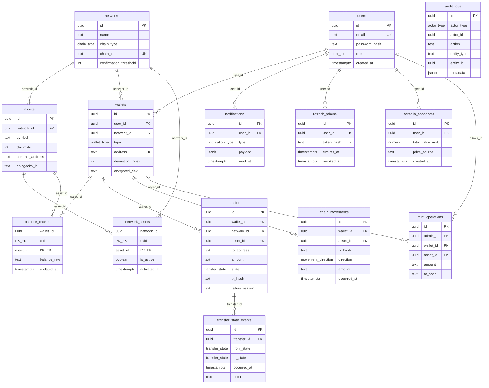

# 02. Veritabanı Şeması — Vault

## İçindekiler

1. Şema Genel Bakış ve İsimlendirme Konvansiyonu
2. Tablo Tanımları
3. Enum ve Lookup Tabloları
4. Index Stratejisi
5. İlişkiler ve Referans Bütünlüğü
6. Şifrelenmiş / Maskelenen Alanlar
7. Audit ve Soft-Delete Kolonları
8. Migration Stratejisi
9. Seed Verisi

---

## 1. Şema Genel Bakış ve İsimlendirme Konvansiyonu

Veritabanı **PostgreSQL 16**, ORM **Prisma ^5.22**'dir. Tüm şema `apps/api/prisma/schema.prisma` içinde tek bir kaynak dosyada tanımlanır.

**Tablo adları:** `snake_case`, çoğul (`wallets`, `transfer_state_events`, `audit_logs`).
**Kolon adları:** `snake_case`, tekil (`wallet_id`, `created_at`, `encrypted_dek`). Prisma model alanları `camelCase` yazılır, `@map` ile veritabanı kolonuna eşlenir (ör. `walletId String @map("wallet_id")`).
**Primary key:** Her tabloda `id UUID DEFAULT gen_random_uuid()`; sıralı integer id kullanılmaz (tahmin edilebilir kaynak id'si güvenlik riski taşır, özellikle `wallets`/`transfers` için).
**Foreign key adı:** `<tablo>_<referans_tablo>_fkey` (Prisma varsayılan adlandırması korunur).
**Index adı:** `<tablo>_<kolon(lar)>_idx`; unique constraint `<tablo>_<kolon(lar)>_key`.
**Zaman damgası kolonları:** Her tabloda `created_at TIMESTAMPTZ DEFAULT now()`; güncellenebilir tablolarda ayrıca `updated_at TIMESTAMPTZ` (Prisma `@updatedAt`). Append-only tablolarda (`transfer_state_events`, `audit_logs`, `chain_movements`) yalnızca `created_at`/`occurred_at` bulunur, `updated_at` yoktur — bu tablolara UPDATE hiçbir zaman uygulanmaz.
**Para/miktar kolonları:** Zincir bakiyeleri ve transfer tutarları en küçük birimde `TEXT` (BigInt string temsili) olarak saklanır, asla `INTEGER`/`FLOAT`/`DOUBLE PRECISION` kullanılmaz. USDT değerleme alanları `NUMERIC(38,18)` ile sabit hassasiyetli saklanır. Bu, domain modelindeki sayısal tip disiplini kuralının şema seviyesindeki karşılığıdır.

---

## 2. Tablo Tanımları

### 2.1 `users`

| Kolon | Tip | Null | Default | Açıklama |
| --- | --- | --- | --- | --- |
| `id` | UUID | ❌ | `gen_random_uuid()` | PK |
| `email` | TEXT | ❌ | — | Benzersiz, giriş kimliği |
| `password_hash` | TEXT | ❌ | — | argon2id hash |
| `role` | `user_role` enum | ❌ | `'user'` | `user` \| `admin` |
| `created_at` | TIMESTAMPTZ | ❌ | `now()` | |

Constraint: `email` üzerinde `UNIQUE`.

### 2.2 `networks`

| Kolon | Tip | Null | Default | Açıklama |
| --- | --- | --- | --- | --- |
| `id` | UUID | ❌ | `gen_random_uuid()` | PK |
| `name` | TEXT | ❌ | — | "Sepolia", "BSC Testnet", "Tron Shasta" |
| `chain_type` | `chain_type` enum | ❌ | — | `evm` \| `tron` — hangi `IChainProvider` implementasyonunun kullanılacağını belirler |
| `chain_id` | TEXT | ❌ | — | EVM için sayısal chain id string'i, Tron için ağ tanımlayıcısı; allowlist kontrolünün karşılaştırdığı değer |
| `confirmation_threshold` | INTEGER | ❌ | — | N-blok onay eşiği (Sepolia 12, BSC Testnet 15, Tron Shasta 19) |
| `created_at` | TIMESTAMPTZ | ❌ | `now()` | |

Constraint: `chain_id` üzerinde `UNIQUE`.

### 2.3 `assets`

| Kolon | Tip | Null | Default | Açıklama |
| --- | --- | --- | --- | --- |
| `id` | UUID | ❌ | `gen_random_uuid()` | PK |
| `network_id` | UUID | ❌ | — | FK → `networks.id` |
| `symbol` | TEXT | ❌ | — | "ETH", "USDT", "TRX" |
| `decimals` | INTEGER | ❌ | — | Token'ın ondalık hassasiyeti (ör. 18, 6) |
| `contract_address` | TEXT | ✅ | `NULL` | Native varlıkta `NULL`; kontrat tabanlı varlıkta mock kontrat adresi |
| `coingecko_id` | TEXT | ❌ | — | Fiyat sorgusu için mainnet sembolüne map (ör. `sepolia:USDT → tether`) |
| `created_at` | TIMESTAMPTZ | ❌ | `now()` | |

Constraint: `(network_id, symbol)` üzerinde `UNIQUE` — aynı ağda aynı sembol iki kez tanımlanamaz.

### 2.4 `network_assets`

Network/Asset aktivasyon join tablosu; `AUTH-003` kuralının veri katmanı karşılığıdır.

| Kolon | Tip | Null | Default | Açıklama |
| --- | --- | --- | --- | --- |
| `network_id` | UUID | ❌ | — | FK → `networks.id` |
| `asset_id` | UUID | ❌ | — | FK → `assets.id` |
| `is_active` | BOOLEAN | ❌ | `false` | Aktif değilse yeni cüzdan/transfer engellenir |
| `activated_at` | TIMESTAMPTZ | ✅ | `NULL` | Son aktivasyon zaman damgası |

Constraint: `(network_id, asset_id)` bileşik `PRIMARY KEY`.

### 2.5 `wallets`

| Kolon | Tip | Null | Default | Açıklama |
| --- | --- | --- | --- | --- |
| `id` | UUID | ❌ | `gen_random_uuid()` | PK |
| `user_id` | UUID | ❌ | — | FK → `users.id` |
| `network_id` | UUID | ❌ | — | FK → `networks.id` |
| `type` | `wallet_type` enum | ❌ | — | `watch_only` \| `managed` |
| `address` | TEXT | ❌ | — | Ağa özel formatta adres (EIP-55 checksum veya base58check) |
| `derivation_index` | INTEGER | ✅ | `NULL` | Yalnızca `managed`; HD wallet türetme index'i |
| `encrypted_dek` | TEXT | ✅ | `NULL` | Yalnızca `managed`; DEK'in master key ile şifrelenmiş hâli (bkz. §6) |
| `encrypted_private_key` | TEXT | ✅ | `NULL` | Yalnızca `managed`; private key'in kendine özel DEK ile (AES-256-GCM) şifrelenmiş hâli — envelope encryption'ın ikinci katmanı (bkz. §6). Faz 4 §4.1/§4.2'de eklenmiştir (Faz 3'te `wallets` tablosu ilk oluşturulduğunda yalnızca `encrypted_dek` vardı; bu kolon additive bir migration'dır, mevcut watch-only satırları etkilenmez) |
| `created_at` | TIMESTAMPTZ | ❌ | `now()` | |

Constraint: `(network_id, address)` üzerinde `UNIQUE`. `type = 'watch_only'` iken `derivation_index`, `encrypted_dek` ve `encrypted_private_key` `NULL` olmalıdır; bu kural application-layer'da (Prisma seviyesinde CHECK constraint yerine servis katmanında) zorlanır çünkü Prisma koşullu CHECK constraint'i doğrudan desteklemez.

### 2.6 `balance_caches`

Faz 3 §3.2'de oluşturuldu (`20260828113740_add_balance_caches`); `balance-sync` worker'ı her aktif `(wallet, asset)` çifti için upsert eder, UI bu tablodan okur (RPC asla sayfa yüklemesinde çağrılmaz — `mimari-kararlar.md` I-003).

| Kolon | Tip | Null | Default | Açıklama |
| --- | --- | --- | --- | --- |
| `wallet_id` | UUID | ❌ | — | FK → `wallets.id` |
| `asset_id` | UUID | ❌ | — | FK → `assets.id` |
| `balance_raw` | TEXT | ❌ | `'0'` | En küçük birimde bakiye (BigInt string) |
| `updated_at` | TIMESTAMPTZ | ❌ | `now()` | Worker'ın son güncelleme zamanı |

Constraint: `(wallet_id, asset_id)` bileşik `PRIMARY KEY`.

### 2.7 `transfers`

| Kolon | Tip | Null | Default | Açıklama |
| --- | --- | --- | --- | --- |
| `id` | UUID | ❌ | `gen_random_uuid()` | PK |
| `wallet_id` | UUID | ❌ | — | FK → `wallets.id`; yalnızca `type = 'managed'` olan cüzdan referans alınabilir (application-layer kontrol) |
| `network_id` | UUID | ❌ | — | FK → `networks.id`; cross-network guard için gönderen cüzdanın ağıyla karşılaştırılır |
| `asset_id` | UUID | ❌ | — | FK → `assets.id` |
| `to_address` | TEXT | ❌ | — | Hedef adres |
| `amount` | TEXT | ❌ | — | En küçük birimde tutar (BigInt string) |
| `state` | `transfer_state` enum | ❌ | `'draft'` | 8 durumlu state machine (bkz. `01_DOMAIN_MODEL.md §5.2` — bu dokümanda yalnızca kolon tanımı) |
| `tx_hash` | TEXT | ✅ | `NULL` | `broadcast` durumuna geçince doldurulur |
| `failure_reason` | TEXT | ✅ | `NULL` | Sadeleştirilmiş hata metni; `failed`/`dropped` durumunda doldurulur |
| `created_at` | TIMESTAMPTZ | ❌ | `now()` | |
| `updated_at` | TIMESTAMPTZ | ❌ | `now()` | Her state geçişinde güncellenir |

### 2.8 `transfer_state_events`

Append-only; hiçbir satır güncellenmez veya silinmez.

| Kolon | Tip | Null | Default | Açıklama |
| --- | --- | --- | --- | --- |
| `id` | UUID | ❌ | `gen_random_uuid()` | PK |
| `transfer_id` | UUID | ❌ | — | FK → `transfers.id` |
| `from_state` | `transfer_state` enum | ✅ | `NULL` | İlk kayıtta `NULL` (giriş durumu) |
| `to_state` | `transfer_state` enum | ❌ | — | |
| `occurred_at` | TIMESTAMPTZ | ❌ | `now()` | |
| `actor` | TEXT | ❌ | — | `'user'` \| `'system'` \| `'worker:signing'` \| `'worker:confirmation'` gibi serbest metin, uygulama katmanında sabit bir liste ile sınırlanır |
| `metadata` | JSONB | ✅ | `NULL` | Geçişe özel ek bilgi (ör. hata detayı, blok derinliği) |

### 2.9 `chain_movements`

| Kolon | Tip | Null | Default | Açıklama |
| --- | --- | --- | --- | --- |
| `id` | UUID | ❌ | `gen_random_uuid()` | PK |
| `wallet_id` | UUID | ❌ | — | FK → `wallets.id` (watch-only dahil tüm cüzdan tipleri) |
| `asset_id` | UUID | ❌ | — | FK → `assets.id` |
| `tx_hash` | TEXT | ❌ | — | Sistem transferleriyle tekilleştirme için kullanılır |
| `direction` | `movement_direction` enum | ❌ | — | `incoming` \| `outgoing` |
| `amount` | TEXT | ❌ | — | En küçük birimde tutar |
| `occurred_at` | TIMESTAMPTZ | ❌ | — | Zincirdeki blok zaman damgası |
| `created_at` | TIMESTAMPTZ | ❌ | `now()` | Worker'ın kaydı indexlediği zaman |

Constraint: `(wallet_id, tx_hash, direction)` üzerinde `UNIQUE` — aynı worker taraması aynı hareketi iki kez yazamaz.

### 2.10 `notifications`

| Kolon | Tip | Null | Default | Açıklama |
| --- | --- | --- | --- | --- |
| `id` | UUID | ❌ | `gen_random_uuid()` | PK |
| `user_id` | UUID | ❌ | — | FK → `users.id` |
| `type` | `notification_type` enum | ❌ | — | `tx_confirmed` \| `tx_failed` \| `incoming_transfer_detected` |
| `payload` | JSONB | ❌ | — | Bildirim içeriği (transferId, txHash, tutar vb.) |
| `read_at` | TIMESTAMPTZ | ✅ | `NULL` | `NULL` ise okunmamış |
| `created_at` | TIMESTAMPTZ | ❌ | `now()` | |

### 2.11 `mint_operations`

| Kolon | Tip | Null | Default | Açıklama |
| --- | --- | --- | --- | --- |
| `id` | UUID | ❌ | `gen_random_uuid()` | PK |
| `admin_id` | UUID | ❌ | — | FK → `users.id` (role = admin) |
| `wallet_id` | UUID | ❌ | — | FK → `wallets.id`; hedef cüzdan |
| `asset_id` | UUID | ❌ | — | FK → `assets.id` |
| `amount` | TEXT | ❌ | — | En küçük birimde mint edilen tutar |
| `tx_hash` | TEXT | ✅ | `NULL` | Mock kontratın `mint()` çağrısının işlem hash'i |
| `created_at` | TIMESTAMPTZ | ❌ | `now()` | |

### 2.12 `audit_logs`

Append-only; hiçbir satır güncellenmez veya silinmez.

| Kolon | Tip | Null | Default | Açıklama |
| --- | --- | --- | --- | --- |
| `id` | UUID | ❌ | `gen_random_uuid()` | PK |
| `actor_type` | `actor_type` enum | ❌ | — | `user` \| `admin` \| `system` |
| `actor_id` | UUID | ✅ | `NULL` | `actor_type = 'system'` iken `NULL` olabilir |
| `action` | TEXT | ❌ | — | Sabit bir eylem kodu listesi (ör. `LOGIN`, `LOGIN_FAILED`, `NETWORK_ASSET_ACTIVATED`, `WALLET_CREATED`, `MINT_EXECUTED`) — uygulama katmanında enum benzeri sabitlerle sınırlanır |
| `entity_type` | TEXT | ❌ | — | Zayıf referans (ör. `'wallet'`, `'transfer'`, `'network_asset'`) |
| `entity_id` | UUID | ✅ | `NULL` | İlgili entity'nin id'si; FK constraint yoktur çünkü tek bir kolon birden fazla tabloya işaret edebilir |
| `metadata` | JSONB | ✅ | `NULL` | Olaya özel ek bilgi |
| `created_at` | TIMESTAMPTZ | ❌ | `now()` | |

### 2.13 `refresh_tokens`

Teknik olarak güncellenebilir (`network_assets.is_active` istisnasına benzer) — audit amaçlı değil, rotation/replay tespiti için satır silinmez, `revoked_at` doldurulur (tombstone). Şema kararı: [`mimari-kararlar.md` SEC-013](mimari-kararlar.md#10-güvenlik-ve-kvkk).

| Kolon | Tip | Null | Default | Açıklama |
| --- | --- | --- | --- | --- |
| `id` | UUID | ❌ | `gen_random_uuid()` | PK |
| `user_id` | UUID | ❌ | — | FK → `users.id` |
| `token_hash` | TEXT | ❌ | — | Ham refresh token'ın `JWT_REFRESH_SECRET` ile HMAC-SHA256'sı (argon2id değil — bkz. SEC-013) |
| `expires_at` | TIMESTAMPTZ | ❌ | — | Token TTL'i (7 gün) |
| `created_at` | TIMESTAMPTZ | ❌ | `now()` | |
| `revoked_at` | TIMESTAMPTZ | ✅ | `NULL` | Rotation'da eski satırda, logout'ta ilgili satırda, replay tespitinde kullanıcının tüm satırlarında doldurulur |

Constraint: `token_hash` üzerinde `UNIQUE`.

### 2.14 `portfolio_snapshots`

Append-only; hiçbir satır güncellenmez veya silinmez. `portfolio-snapshot` worker'ı tarafından periyodik yazılır (`docs/04_BACKEND_SPEC.md` §8); geçmiş grafiği (`GET /portfolio/history`) sorgu anında yeniden hesaplamaz, doğrudan bu tablodan okur ([`mimari-kararlar.md` P-016](mimari-kararlar.md#1-proje-kimliği-ve-kapsam)).

| Kolon | Tip | Null | Default | Açıklama |
| --- | --- | --- | --- | --- |
| `id` | UUID | ❌ | `gen_random_uuid()` | PK |
| `user_id` | UUID | ❌ | — | FK → `users.id` |
| `total_value_usdt` | NUMERIC(38,18) | ❌ | — | Snapshot anındaki toplam portföy değeri; asla JS `number` olarak serileştirilmez (bkz. `docs/03_API_CONTRACTS.md` §5.6) |
| `price_source` | TEXT | ❌ | `'coingecko'` | Değerin türetildiği fiyat kaynağı; ileride birden fazla kaynak desteklenirse ayırt edici alan |
| `created_at` | TIMESTAMPTZ | ❌ | `now()` | Snapshot zaman damgası; grafik x ekseni bu alanı kullanır |

### 2.15 ERD

---

## 3. Enum ve Lookup Tabloları

Tüm sabit değer kümeleri Postgres native enum tipi olarak tanımlanır (application-layer geçiş mantığı korunur, DB yalnızca geçersiz string'i engeller); ayrı bir lookup tablosu kullanılmaz çünkü değer kümeleri sabittir ve admin panelinden yönetilmez.

| Enum | Değerler |
| --- | --- |
| `user_role` | `user`, `admin` |
| `chain_type` | `evm`, `tron` |
| `wallet_type` | `watch_only`, `managed` |
| `transfer_state` | `draft`, `pending_signature`, `signed`, `broadcast`, `confirming`, `confirmed`, `failed`, `dropped` |
| `movement_direction` | `incoming`, `outgoing` |
| `notification_type` | `tx_confirmed`, `tx_failed`, `incoming_transfer_detected` |
| `actor_type` | `user`, `admin`, `system` |

`networks` ve `assets` tabloları kod anlamında enum değildir (Admin panelinden CRUD yapılabilir master data), ama pratikte sabit ve küçük satır sayısına sahip lookup tablolarıdır; bu yüzden §1'deki genel tablo kurallarına tabidirler, ayrı bir enum muamelesi görmezler.

---

## 4. Index Stratejisi

| Index | Tablo | Kolon(lar) | Hangi sorgu için |
| --- | --- | --- | --- |
| `wallets_user_id_idx` | `wallets` | `user_id` | Kullanıcının portföy ekranında kendi cüzdanlarını listelemesi |
| `wallets_network_id_idx` | `wallets` | `network_id` | Admin'in ağ bazlı cüzdan filtreleme ekranı |
| `balance_caches_wallet_id_idx` | `balance_caches` | `wallet_id` | Bir cüzdanın tüm varlık bakiyelerini tek sorguda çekmek (PK zaten `(wallet_id, asset_id)` olduğundan bu index'in ilk kolonu PK'nin bir parçası — ayrı index yalnızca yalnız `wallet_id` ile sorgulanan durumları hızlandırmak için gerekliyse eklenir; PK zaten bu erişim paternini karşılar) |
| `transfers_wallet_id_idx` | `transfers` | `wallet_id` | Bir cüzdanın transfer geçmişini listelemek |
| `transfers_state_idx` | `transfers` | `state` | Confirmation worker'ın `broadcast`/`confirming` durumundaki transferleri taraması |
| `transfers_tx_hash_idx` | `transfers` | `tx_hash` | `ChainMovement` ile tekilleştirme eşleşmesi (`txHash` üzerinden lookup) |
| `transfer_state_events_transfer_id_idx` | `transfer_state_events` | `transfer_id` | Bir transferin tam denetim izini zaman sırasıyla çekmek |
| `chain_movements_wallet_id_occurred_at_idx` | `chain_movements` | `(wallet_id, occurred_at DESC)` | Hareket geçmişi ekranının cüzdan + tarih filtreleme paterni |
| `chain_movements_tx_hash_idx` | `chain_movements` | `tx_hash` | Sistem transferi tekilleştirme eşleşmesi |
| `notifications_user_id_read_at_idx` | `notifications` | `(user_id, read_at)` | Kullanıcının okunmamış bildirim sayacı ve listesi |
| `mint_operations_wallet_id_idx` | `mint_operations` | `wallet_id` | Bir cüzdana yapılan mint işlemlerinin geçmişi |
| `audit_logs_actor_idx` | `audit_logs` | `(actor_type, actor_id)` | Admin'in belirli bir aktörün eylemlerini filtrelemesi |
| `audit_logs_entity_idx` | `audit_logs` | `(entity_type, entity_id)` | Belirli bir entity'nin (ör. bir transferin) tüm audit kayıtlarını bulmak |
| `audit_logs_created_at_idx` | `audit_logs` | `created_at DESC` | Audit log ekranının varsayılan kronolojik listelemesi |
| `refresh_tokens_user_id_idx` | `refresh_tokens` | `user_id` | Replay tespitinde bir kullanıcının tüm satırlarının geçersiz kılınması; logout'ta kullanıcının aktif satırlarının bulunması |
| `portfolio_snapshots_user_id_created_at_idx` | `portfolio_snapshots` | `(user_id, created_at DESC)` | `GET /portfolio/history`'nin kullanıcı + tarih aralığı filtreleme paterni |

Genel kural: her yabancı anahtar kolonuna, o kolon üzerinden filtreleme yapan en az bir okuma yolu varsa index eklenir; salt `UNIQUE` constraint zaten bir index oluşturduğundan (`users.email`, `assets.(network_id,symbol)`, `wallets.(network_id,address)`, `chain_movements.(wallet_id,tx_hash,direction)`, `refresh_tokens.token_hash`) bu kolonlar için ayrıca index tanımlanmaz.

---

## 5. İlişkiler ve Referans Bütünlüğü

Sistemde kullanıcı/cüzdan/transfer silme akışı olmadığından (§7), varsayılan FK davranışı çoğu ilişkide `ON DELETE RESTRICT`tir — bir satırın silinmesi, ona bağlı kayıtlar varsa veritabanı seviyesinde engellenir. Bu, uygulamanın yanlışlıkla bir kullanıcıyı veya cüzdanı, bağlı transfer/audit geçmişini kaybederek silmesini imkânsız kılar.

| İlişki | ON DELETE | ON UPDATE | Gerekçe |
| --- | --- | --- | --- |
| `wallets.user_id → users.id` | `RESTRICT` | `CASCADE` | Kullanıcı silme akışı yok; kazara silme denemesi veritabanı seviyesinde reddedilir. |
| `wallets.network_id → networks.id` | `RESTRICT` | `CASCADE` | Bir ağ, ona bağlı cüzdan varken silinemez. |
| `assets.network_id → networks.id` | `RESTRICT` | `CASCADE` | Bir ağ, tanımlı varlığı varken silinemez. |
| `network_assets.network_id/asset_id → networks.id/assets.id` | `CASCADE` | `CASCADE` | Join tablosu; network veya asset silinirse (yalnızca hiçbir cüzdan/transfer'i yoksa mümkün) aktivasyon kaydı da anlamsızlaşır. |
| `balance_caches.wallet_id → wallets.id` | `CASCADE` | `CASCADE` | Bakiye önbelleği cüzdanın türetilmiş bir alt kaynağıdır; cüzdan silinemediği için pratikte bu hiç tetiklenmez, ama önbellek kavramsal olarak cüzdana bağımlıdır. |
| `balance_caches.asset_id → assets.id` | `RESTRICT` | `CASCADE` | Bir varlık, ona ait bakiye önbelleği varken silinemez. |
| `transfers.wallet_id → wallets.id` | `RESTRICT` | `CASCADE` | Transfer geçmişi olan bir cüzdan asla silinemez — denetlenebilirlik zorunluluğu. |
| `transfer_state_events.transfer_id → transfers.id` | `RESTRICT` | `CASCADE` | Denetim izi hiçbir koşulda transferden bağımsız silinemez. |
| `chain_movements.wallet_id → wallets.id` | `RESTRICT` | `CASCADE` | Zincir hareket geçmişi denetlenebilir veri; cüzdanla birlikte kaybolamaz. |
| `notifications.user_id → users.id` | `CASCADE` | `CASCADE` | Bildirimler kullanıcıya özel, denetim amaçlı değildir; pratikte kullanıcı silinmediği için tetiklenmez ama kavramsal olarak kullanıcıya bağımlıdır. |
| `refresh_tokens.user_id → users.id` | `CASCADE` | `CASCADE` | Oturum/güvenlik artefaktı, denetim amaçlı değildir (`transfer_state_events`/`audit_logs`'un aksine); notifications ile aynı gerekçe. |
| `mint_operations.wallet_id → wallets.id` | `RESTRICT` | `CASCADE` | Mint geçmişi denetlenebilir veri. |
| `portfolio_snapshots.user_id → users.id` | `CASCADE` | `CASCADE` | Grafik geçmişi, denetim amaçlı değildir (`audit_logs`'un aksine); notifications/refresh_tokens ile aynı gerekçe. |
| `audit_logs.*` | FK yok (zayıf referans) | — | `entity_type`/`entity_id` çifti kasıtlı olarak FK değildir; farklı tablolara işaret edebilmesi ve silinmiş/olmayan entity'lere referans içerebilmesi (ör. sistem olayları) gerekir. |

Tüm FK'lerde `ON UPDATE CASCADE` kullanılır çünkü PK'ler UUID'dir ve pratikte hiçbir zaman güncellenmez; bu yalnızca bir güvenlik ağıdır.

---

## 6. Şifrelenmiş / Maskelenen Alanlar

**`wallets.encrypted_dek`** ve **`wallets.encrypted_private_key`** iki katmanlı envelope encryption'ın her biri kendi katmanını tutan şifreli alanlardır. Her managed cüzdanın private key'i kendine özel bir DEK (Data Encryption Key) ile AES-256-GCM kullanılarak şifrelenir — bu ciphertext `encrypted_private_key`'de saklanır; DEK'in kendisi, uygulama dışında (env/secret dosyasında tutulan, hiçbir zaman log'a yazılmayan) bir master key ile ayrıca şifrelenip `encrypted_dek`'te saklanır. Her iki kolonun tipi de `TEXT`'tir (base64 encoded ciphertext + IV + auth tag birleşimi).

Kritik kısıtlar:
- Bu iki kolon hiçbir API yanıtında (admin dahil) döndürülmez; Prisma select ifadelerinde bu alanlar varsayılan olarak dışlanır, yalnızca imzalama worker'ının servis katmanı okur.
- Decrypt edilmiş private key hiçbir veritabanı kolonunda, cache'te veya log satırında tutulmaz; yalnızca imzalama işleminin bellek-içi akışında var olur ve işlem bitince referansı bırakılır.
- Admin panelinden bu kolona erişen hiçbir endpoint yoktur; Admin, cüzdan sahiplik/bakiye bilgisini görür ama private key materyaline hiçbir yoldan ulaşamaz.

**Maskelenen alan yoktur** — sistemde gerçek PII bulunmadığından (yalnızca email + password hash), telefon/isim/adres gibi maskelenmesi gereken bir alan şemada mevcut değildir. `password_hash` zaten tersine çevrilemez bir hash olduğundan ayrıca maskeleme gerektirmez, ancak API yanıtlarında hiçbir zaman döndürülmez.

---

## 7. Audit ve Soft-Delete Kolonları

**Soft-delete yoktur.** Hiçbir tabloda `deleted_at` veya benzeri bir kolon bulunmaz. Gerekçe: sistemde hiçbir entity için bir silme akışı (kullanıcı, cüzdan, transfer, network/asset) tasarlanmamıştır — `network_assets.is_active = false` zaten "işlevsel olarak devre dışı bırakma" ihtiyacını soft-delete'e gerek kalmadan karşılar. Bunun ötesinde bir soft-delete mekanizması eklemek, projenin over-engineering yasağıyla çelişir.

**Zaman damgası konvansiyonu (§1'in tekrarı, burada audit bağlamında netleştirilir):**
- Güncellenebilir tablolar (`users`, `networks`, `assets`, `wallets`, `balance_caches`, `transfers`) hem `created_at` hem `updated_at` taşır.
- Append-only tablolar (`transfer_state_events`, `chain_movements`, `audit_logs`, `notifications`, `mint_operations`, `network_assets`, `portfolio_snapshots`) yalnızca oluşturulma zamanını tutar; bu satırlara hiçbir zaman `UPDATE` uygulanmaz (yalnızca `network_assets.is_active` ve `activated_at` istisnadır — aktivasyon durumu değişebilir, bu yüzden bu tablo teknik olarak güncellenebilir ama diğer append-only tablolardan farklı olarak `created_at` yerine `activated_at` taşır).
- `refresh_tokens` de benzer bir istisnadır: satır silinmez, rotation/logout/replay tespitinde `revoked_at` doldurulur (tombstone) — ama bu bir audit kaydı değil, oturum durumu bilgisidir (bkz. §2.13, SEC-013).

**Uygulama seviyesi audit** ayrı bir `audit_logs` tablosuyla sağlanır (§2.12); bu, veritabanı seviyesindeki `created_at`/`updated_at` kolonlarından farklı olarak "kim, ne zaman, hangi eylemi yaptı" sorusunu iş mantığı seviyesinde cevaplar.

---

## 8. Migration Stratejisi

Migration'lar `prisma migrate dev` ile üretilir, `apps/api/prisma/migrations/<timestamp>_<açıklayıcı_ad>/migration.sql` altında saklanır. Dosya adı formatı Prisma'nın kendi konvansiyonudur (`YYYYMMDDHHMMSS_snake_case_açıklama`, ör. `20260101120000_add_wallets_table`).

**Geri alma politikası:** Uygulanmış bir migration asla dosya düzeyinde düzenlenmez veya silinmez (bir kez `main`'e merge edildikten sonra immutable kabul edilir). Bir hatayı düzeltmek için her zaman yeni bir düzeltme migration'ı eklenir (`fix_<açıklama>`), var olan migration geçmişi yeniden yazılmaz. Yalnızca henüz merge edilmemiş, geliştirici kendi dalında oluşturduğu migration'lar `prisma migrate reset` ile geri alınabilir.

**Veri migration kuralı:** Şema değişikliği mevcut veriyi etkiliyorsa (ör. yeni bir zorunlu kolon eklenmesi), migration dosyası içine hem DDL hem gerekli `UPDATE` ifadesi eklenir; ayrı bir veri-migration script'i yalnızca dönüşüm SQL ile ifade edilemeyecek kadar karmaşıksa (ör. harici API çağrısı gerektiren bir backfill) kullanılır ve `apps/api/scripts/migrations/` altına yazılır.

**Deploy'da migration çalıştırma yoktur** çünkü sistem hiçbir ortama deploy edilmez, yalnızca lokal Docker Compose ile çalışır; migration'lar geliştirme ortamında `docker-compose up` sırasında API konteynerinin başlangıç adımı olarak (`prisma migrate deploy`) otomatik uygulanır.

---

## 9. Seed Verisi

Seed yalnızca `local`/geliştirme ortamı için çalışır (`apps/api/prisma/seed.ts`, `prisma db seed` ile tetiklenir); üretim seed'i yoktur çünkü sistem hiçbir üretim ortamına deploy edilmez.

Seed edilen veri:
- **Network kataloğu:** Sepolia (`chain_type: evm`), BSC Testnet (`chain_type: evm`), Tron Shasta (`chain_type: tron`) — üçü de `confirmation_threshold` değerleriyle (12/15/19) birlikte.
- **Asset kataloğu:** her ağın native varlığı (ETH, BNB, TRX) ve mock USDT (her üç ağda ayrı `Asset` kaydı, kendi mock kontrat adresleriyle) — tümü `network_assets.is_active = true` olarak işaretlenir.
- **1 admin kullanıcı:** sabit test email'i ve argon2id hash'lenmiş sabit şifreyle, `role = 'admin'`.
- **1 demo kullanıcı:** `role = 'user'`, örnek bir watch-only cüzdan ve bir managed cüzdan ile (managed cüzdanın private key'i seed sırasında gerçek envelope encryption akışından geçirilir, test amaçlı bile olsa düz metin saklanmaz).

Seed script'i idempotent yazılır (`upsert` kullanılır); tekrar çalıştırıldığında yinelenen kayıt oluşturmaz.
