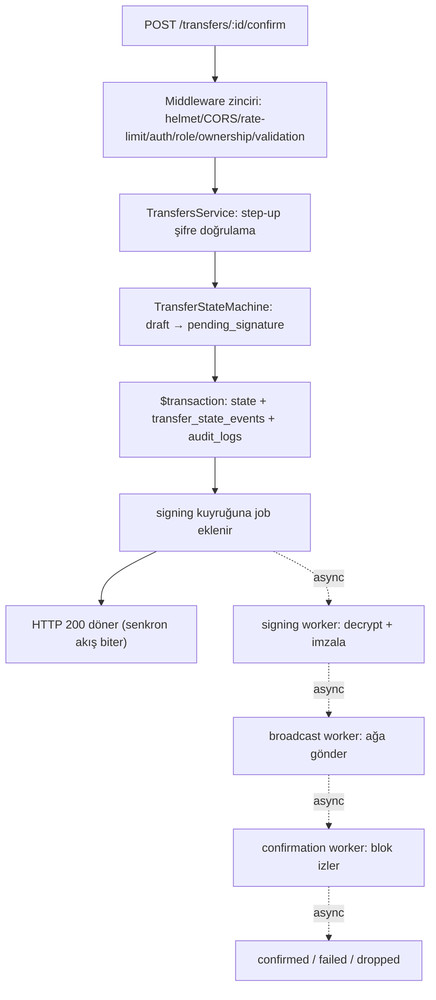

# 04. Backend Spesifikasyonu — Vault

## İçindekiler

1. Katman Mimarisi
2. Klasör ve Modül Yapısı
3. Dependency Injection ve Modül Kayıt Kalıbı
4. Middleware Zinciri
5. Validation Kalıbı
6. Exception Handling
7. Transaction Yönetimi ve Audit Yazımı
8. Background Job / Worker Kalıbı
9. Logging
10. Konfigürasyon ve Env Değişkenleri Tablosu

---

## 1. Katman Mimarisi

Backend üç katmana ayrılır; her katmanın sınırı kesindir, bir katman kendi altındakini atlayarak bir üsttekini çağırmaz.

- **Controller:** HTTP isteğini karşılar. Yalnızca DTO doğrulama sonucu gelen veriyi servise iletir ve servisin döndürdüğü sonucu response envelope'una sarar. Controller içinde **hiçbir iş kuralı, hiçbir veritabanı erişimi, hiçbir zincir çağrısı bulunmaz.**
- **Service:** Tüm iş mantığının yaşadığı katmandır. Yetkilendirme sonrası kontroller (sahiplik, cross-network guard, aktivasyon kontrolü), state machine geçişleri, audit yazımı, worker'a iş bırakma bu katmanda olur. Bir servis başka bir modülün repository'sine doğrudan erişmez; ihtiyaç duyduğu modülü DI ile enjekte eder.
- **Repository:** Veritabanı erişimini soyutlar (Prisma client çağrılarını sarmalar). Repository katmanında **hiçbir iş kuralı bulunmaz** — yalnızca sorgu/yazma işlemleri. Bu ayrım, ileride ORM değişikliği veya test'te mock'lama ihtiyacını izole eder.

**Kesin kural:** `Transfer.state` alanına yazan tek kod yolu `TransferStateMachine` servisidir; hiçbir controller, hiçbir repository, hiçbir worker bu alana doğrudan `UPDATE` uygulamaz — her worker da state geçişini `TransferStateMachine` servisi üzerinden tetikler.

Zincir sağlayıcı erişimi (`IChainProvider`) yalnızca service katmanından veya worker'lardan çağrılır; controller hiçbir zaman doğrudan bir `EvmProvider`/`TronProvider` örneğine erişmez.

---

## 2. Klasör ve Modül Yapısı

```
apps/api/src/
  auth/              — login, register, refresh, step-up doğrulama
  wallets/           — watch-only + managed cüzdan yönetimi
  networks/          — network/asset master data + admin aktivasyon
  transfers/         — TransferStateMachine servisi + endpoint'ler
  movements/         — birleşik hareket geçmişi sorgusu
  portfolio/         — toplam değer + snapshot/grafik
  notifications/     — in-app bildirim CRUD
  admin/             — mint + audit log + kullanıcı verisi görüntüleme
  audit/             — AuditLog yazma servisi (diğer modüllerce enjekte edilir)
  workers/           — BullMQ processor'ları (signing, broadcast, confirmation, balance-sync, price-sync, movement-index)
  common/            — guard, filter, pipe, decorator (paylaşılan altyapı)
  config/            — env şeması ve okuma servisi
```

Her domain modülü (`wallets`, `transfers`, vb.) kendi içinde standart dosya kümesini taşır:

```
transfers/
  transfers.module.ts
  transfers.controller.ts
  transfers.service.ts
  transfers.repository.ts
  transfer-state-machine.service.ts   — yalnızca transfers modülünde
  dto/
    create-transfer.dto.ts
    confirm-transfer.dto.ts
```

`workers/` altındaki her processor kendi dosyasında yaşar (`signing.processor.ts`, `confirmation.processor.ts` vb.) ve ilgili domain modülünün servisini (ör. `TransferStateMachine`) DI ile enjekte eder; worker'lar kendi repository'lerini tutmaz, domain modülünün repository'sini kullanır.

Mock kontrat kaynağı ve deploy script'leri (`MockERC20.sol` + Hardhat/`tronweb` deploy akışı) `apps/api`'nin dışında, ayrı bir `packages/contracts` workspace'inde yaşar — `apps/api` bu paketi runtime'da import etmez, yalnızca deploy sonucu üretilen kontrat adreslerini (`assets.contract_address`) okur (`docs/mimari-kararlar.md` TS-008, `docs/10_IMPLEMENTATION_ROADMAP.md` §4.4a).

---

## 3. Dependency Injection ve Modül Kayıt Kalıbı

Her domain modülü kendi `Module` sınıfında `controllers`, `providers` (service + repository) tanımlar ve ihtiyaç duyduğu diğer modülleri `imports` ile alır. Repository'ler `providers` listesinde yer alır ve yalnızca kendi modülünün servisine enjekte edilir — bir modülün repository'si `exports` edilmez, dışarıdan erişilmez; başka bir modül veri ihtiyacı duyarsa ilgili modülün servisini `imports` + `exports` yoluyla kullanır.

`AuditModule` (`audit/`), `PrismaModule` (global — `@Global()` dekoratörüyle işaretlenir, her modülde ayrı `imports` gerektirmez) ve `ConfigModule` (global) uygulama genelinde paylaşılan tek altyapı modülleridir. Diğer tüm domain modülleri birbirine yalnızca gerektiği kadar (ör. `TransfersModule`, cross-network guard için `NetworksModule`'ü, sahiplik kontrolü için `WalletsModule`'ü import eder) bağımlıdır; döngüsel modül bağımlılığı (`forwardRef`) yalnızca kaçınılmaz olduğunda kullanılır ve bir yorum satırıyla neden gerektiği açıklanır.

`workers/` altındaki her processor, `BullModule.registerQueue()` ile kendi kuyruğunu tanımlayan bir alt-modülde yaşar (ör. `SigningQueueModule`) ve ilgili domain modülünü import ederek servisine erişir; kuyruk tanımı ile domain mantığı aynı dosyada karışmaz.

---

## 4. Middleware Zinciri

İstek şu sırayla işlenir:

1. **`helmet`** — HTTP güvenlik başlıkları (HSTS, CSP, X-Content-Type-Options vb.) her yanıta eklenir.
2. **CORS** — yalnızca frontend origin'ine izin verilir; diğer origin'lerden gelen istek tarayıcı tarafından engellenir.
3. **Global rate limiter** (`ThrottlerGuard`) — §03 API_CONTRACTS'taki eşiklere göre isteği sayar, aşımda `429` döner.
4. **Auth guard** (`JwtAuthGuard`) — `Authorization: Bearer` header'ındaki JWT'yi doğrular; public olarak işaretlenmemiş (`@Public()` dekoratörü taşımayan) her endpoint için zorunludur. Geçersiz/süresi dolmuş token'da `401` ile zincir burada durur.
5. **Role guard** (`RolesGuard`, `@Roles()` dekoratörüyle okunur) — endpoint'in gerektirdiği rol (`User`/`Admin`) ile token'daki rolü karşılaştırır; uyuşmazlıkta `403 FORBIDDEN_ROLE`.
6. **Ownership guard** (`OwnershipGuard`, yalnızca cüzdan/transfer kaynaklarında) — path parametresindeki kaynak id'sinin, token'daki `userId`'ye ait olup olmadığını kontrol eder (Admin bu guard'dan muaftır, salt-okunur erişimi ayrı bir yetki yoluyla alır); uyuşmazlıkta `403 FORBIDDEN_NOT_OWNER`.
7. **Validation pipe** (`ValidationPipe`, `whitelist:true, forbidNonWhitelisted:true`) — DTO şemasına göre gövde/query doğrulanır; hata durumunda `400 VALIDATION_FAILED`, alan bazlı `details` ile.
8. **Controller → Service → Repository** — §1'de tanımlanan katman akışı çalışır.
9. **Global exception filter** — servis katmanından fırlatılan domain exception'ları yakalayıp §03'teki error code/HTTP status eşlemesine çevirir (bkz. §6).

Bu sıra sabittir; bir endpoint'in adım 4 veya 5'i atlaması yalnızca `@Public()` dekoratörüyle (yalnızca `register`/`login`/`refresh`/Alchemy webhook) mümkündür.

---

## 5. Validation Kalıbı

Tüm request şemaları `zod` ile tanımlanır ve `packages/types` paketinde tutulur — böylece aynı şema hem backend DTO doğrulamasında hem frontend form doğrulamasında birebir kullanılır, iki yerde kopya şema yazılmaz.

Backend'de her DTO sınıfı, `packages/types`'taki zod şemasını bir NestJS pipe'ı üzerinden çalıştırır (zod şeması `class-validator` dekoratörlerine çevrilmez; doğrudan zod `.parse()` çağrılır). `ValidationPipe` global olarak `whitelist:true, forbidNonWhitelisted:true` ile kayıtlıdır — şemada tanımlanmamış bir alan gövdede gelirse istek `400 VALIDATION_FAILED` ile reddedilir, sessizce yok sayılmaz.

Şema nerede tanımlanır: her domain modülünün `dto/` klasöründe, o modülün ait olduğu zod şemasına referans veren ince bir DTO dosyası bulunur; asıl şema tanımı `packages/types/src/schemas/<domain>.schema.ts` içindedir. Path parametreleri (`:id` gibi UUID'ler) ayrı bir `ParseUUIDPipe` ile doğrulanır, zod şemasına dahil edilmez.

Zincir bakiyesi/tutar alanları (`amount`) şemada `string` tipinde tanımlanır ve regex ile yalnızca pozitif tam sayı string'i kabul edilir (`/^\d+$/`); asla `z.number()` kullanılmaz — bu, sayısal tip disiplininin validation katmanındaki karşılığıdır.

---

## 6. Exception Handling

Domain exception'ları için ortak bir taban sınıf vardır: `DomainException extends Error { code: string; httpStatus: number; details?: unknown }`. Her spesifik hata bu taban sınıftan türetilir ve error taxonomy'deki (§03 API_CONTRACTS'ta tanımlı) tam kod ile eşleşir — ör. `TransferInvalidTransitionException extends DomainException` sabit olarak `code: 'TRANSFER_INVALID_TRANSITION', httpStatus: 409` taşır.

Servis katmanı yalnızca bu domain exception'larını fırlatır; hiçbir servis doğrudan `throw new HttpException(...)` yazmaz. Global bir `AllExceptionsFilter`:

1. Fırlatılan hata bir `DomainException` ise, `code`/`httpStatus`/`details`'i doğrudan §03'teki response envelope'una yazar.
2. Fırlatılan hata bir Prisma hatası ise (ör. unique constraint ihlali), bilinen Prisma hata kodları (`P2002` vb.) ilgili `DomainException`'a çevrilir (ör. `P2002` on `wallets.address` → `409 WALLET_ADDRESS_ALREADY_EXISTS`).
3. Hiçbiri değilse, `500 INTERNAL_ERROR` döner; ham hata mesajı ve stack trace yalnızca structured log'a yazılır (bkz. §9), API yanıtına asla yansımaz.

Worker (BullMQ processor) katmanında exception handling farklıdır: bir processor içinde fırlatılan hata HTTP yanıtına dönüşmez, bunun yerine job'u `failed` job durumuna düşürür ve BullMQ'nun retry/backoff mekanizması devreye girer (bkz. §8). Bir worker, ilgili `Transfer`'i `failed` state'ine geçirmek istediğinde bunu `TransferStateMachine` servisi üzerinden yapar, exception fırlatarak değil.

---

## 7. Transaction Yönetimi ve Audit Yazımı

Bir state değişikliği ile ona bağlı denetim kaydı **her zaman aynı veritabanı transaction'ı içinde yazılır** — Prisma `$transaction()` bloğu kullanılır. Somut kural: `TransferStateMachine` servisi bir geçişi uyguladığında, tek bir `$transaction` içinde hem `transfers.state` güncellenir hem `transfer_state_events`'e yeni satır eklenir hem de (geçiş türüne göre) `audit_logs`'a ilgili kayıt yazılır. Bu üçünden biri başarısız olursa hepsi geri alınır; yarım kalmış bir state geçişi (durum güncellendi ama denetim izi yazılmadı) veritabanı seviyesinde imkânsız kılınır.

Aynı kural şu servisler için de geçerlidir: managed cüzdan oluşturma (`wallets` yazımı + `audit_logs` yazımı tek transaction), admin network/asset aktivasyon değişikliği (`network_assets` güncelleme + `audit_logs` yazımı), admin mint işlemi (`mint_operations` yazımı + `audit_logs` yazımı).

`AuditService.record()` metodu, transaction içinde çağrılabilmesi için Prisma'nın transaction client'ını (`Prisma.TransactionClient`) parametre olarak kabul eder; kendi bağımsız transaction'ını açmaz — çağıran servisin transaction'ına katılır. Bu, audit yazımının "ayrı bir yan işlem" değil, iş işleminin ayrılmaz bir parçası olmasını garanti eder.

Salt-okunur (`GET`) endpoint'ler transaction açmaz; yalnızca yazma işlemleri (birden fazla tabloyu etkileyenler) `$transaction` kullanır.

---

## 8. Background Job / Worker Kalıbı

Tüm arka plan işleri **BullMQ kuyruğu** üzerinde çalışır; cron tabanlı zamanlama kullanılmaz (worker'lar sürekli veya kısa aralıklı polling ile kuyruktan iş çeker).

**Kuyruklar:**

| Kuyruk | Tetikleyici | Görev |
| --- | --- | --- |
| `signing` | `Transfer` `pending_signature`'a geçtiğinde | Private key'i bellekte decrypt eder, raw tx'i imzalar, `signed`'e geçirir |
| `broadcast` | `signing` job'u tamamlandığında | İmzalı tx'i `IChainProvider.broadcastTransaction()` ile ağa gönderir, `broadcast`'e geçirir |
| `confirmation` | `broadcast` job'u tamamlandığında, sürekli çalışan bir izleyici | tx hash'in blok derinliğini izler, eşik geçilince `confirmed`, süre aşımında `dropped`, revert'te `failed`'e geçirir |
| `balance-sync` | Periyodik (kısa aralıklı) | Her aktif cüzdan/varlık çifti için RPC/Alchemy/TronGrid'den bakiye okur, `balance_caches`'i günceller |
| `price-sync` | Periyodik (60 saniyede bir) | CoinGecko'dan fiyatları çeker, Redis'te cache'ler |
| `movement-index` | Alchemy webhook (EVM) veya periyodik polling (Tron) | Zincir hareketlerini tespit edip `chain_movements`'e yazar, bildirim tetikler |
| `portfolio-snapshot` | Periyodik | Kullanıcı portföylerinin USDT toplamını hesaplayıp snapshot olarak yazar (grafik bu snapshot'lardan okunur) |

**Idempotency:** Her job, `(chain, txHash)` veya `(transferId, targetState)` gibi bileşik bir anahtardan türetilen sabit bir BullMQ job id ile kuyruğa alınır; aynı anahtarla ikinci kez eklenen job BullMQ tarafından otomatik olarak yok sayılır (deduplication). Bu, worker kodunun kendisinin de idempotent yazılmasıyla desteklenir: bir job ikinci kez çalıştırılsa bile (ör. bir restart sonrası kuyruktan tekrar alınırsa) sonucu değiştirmez — terminal durumdaki bir transfer üzerinde çalışan bir worker hiçbir state değişikliği yapmaz, sessizce çıkar.

**Retry/backoff:** RPC/webhook çağrılarında exponential backoff (1s, 2s, 4s... maksimum 5 deneme) uygulanır; bu BullMQ'nun `attempts` + `backoff: { type: 'exponential', delay: 1000 }` job seçenekleriyle konfigüre edilir, worker kodu içinde manuel retry döngüsü yazılmaz.

**Reorg toleransı:** `confirmation` worker'ı, eşik altı derinlikte bir reorg (block hash uyuşmazlığı) tespit ederse, ilgili transferi `confirming` durumunda tutar ve onay sayacını sıfırlamadan yeniden doğrular; bu bir state geçişi değildir, aynı durumda kalınarak iç sayaç güncellenir.

**İstek yaşam döngüsü örneği — transfer onay akışı:**



---

## 9. Logging

Yapılandırılmış (structured) JSON log, `pino` ile üretilir ve stdout'a yazılır; merkezi log toplama (ELK/Datadog vb.) kurulmaz çünkü sistem hiçbir ortama deploy edilmez.

**Log seviyeleri:**
- `error` — beklenmeyen hatalar (`500 INTERNAL_ERROR`'a düşen her durum), worker job başarısızlıkları
- `warn` — beklenen ama dikkat gerektiren durumlar (rate limit aşımı, refresh token replay tespiti, transfer `dropped`/`failed` terminal durumu)
- `info` — normal iş akışı olayları (transfer state geçişleri, cüzdan oluşturma, login)
- `debug` — yalnızca lokal geliştirmede açık; RPC çağrı detayları, worker job adımları

**Format:** Her log satırı en az `{ level, timestamp, context (modül/servis adı), message }` alanlarını taşır; hata loglarında ayrıca `err: { message, stack }` eklenir.

**Hassas alan maskeleme:** Aşağıdaki alanlar hiçbir log satırında, hiçbir seviyede yer almaz — bu bir "maskeleme" değil, tam dışlamadır (pino'nun `redact` seçeneğiyle path bazlı otomatik olarak temizlenir):
- Private key (şifreli veya çözülmüş, her ikisi de)
- `password`, `passwordHash`, `currentPassword` alanları
- JWT access token değeri, refresh token değeri
- `encrypted_dek` ve `encrypted_private_key` kolonlarının içeriği

Bir servis, decrypt edilmiş private key'i içeren bir nesneyi hiçbir log çağrısına (`logger.info(...)`, `logger.debug(...)`) argüman olarak geçiremez; bu kural code review'da denetlenen bir agent kısıtıdır, yalnızca `redact` konfigürasyonuna güvenilmez.

---

## 10. Konfigürasyon ve Env Değişkenleri Tablosu

Env değişkenleri `apps/api/.env` dosyasında tutulur (`.gitignore`'da), lokal/demo ortamı için ayrı bir secret manager kurulmaz. Uygulama başlangıcında bir zod şeması (`config/env.schema.ts`) tüm değişkenleri doğrular; eksik veya geçersiz bir değişken varsa uygulama başlamaz (fail-fast).

| Değişken | Örnek | Açıklama |
| --- | --- | --- |
| `DATABASE_URL` | `postgresql://...` | Prisma bağlantı string'i |
| `REDIS_URL` | `redis://redis:6379` | BullMQ ve fiyat cache için |
| `JWT_ACCESS_SECRET` | — | Access token imzalama anahtarı |
| `JWT_ACCESS_TTL` | `15m` | Access token yaşam süresi |
| `JWT_REFRESH_SECRET` | — | Refresh token imzalama anahtarı |
| `JWT_REFRESH_TTL` | `7d` | Refresh token yaşam süresi |
| `MASTER_ENCRYPTION_KEY` | — | Envelope encryption'da DEK'leri şifreleyen master key; log'a asla yazılmaz |
| `HD_WALLET_MNEMONIC` | — | Managed cüzdan türetmesinin kök seed'i (BIP-39); tek mnemonic'ten hem EVM (coinType 60) hem Tron (coinType 195) dalları türetilir (`m/44'/<coinType>'/0'/0/<index>`); log'a asla yazılmaz — `MASTER_ENCRYPTION_KEY` kadar kritik bir secret'tır |
| `MINT_OPERATOR_PRIVATE_KEY` | — | Mock ERC-20/TRC-20 kontratlarının `onlyOwner mint()` fonksiyonunu çağırabilen cüzdanın private key'i; `packages/contracts`'ın deploy sırasında kullandığı `CONTRACT_DEPLOYER_PRIVATE_KEY` ile **aynı** cüzdan olmalıdır (deploy eden = kontrat owner'ı = mint çağıran) — gerçek kullanıcı fonlarına erişimi yoktur (testnet mock token, `docs/mimari-kararlar.md` I-008), `MASTER_ENCRYPTION_KEY`/`HD_WALLET_MNEMONIC`'ten daha düşük hassasiyette ama yine de log'a yazılmaz |
| `SEPOLIA_RPC_URL` | — | EVM provider RPC endpoint'i (Sepolia) |
| `BSC_TESTNET_RPC_URL` | — | EVM provider RPC endpoint'i (BSC Testnet) |
| `TRON_SHASTA_RPC_URL` | — | Tron provider endpoint'i |
| `ALCHEMY_API_KEY` | — | Alchemy webhook + veri kaynağı erişimi |
| `ALCHEMY_WEBHOOK_SIGNING_KEY` | — | Gelen webhook imzasını doğrulamak için |
| `TRONGRID_API_KEY` | — | TronGrid erişimi |
| `COINGECKO_API_KEY` | — | Fiyat kaynağı erişimi (varsa; public tier'da boş bırakılabilir) |
| `CHAIN_ID_ALLOWLIST` | `sepolia,bsc-testnet,tron-shasta` | Mainnet bağlantısını engelleyen sabit izin listesi |
| `CORS_ORIGIN` | `http://localhost:3000` | Yalnızca frontend origin'ine izin verilir |
| `NODE_ENV` | `development` | `development` \| `test` (tek ortam; `production` MVP'de kullanılmaz) |
| `LOG_LEVEL` | `info` | pino log seviyesi |

Tüm secret değerler (JWT anahtarları, master key, API key'ler) yalnızca `.env` dosyasında tutulur, hiçbir zaman koda gömülmez veya versiyon kontrolüne eklenmez.
