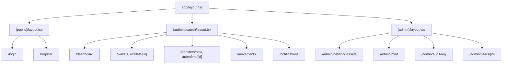

# 05. Frontend Spesifikasyonu — Vault

## İçindekiler

1. Uygulama Yapısı ve Klasör Organizasyonu
2. Routing Konvansiyonu
3. State Yönetimi Stratejisi
4. Veri Çekme Kalıbı
5. Form Kalıbı
6. Bileşen Katmanları
7. Tasarım Token'ları ve Stil Kuralları
8. Erişilebilirlik (a11y) Minimumları
9. Performans Hedefleri ve Bundle Bütçesi
10. i18n ve Metin Yönetimi

---

## 1. Uygulama Yapısı ve Klasör Organizasyonu

Frontend **Next.js App Router** ile `apps/web` altında yaşar:

```
apps/web/src/
  app/
    (public)/            — login, register (auth layout)
    (authenticated)/      — dashboard, wallets, transfers, movements, notifications (kullanıcı layout'u)
    (admin)/              — admin/network-assets, admin/mint, admin/audit-log, admin/users (admin layout'u)
    api/                  — yalnızca Next.js route handler gerektiren durumlar (ör. auth callback); asıl API çağrıları apps/api'ye gider
  components/
    ui/                   — primitive (shadcn/ui bileşenleri, CLI ile kopyalanır)
    composite/             — birden fazla primitive'i birleştiren tekrar kullanılabilir parçalar (ör. WalletBalanceRow, TransferStateBadge)
    features/               — ekrana özel, tekrar kullanılmayan bileşenler
  hooks/                   — useAuth, useWalletList, useTransferMutation gibi TanStack Query sarmalayıcıları
  lib/
    api-client.ts          — merkezi fetch wrapper (access token header, hata çevirimi)
    query-keys.ts           — TanStack Query key fabrikası
  styles/                   — Tailwind konfigürasyonu ve global stiller
```

`packages/types` içindeki zod şemaları ve paylaşılan tipler doğrudan import edilir (`@vault/types`); frontend'e özel ayrı bir tip tanımı yalnızca UI'a özgü (ör. bir bileşenin prop tipi) durumlarda yazılır.

---

## 2. Routing Konvansiyonu

Üç route grubu (Next.js route group'ları, URL'e yansımaz) vardır: `(public)`, `(authenticated)`, `(admin)`. Her grup kendi `layout.tsx`'ini taşır.

- **`(public)`:** `/login`, `/register`. Zaten authenticate olmuş bir kullanıcı bu route'lara girerse `/dashboard`'a yönlendirilir.
- **`(authenticated)`:** `/dashboard`, `/wallets`, `/wallets/[id]`, `/transfers/new`, `/transfers/[id]`, `/movements`, `/notifications`. Bu grubun layout'u, sunucu tarafında (middleware) access token/refresh cookie kontrolü yapar; geçersizse `/login`'e yönlendirir.
- **`(admin)`:** `/admin/network-assets`, `/admin/mint`, `/admin/audit-log`, `/admin/users/[id]`. Bu grubun layout'u, `(authenticated)` kontrolüne ek olarak rolün `admin` olduğunu doğrular; `user` rolündeki bir kullanıcı bu route'lara girmeye çalışırsa `403` sayfasına yönlendirilir (backend zaten aynı isteği reddeder — bu yalnızca UX katmanıdır, tek başına güvenlik sınırı değildir).

**Korumalı route mekanizması:** Next.js `middleware.ts`, her `(authenticated)` ve `(admin)` isteğinde refresh cookie'nin varlığını kontrol eder (cookie `httpOnly` olduğundan içeriği okunamaz, yalnızca varlığı kontrol edilir); asıl yetki kontrolü (rol, sahiplik) her zaman backend'de tekrar yapılır — frontend routing kontrolü hiçbir zaman tek başına yeterli güvenlik sınırı sayılmaz.

**Layout hiyerarşisi:** `app/layout.tsx` (root — HTML iskeleti, font, global provider'lar) → grup layout'u (`(authenticated)/layout.tsx` — nav bar, "testnet varlıkları — gösterge değerdir" ibaresi, bildirim ikonu) → sayfa. Admin layout'u, kullanıcı layout'unu sarmalamaz; ayrı bir nav yapısı (admin menüsü) taşır.



---

## 3. State Yönetimi Stratejisi

**Server state** (API'den gelen her şey — cüzdan listesi, transfer listesi, bakiyeler, bildirimler) **TanStack Query** ile yönetilir. Bu veri hiçbir zaman ayrıca bir global state kütüphanesine (Redux, Zustand vb.) kopyalanmaz; TanStack Query'nin kendi cache'i tek doğruluk kaynağıdır.

**Client state** (formun anlık değeri, bir modal'ın açık/kapalı durumu, bir dropdown'ın seçili sekmesi) React'in kendi `useState`/`useReducer`'ı ile yönetilir. Bu ihtiyaç minimal olduğundan ek bir client state kütüphanesi kurulmaz; birden fazla uzak bileşenin paylaştığı client state gerektiğinde (nadiren) React Context kullanılır, yeni bir bağımlılık eklenmez.

**Access token istisnası:** Access token (JWT) ne server state ne de kalıcı client state'tir — yalnızca bellekte tutulan bir React Context değeridir (`AuthContext`), sayfa yenilendiğinde kaybolur ve `refresh` akışıyla yeniden alınır. `localStorage`/`sessionStorage`'a asla yazılmaz; bu, XSS ile token çalınması riskini ortadan kaldırmak için zorunlu bir kısıttır.

**Sınır kuralı:** Bir veri, API'den okunuyorsa TanStack Query'nin sorumluluğundadır; yalnızca UI etkileşiminin sonucuysa (ve API'ye yazılana kadar) React state'in sorumluluğundadır. İkisini karıştıran bir bileşen (ör. sunucudan gelen veriyi `useState`'e kopyalayıp elle senkronize eden kod) yazılmaz.

---

## 4. Veri Çekme Kalıbı

Her domain için bir `use<Domain>` hook ailesi tanımlanır (`useWallets()`, `useWallet(id)`, `useTransfers(filters)`, `useTransferMutation()`), `hooks/` altında yaşar ve `lib/api-client.ts`'teki merkezi fetch wrapper'ı kullanır.

**Query key kalıbı:** `lib/query-keys.ts` içinde bir fabrika fonksiyonu bulunur (`walletKeys.list(filters)`, `walletKeys.detail(id)`), key'ler elle string olarak yazılmaz — bu, invalidation'ı tutarlı tutar.

**Cache/invalidation stratejisi:**
- Liste sorguları (`useWallets`, `useTransfers`, `useMovements`) `staleTime: 30_000` (30 saniye) ile cache'lenir; bu süre içinde aynı query yeniden fetch edilmez.
- Bir mutasyon (ör. cüzdan oluşturma, transfer onaylama) başarılı olduğunda, ilgili liste query'leri `queryClient.invalidateQueries({ queryKey: walletKeys.all })` ile geçersiz kılınır — optimistic update yalnızca geri alınması kolay, düşük riskli durumlarda (ör. bildirim okundu işaretleme) kullanılır; bakiye/transfer gibi finansal veride optimistic update yapılmaz, her zaman sunucu yanıtı beklenir.
- Bildirim listesi (`useNotifications`) `refetchInterval: 15_000` (15 saniyede bir) ile polling yapılır; websocket/SSE kullanılmaz.
- Transfer detay sayfası (`useTransfer(id)`), transfer terminal olmayan bir durumdaysa (`draft` hariç) `refetchInterval: 5_000` ile polling yapar, terminal duruma ulaştığında (`confirmed`/`failed`/`dropped`) polling durur.

**Loading/error state standardı:** Her veri çeken bileşen üç durumu ayrı ayrı ele alır — `isPending` (iskelet/skeleton loader gösterilir, spinner değil), `isError` (TR hata mesajı + "tekrar dene" butonu, ham hata metni gösterilmez), başarı (veri render edilir). Boş liste durumu (`data.length === 0`) ayrı bir "boş durum" bileşeniyle ele alınır, hata durumuyla karıştırılmaz.

---

## 5. Form Kalıbı

Formlar **react-hook-form** + `packages/types`'taki zod şeması (`@hookform/resolvers/zod` ile bağlanır) kullanır; şema backend DTO'suyla birebir aynıdır, iki ayrı doğrulama kuralı yazılmaz.

**Doğrulama zamanlaması:** Alan `onBlur`'da doğrulanır (yazarken her tuşta değil — gürültülü hata gösterimini engeller); submit denemesinde tüm alanlar yeniden doğrulanır.

**Hata gösterimi:** Her alanın altında, o alana özel TR hata mesajı gösterilir (zod şemasındaki `message` alanından gelir). Sunucu tarafı doğrulama hatası (`400 VALIDATION_FAILED`, `details: [{ field, reason }]`) dönerse, bu hatalar ilgili form alanlarına `setError()` ile eşlenir; genel bir hata banner'ı yalnızca alan eşlemesi mümkün olmayan hatalarda (ör. `409 WALLET_CROSS_NETWORK_MISMATCH`) gösterilir.

**Submit/disable davranışı:** Submit butonu, form geçerli değilken veya bir mutasyon in-flight iken (`isPending`) devre dışıdır; çift tıklamayı önlemek için buton metni "Gönderiliyor..." olarak değişir. Transfer oluşturma formu, `Idempotency-Key` header'ını form mount edildiğinde bir kez üretir (`crypto.randomUUID()`) ve submit boyunca aynı değeri kullanır — böylece bir ağ hatası sonrası kullanıcı tekrar submit etse bile backend aynı transferi iki kez oluşturmaz.

**Step-up auth deseni (transfer onayı):** Transfer onay formu, normal alan doğrulamasına ek olarak `currentPassword` alanını taşır; bu alan her zaman `type="password"`, autocomplete `current-password`, ve `AUTH_STEP_UP_REQUIRED` hatası döndüğünde yalnızca bu alan sıfırlanır (diğer form verileri korunur) — kullanıcı tüm formu yeniden doldurmak zorunda kalmaz.

---

## 6. Bileşen Katmanları

Üç katman vardır, üstteki alttakini kullanır, ters yönde bağımlılık kurulmaz:

- **Primitive (`components/ui/`):** shadcn/ui'den CLI ile kopyalanan temel bileşenler (Button, Input, Dialog, Badge, Table). Bu dosyalar proje ihtiyacına göre düzenlenebilir ama iş mantığı içermez — yalnızca görsel/etkileşim davranışı.
- **Composite (`components/composite/`):** Birden fazla primitive'i birleştiren, birden fazla ekranda tekrar kullanılan parçalar. Örnekler: `WalletBalanceRow` (bir cüzdanın varlık bakiyesini gösteren satır), `TransferStateBadge` (8 durumun TR badge karşılığını renkli gösteren bileşen — bkz. §7 için renk kuralı), `UsdtValue` (her zaman USDT etiketiyle, `$` kullanmadan para değeri gösteren bileşen). Composite bileşenler kendi veri çekme mantığını taşımaz, prop olarak veri alır.
- **Feature (`components/features/`):** Tek bir ekrana özel, başka yerde tekrar kullanılmayan bileşenler (ör. `TransferConfirmForm`). Bu bileşenler ilgili `use<Domain>` hook'larını doğrudan çağırabilir.

**Yeniden kullanım kuralı:** Bir bileşen iki farklı ekranda ihtiyaç duyulur hale geldiğinde `features/`'tan `composite/`'e taşınır ve veri çekme sorumluluğu prop'a çevrilir; tersi yönde (composite'i feature'a özelleştirmek için içini domain'e bağlamak) yapılmaz.

---

## 7. Tasarım Token'ları ve Stil Kuralları

Stil **Tailwind CSS** utility class'larıyla yazılır; ayrı bir CSS-in-JS çözümü kullanılmaz. Tasarım token'ları `styles/`'taki Tailwind config'inde tanımlanır (renk paleti, spacing ölçeği, tipografi) ve doğrudan class isimleri üzerinden (`bg-primary`, `text-danger`) kullanılır; hardcoded hex değer (`bg-[#ff0000]`) bileşen kodunda yazılmaz.

**Transfer durum renkleri** (`TransferStateBadge` bileşeni için sabit bir eşleme):

| Durum | Renk kategorisi |
| --- | --- |
| `draft` | nötr (gri) |
| `pending_signature`, `signed`, `broadcast`, `confirming` | bilgi/işlemde (mavi/sarı) |
| `confirmed` | başarı (yeşil) |
| `failed`, `dropped` | hata (kırmızı) |

**Para birimi gösterim kuralı:** Tüm parasal değerler `UsdtValue` composite bileşeni üzerinden render edilir; bu bileşen değeri her zaman `"1.234,56 USDT"` formatında (TR sayı biçimi — nokta binlik ayracı, virgül ondalık ayracı) gösterir ve hiçbir koşulda `$` sembolü üretmez. Bu bileşenin dışında, hiçbir yerde manuel para birimi string'i formatlanmaz — tek bir kaynak, tek bir kural.

Component-level stil, shadcn/ui'nin `class-variance-authority` (cva) kalıbını takip eder; yeni bir primitive varyantı eklenirken var olan cva tanımı genişletilir, yeni bir stil sistemi kurulmaz.

---

## 8. Erişilebilirlik (a11y) Minimumları

Hedef **WCAG 2.1 AA temel pratikleridir**; otomatik denetim aracı (axe, Lighthouse a11y skoru) kurulmaz, sert bir sayısal eşik konmaz — proje ölçeğinde over-engineering'den kaçınma ilkesiyle tutarlı asgari yaklaşım budur. Buna karşın aşağıdaki pratikler her ekranda zorunludur:

- **Semantic HTML:** `div` yığınları yerine `button`, `nav`, `main`, `form`, `table` gibi anlamlı etiketler kullanılır; shadcn/ui primitive'leri zaten bu temel üzerine kuruludur.
- **Klavye navigasyonu:** Tüm interaktif öğeler (buton, link, form alanı, modal) yalnızca fare ile değil `Tab`/`Enter`/`Escape` ile de kullanılabilir olmalıdır; özel bir `onClick` taşıyan `div` asla interaktif kontrol yerine geçmez.
- **Form etiketleme:** Her form alanı bir `<label>` ile ilişkilendirilir (`htmlFor`/`id` eşleşmesi); yalnızca placeholder ile etiketlenen alan kullanılmaz.
- **Odak yönetimi:** Bir modal/dialog açıldığında odak içine taşınır (focus trap), kapandığında tetikleyen öğeye geri döner — shadcn/ui `Dialog` bileşeni bunu varsayılan sağlar, elle yeniden implemente edilmez.
- **Renk tek başına anlam taşımaz:** `TransferStateBadge` gibi durum göstergeleri rengin yanında her zaman metin de taşır (yalnızca renk kodlaması yapılmaz) — renk körü kullanıcı için de durum okunabilir olmalıdır.
- **Alt metin:** Anlam taşıyan görsellerde `alt` metni zorunludur; salt dekoratif görsellerde `alt=""` ile ekran okuyucudan gizlenir.

---

## 9. Performans Hedefleri ve Bundle Bütçesi

Vault yayına alınmayacağından Core Web Vitals için sert sayısal bir hedef (ör. "LCP < 2.5s") konmaz ve bir bundle boyutu bütçesi izlenmez — bu, projenin ölçeğine göre over-engineering olur. Bunun yerine Next.js'in varsayılan optimizasyonlarına güvenilir ve bunlar bilinçli olarak devre dışı bırakılmaz:

- `next/image` ile görsel optimizasyonu (otomatik boyutlandırma, lazy loading) her görselde kullanılır, çıplak `` etiketi yazılmaz.
- `next/font` ile font yükleme optimize edilir (self-hosted font, layout shift önleme); harici bir `<link>` ile font yüklenmez.
- Route bazlı otomatik kod bölme (App Router'ın varsayılan davranışı) korunur; bir sayfanın yalnızca kendi route'unda ihtiyaç duyduğu kodu yüklemesi için manuel `dynamic import` yalnızca büyük, nadir kullanılan bileşenlerde (ör. grafik kütüphanesi) eklenir.
- Server Component'ler varsayılandır; bir bileşen yalnızca interaktivite (state, event handler) gerektiriyorsa `"use client"` ile client component'e çevrilir — gereksiz yere tüm ağacı client'a taşımak yapılmaz.

---

## 10. i18n ve Metin Yönetimi

Arayüz dili sabit olarak **Türkçedir**; birden fazla dil desteği MVP kapsamında yoktur. Bu nedenle `next-intl` veya benzeri bir i18n kütüphanesi kurulmaz — tek dilli bir uygulamada bu, çözülmeyen bir problem için karmaşıklık eklemek olur.

Bunun yerine tüm sabit UI metinleri (buton etiketleri, form hata mesajları, durum badge metinleri, bildirim şablonları) merkezi bir `lib/messages.ts` dosyasında düz bir obje olarak tutulur (ör. `messages.transfer.stateLabels.confirmed = "Tamamlandı"`). Bileşenler string'i doğrudan JSX içine yazmaz, bu obje üzerinden referans alır — bu, ileride ikinci bir dil eklenmesi gerekirse (MVP kapsamı dışında) tüm string'lerin tek bir dosyada toplanmış olmasını sağlar, ama şu an için amaç çoklu dil değil, metin tutarlılığı ve tek noktadan güncellenebilirliktir.

Backend'den gelen hata mesajları (yanıt gövdesindeki `error.message` alanı) zaten Türkçe döner; frontend bu mesajları doğrudan gösterir, ayrıca çevirmez.
