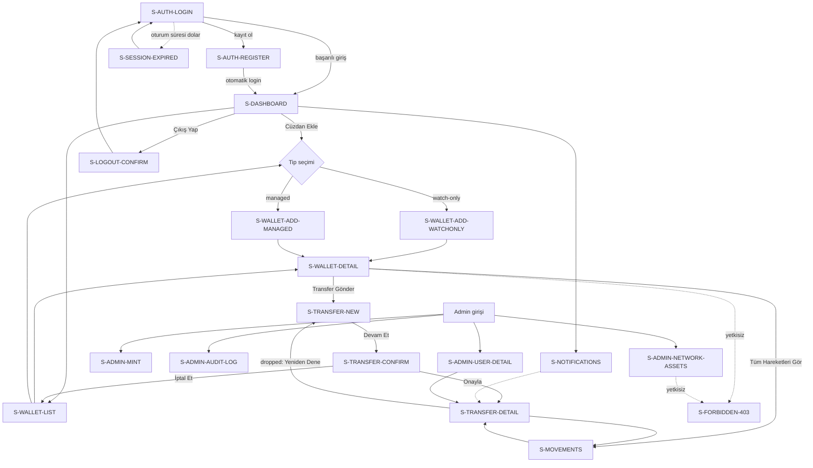

# 06. Ekran Kataloğu — Vault

## İçindekiler

1. Ekran Haritası ve Navigasyon
2. Layout Tanımları
3. Ekran ID Konvansiyonu
4. Kritik Ekranlar
5. İkincil Ekranlar
6. Ortak Bileşenler ve UX Durumları

---

## 1. Ekran Haritası ve Navigasyon

Sistemde 21 ekran vardır: 4 auth/sistem, 5 portföy/cüzdan, 4 transfer/hareket, 5 bildirim/admin, 3 sistem hata ekranı.

**Üst düzey navigasyon:**
- Giriş yapmamış kullanıcı yalnızca `/login` ve `/register`'a erişir.
- Giriş yapmış `User`, nav bar üzerinden Dashboard, Cüzdanlarım, Hareketler, Bildirimler arasında gezinir; Admin ekranlarına linki görünmez.
- Giriş yapmış `Admin`, ayrı bir admin nav bar'ı görür (Ağ/Varlık Yönetimi, Mock Mint, Audit Log, Kullanıcılar); kendi cüzdanı/transferi olmadığından `User` nav öğelerini görmez.
- Tam ekran akış diyagramı §6 sonunda, tüm ekranlar tanımlandıktan sonra eklenir.

**Ekran envanteri (kararlardan çıkanlar):**

| Ekran ID | Route | Layout | Kritik/İkincil |
| --- | --- | --- | --- |
| S-AUTH-LOGIN | `/login` | public | Kritik |
| S-AUTH-REGISTER | `/register` | public | Kritik |
| S-SESSION-EXPIRED | modal/redirect | authenticated | İkincil |
| S-LOGOUT-CONFIRM | modal | authenticated | İkincil |
| S-DASHBOARD | `/dashboard` | authenticated | Kritik |
| S-WALLET-LIST | `/wallets` | authenticated | Kritik |
| S-WALLET-DETAIL | `/wallets/[id]` | authenticated | Kritik |
| S-WALLET-ADD-WATCHONLY | `/wallets/add?type=watch-only` | authenticated | Kritik |
| S-WALLET-ADD-MANAGED | `/wallets/add?type=managed` | authenticated | Kritik |
| S-TRANSFER-NEW | `/transfers/new` | authenticated | Kritik |
| S-TRANSFER-CONFIRM | `/transfers/[id]` (onay adımı) | authenticated | Kritik |
| S-TRANSFER-DETAIL | `/transfers/[id]` (izleme) | authenticated | Kritik |
| S-MOVEMENTS | `/movements` | authenticated | Kritik |
| S-NOTIFICATIONS | `/notifications` | authenticated | İkincil |
| S-ADMIN-NETWORK-ASSETS | `/admin/network-assets` | admin | Kritik |
| S-ADMIN-MINT | `/admin/mint` | admin | Kritik |
| S-ADMIN-AUDIT-LOG | `/admin/audit-log` | admin | İkincil |
| S-ADMIN-USER-DETAIL | `/admin/users/[id]` | admin | İkincil |
| S-ERROR-404 | `*` | — | İkincil |
| S-ERROR-500 | global error boundary | — | İkincil |
| S-FORBIDDEN-403 | `*` (yetkisiz) | — | İkincil |

---

**Tam ekran akış diyagramı:**

---

## 2. Layout Tanımları

- **`public`:** Ortalanmış tek kart layout, nav bar yok, yalnızca Vault logosu ve dil bilgisi (TR sabit) üstte.
- **`authenticated`:** Sol/üst nav bar (Dashboard, Cüzdanlarım, Hareketler, Bildirim ikonu, kullanıcı menüsü) + içerik alanı. Her sayfanın üstünde sabit "testnet varlıkları — gösterge değerdir" ibaresi bulunur.
- **`admin`:** Ayrı bir nav bar (Ağ/Varlık Yönetimi, Mock Mint, Audit Log, Kullanıcılar) + içerik alanı; `authenticated` layout'undan bağımsızdır, kullanıcı nav öğelerini içermez.
- **Sistem hata ekranları** (404/500/403) herhangi bir layout'a bağlı değildir; route'un hangi grupta olduğuna göre ilgili nav bar korunur (ör. `/admin/xyz` altında 403 alan bir user, admin nav'ı görmez, genel/minimal bir çerçevede hata mesajını görür).

---

## 3. Ekran ID Konvansiyonu

Format: `S-<DOMAIN>-<ACTION>`. `DOMAIN` büyük harfli kısa bir isim (`AUTH`, `WALLET`, `TRANSFER`, `MOVEMENTS`, `NOTIFICATIONS`, `ADMIN`, `ERROR`, `FORBIDDEN`, `SESSION`, `LOGOUT`), `ACTION` ekranın işlevini belirten bir fiil/isim (`LOGIN`, `LIST`, `DETAIL`, `ADD-WATCHONLY`, `CONFIRM`). Alt akışlar (ör. cüzdan ekleme içindeki iki tip) `ACTION` kısmında tire ile ayrılan ikinci bir kelimeyle ifade edilir (`ADD-WATCHONLY`, `ADD-MANAGED`).

---

## 4. Kritik Ekranlar

### 4.1 Auth

**S-AUTH-LOGIN**
- *Route:* `/login`
- *Layout:* public
- *Erişim yetkisi:* Herkese açık; zaten authenticate olmuş kullanıcı buraya girerse `/dashboard`'a yönlendirilir.
- *Amaç:* Kayıtlı kullanıcının email + şifre ile giriş yapması.
- *Alan listesi:*
  | Etiket | Tip | Zorunlu | Validation |
  | --- | --- | --- | --- |
  | E-posta | text (email) | ✅ | Geçerli email formatı |
  | Şifre | password | ✅ | Boş olamaz |
- *Aksiyonlar ve sonuçları:*
  - "Giriş Yap" → başarılıysa `/dashboard`'a yönlendirir, access token bellekte tutulur; başarısızsa alan altı hata mesajı gösterir.
  - "Hesabın yok mu? Kayıt ol" linki → `/register`'a götürür.
- *UX state'leri:*
  - *Boş:* Form ilk açıldığında alanlar boş, "Giriş Yap" pasif değildir (client-side zorunlu alan kontrolü submit anında çalışır).
  - *Yükleniyor:* Submit sonrası buton "Giriş yapılıyor..." metniyle devre dışı kalır.
  - *Hata:* `AUTH_INVALID_CREDENTIALS` → "E-posta veya şifre hatalı." genel banner'ı (hangi alanın yanlış olduğu belirtilmez — güvenlik gereği); `RATE_LIMIT_EXCEEDED` → "Çok fazla deneme yapıldı, lütfen birkaç dakika sonra tekrar deneyin."
  - *Yetkisiz:* Uygulanmaz (public ekran).
  - *Başarı:* Yönlendirme anlık gerçekleşir, ayrı bir başarı ekranı gösterilmez.
- *Kullanılan endpoint'ler:* `POST /api/v1/auth/login`
- *TR mesaj metinleri:* "Giriş Yap", "E-posta", "Şifre", "E-posta veya şifre hatalı.", "Çok fazla deneme yapıldı, lütfen birkaç dakika sonra tekrar deneyin.", "Hesabın yok mu? Kayıt ol"

**S-AUTH-REGISTER**
- *Route:* `/register`
- *Layout:* public
- *Erişim yetkisi:* Herkese açık; zaten authenticate olmuş kullanıcı buraya girerse `/dashboard`'a yönlendirilir.
- *Amaç:* Yeni kullanıcı kaydı oluşturma.
- *Alan listesi:*
  | Etiket | Tip | Zorunlu | Validation |
  | --- | --- | --- | --- |
  | E-posta | text (email) | ✅ | Geçerli email formatı, sistemde kayıtlı olmamalı |
  | Şifre | password | ✅ | En az 8 karakter, en az bir rakam |
  | Şifre (tekrar) | password | ✅ | "Şifre" alanıyla birebir eşleşmeli |
- *Aksiyonlar ve sonuçları:*
  - "Kayıt Ol" → başarılıysa otomatik login akışına geçilir ve `/dashboard`'a yönlendirilir; başarısızsa alan altı hata gösterir.
  - "Zaten hesabın var mı? Giriş yap" linki → `/login`'e götürür.
- *UX state'leri:*
  - *Boş:* Form ilk açıldığında alanlar boş.
  - *Yükleniyor:* Submit sonrası buton "Kayıt oluşturuluyor..." metniyle devre dışı kalır.
  - *Hata:* `409 EMAIL_ALREADY_EXISTS` → "Bu e-posta adresi zaten kayıtlı." (E-posta alanı altında); `VALIDATION_FAILED` → ilgili alan(lar) altında sunucudan gelen alan bazlı mesaj.
  - *Yetkisiz:* Uygulanmaz (public ekran).
  - *Başarı:* Otomatik yönlendirme, ayrı bir başarı ekranı gösterilmez.
- *Kullanılan endpoint'ler:* `POST /api/v1/auth/register`, ardından `POST /api/v1/auth/login`
- *TR mesaj metinleri:* "Kayıt Ol", "E-posta", "Şifre", "Şifre (tekrar)", "Bu e-posta adresi zaten kayıtlı.", "Şifreler eşleşmiyor.", "Zaten hesabın var mı? Giriş yap"

### 4.2 Portföy / Cüzdan

**S-DASHBOARD**
- *Route:* `/dashboard`
- *Layout:* authenticated
- *Erişim yetkisi:* `User`
- *Amaç:* Kullanıcının tüm cüzdanlarındaki toplam portföy değerini (USDT) ve varlık dağılımını tek ekranda göstermek.
- *Alan listesi:* Salt-okunur özet ekranı; kullanıcı girdisi alan yoktur, yalnızca opsiyonel bir tarih aralığı filtresi (portföy geçmiş grafiği için) bulunur.
  | Etiket | Tip | Zorunlu | Validation |
  | --- | --- | --- | --- |
  | Tarih aralığı (grafik filtresi) | date range picker | ❌ | Bitiş tarihi başlangıçtan önce olamaz |
- *Aksiyonlar ve sonuçları:*
  - "Cüzdan Ekle" butonu → cüzdan ekleme akışını başlatır (S-WALLET-ADD-WATCHONLY / S-WALLET-ADD-MANAGED seçim modalı).
  - Cüzdan satırına tıklama → S-WALLET-DETAIL'e götürür.
- *UX state'leri:*
  - *Boş:* Hiç cüzdan yoksa "Henüz bir cüzdanınız yok. Başlamak için bir cüzdan ekleyin." mesajı ve "Cüzdan Ekle" CTA'sı ortada gösterilir, toplam değer ve grafik gizlenir.
  - *Yükleniyor:* İskelet (skeleton) kartlar — toplam değer alanı ve cüzdan listesi için ayrı iskelet blokları.
  - *Hata:* "Portföy verisi yüklenemedi." banner'ı + "Tekrar Dene" butonu.
  - *Yetkisiz:* Uygulanmaz (route zaten authenticated middleware'i ile korunur).
  - *Başarı:* Toplam USDT değeri büyük punto ile üstte, altında cüzdan bazlı varlık listesi.
- *Kullanılan endpoint'ler:* `GET /api/v1/portfolio/summary`, `GET /api/v1/portfolio/history`
- *TR mesaj metinleri:* "Toplam Portföy Değeri", "Cüzdan Ekle", "Henüz bir cüzdanınız yok. Başlamak için bir cüzdan ekleyin.", "Portföy verisi yüklenemedi.", "testnet varlıkları — gösterge değerdir"

**S-WALLET-LIST**
- *Route:* `/wallets`
- *Layout:* authenticated
- *Erişim yetkisi:* `User` (yalnızca kendi cüzdanları)
- *Amaç:* Kullanıcının tüm cüzdanlarını (watch-only + managed) filtrelenebilir bir liste halinde göstermek.
- *Alan listesi:*
  | Etiket | Tip | Zorunlu | Validation |
  | --- | --- | --- | --- |
  | Ağ filtresi | select | ❌ | Yalnızca tanımlı ağlardan biri |
  | Tip filtresi | select (watch-only / managed / tümü) | ❌ | — |
- *Aksiyonlar ve sonuçları:*
  - "Cüzdan Ekle" → `/wallets/add` (type'sız) tip seçim ekranı → S-WALLET-ADD-WATCHONLY veya S-WALLET-ADD-MANAGED'e gider.
  - Satıra tıklama → S-WALLET-DETAIL.
- *UX state'leri:*
  - *Boş:* "Henüz bir cüzdanınız yok." + CTA.
  - *Yükleniyor:* Tablo satırları için iskelet.
  - *Hata:* "Cüzdanlar yüklenemedi." + "Tekrar Dene".
  - *Yetkisiz:* Uygulanmaz.
  - *Başarı:* Her satırda ağ adı, tip badge'i (İzleme / Yönetilen), adres (kısaltılmış, tam adres tooltip'te), toplam USDT karşılığı.
- *Kullanılan endpoint'ler:* `GET /api/v1/wallets`
- *TR mesaj metinleri:* "Cüzdanlarım", "İzleme", "Yönetilen", "Cüzdan Ekle", "Henüz bir cüzdanınız yok.", "Cüzdanlar yüklenemedi."

**S-WALLET-DETAIL**
- *Route:* `/wallets/[id]`
- *Layout:* authenticated
- *Erişim yetkisi:* `User` (sahiplik kontrolü — kendi cüzdanı değilse 403)
- *Amaç:* Bir cüzdanın varlık bazlı bakiyelerini ve son hareketlerini göstermek.
- *Alan listesi:* Salt-okunur; kullanıcı girdisi yoktur.
- *Aksiyonlar ve sonuçları:*
  - "Transfer Gönder" butonu (yalnızca `type = managed` cüzdanlarda görünür) → S-TRANSFER-NEW'e, bu cüzdan önceden seçili olarak götürür.
  - "Tüm Hareketleri Gör" linki → S-MOVEMENTS'e, bu cüzdan filtresiyle götürür.
- *UX state'leri:*
  - *Boş:* Cüzdanda hiç varlık/bakiye yoksa "Bu cüzdanda henüz bir varlık bulunmuyor." mesajı.
  - *Yükleniyor:* İskelet kartlar.
  - *Hata:* "Cüzdan bilgisi yüklenemedi." + "Tekrar Dene".
  - *Yetkisiz:* Kendi cüzdanı değilse S-FORBIDDEN-403'e yönlendirilir.
  - *Başarı:* Adres (kopyalanabilir), ağ, tip, varlık bazlı bakiye tablosu (sembol, miktar, USDT karşılığı), son 5 hareket.
- *Kullanılan endpoint'ler:* `GET /api/v1/wallets/:id`
- *TR mesaj metinleri:* "Cüzdan Detayı", "Adresi Kopyala", "Transfer Gönder", "Tüm Hareketleri Gör", "Bu cüzdanda henüz bir varlık bulunmuyor.", "Cüzdan bilgisi yüklenemedi."

**S-WALLET-ADD-WATCHONLY**
- *Route:* `/wallets/add?type=watch-only` (modal olarak da sunulabilir)
- *Layout:* authenticated
- *Erişim yetkisi:* `User`
- *Amaç:* Harici bir adresi izleme-amaçlı cüzdan olarak eklemek.
- *Alan listesi:*
  | Etiket | Tip | Zorunlu | Validation |
  | --- | --- | --- | --- |
  | Ağ | select | ✅ | Yalnızca aktif ağlar listelenir |
  | Adres | text | ✅ | Ağa özel format (EVM: `0x...` + EIP-55 checksum; Tron: `T...` + base58check) |
- *Aksiyonlar ve sonuçları:*
  - "Cüzdanı Ekle" → başarılıysa S-WALLET-DETAIL'e yönlendirir; başarısızsa alan altı hata gösterir.
  - "Vazgeç" → S-WALLET-LIST'e döner.
- *UX state'leri:*
  - *Boş:* Form ilk açıldığında alanlar boş.
  - *Yükleniyor:* "Ekleniyor..." buton metni.
  - *Hata:* `WALLET_ADDRESS_INVALID_FORMAT` → "Adres formatı bu ağ için geçerli değil." (Adres alanı altında); `NETWORK_ASSET_INACTIVE` → "Bu ağ şu anda kullanıma kapalı."; `409 WALLET_ADDRESS_ALREADY_EXISTS` → "Bu adres zaten sisteme kayıtlı."
  - *Yetkisiz:* Uygulanmaz.
  - *Başarı:* Yönlendirme anlık gerçekleşir.
- *Kullanılan endpoint'ler:* `POST /api/v1/wallets/watch-only`, `GET /api/v1/networks`
- *TR mesaj metinleri:* "İzleme Cüzdanı Ekle", "Ağ", "Adres", "Cüzdanı Ekle", "Adres formatı bu ağ için geçerli değil.", "Bu ağ şu anda kullanıma kapalı.", "Bu adres zaten sisteme kayıtlı."

**S-WALLET-ADD-MANAGED**
- *Route:* `/wallets/add?type=managed` (modal olarak da sunulabilir)
- *Layout:* authenticated
- *Erişim yetkisi:* `User`
- *Amaç:* Sistemin yeni bir HD wallet türetip yönetilen cüzdan olarak oluşturmasını tetiklemek.
- *Alan listesi:*
  | Etiket | Tip | Zorunlu | Validation |
  | --- | --- | --- | --- |
  | Ağ | select | ✅ | Yalnızca aktif ağlar listelenir |
- *Aksiyonlar ve sonuçları:*
  - "Cüzdan Oluştur" → başarılıysa S-WALLET-DETAIL'e yönlendirir (yeni oluşturulan cüzdanın adresi gösterilir); başarısızsa hata banner'ı.
  - "Vazgeç" → S-WALLET-LIST'e döner.
- *UX state'leri:*
  - *Boş:* Yalnızca ağ seçimi bekler.
  - *Yükleniyor:* "Oluşturuluyor..." buton metni (private key türetme/şifreleme sunucu tarafında sürer, bu adım kullanıcıya beklenen bir işlem olarak gösterilir).
  - *Hata:* `NETWORK_ASSET_INACTIVE` → "Bu ağ şu anda kullanıma kapalı."
  - *Yetkisiz:* Uygulanmaz.
  - *Başarı:* Yönlendirme + "Yönetilen cüzdanınız oluşturuldu." kısa bildirimi (toast).
- *Kullanılan endpoint'ler:* `POST /api/v1/wallets/managed`, `GET /api/v1/networks`
- *TR mesaj metinleri:* "Yönetilen Cüzdan Oluştur", "Ağ", "Cüzdan Oluştur", "Yönetilen cüzdanınız oluşturuldu.", "Bu ağ şu anda kullanıma kapalı."

### 4.3 Transfer

**S-TRANSFER-NEW**
- *Route:* `/transfers/new` (query ile `?walletId=` önceden seçili gelebilir)
- *Layout:* authenticated
- *Erişim yetkisi:* `User`
- *Amaç:* Yeni bir transfer taslağı (`draft`) oluşturmak — gönderen managed cüzdan, hedef adres, varlık ve tutarı belirlemek.
- *Alan listesi:*
  | Etiket | Tip | Zorunlu | Validation |
  | --- | --- | --- | --- |
  | Gönderen Cüzdan | select (yalnızca kullanıcının managed cüzdanları) | ✅ | En az bir managed cüzdan olmalı, yoksa form yerine uyarı gösterilir |
  | Varlık | select (seçili cüzdanın ağındaki aktif varlıklar) | ✅ | — |
  | Hedef Adres | text | ✅ | Seçili ağın formatına uygun (EIP-55/base58check) |
  | Tutar | text (sayısal) | ✅ | Pozitif, ondalık ayracı nokta, bakiyeyi aşamaz (client-side ön kontrol; asıl kontrol backend'de) |
- *Aksiyonlar ve sonuçları:*
  - "Devam Et" → `draft` oluşturur, S-TRANSFER-CONFIRM'e (aynı `/transfers/[id]` route'unun onay adımı) yönlendirir.
  - "Vazgeç" → S-WALLET-LIST veya S-DASHBOARD'a döner.
- *UX state'leri:*
  - *Boş:* Hiç managed cüzdan yoksa "Transfer göndermek için önce yönetilen bir cüzdan oluşturmalısınız." mesajı + S-WALLET-ADD-MANAGED'e link, form gösterilmez.
  - *Yükleniyor:* "Oluşturuluyor..." buton metni.
  - *Hata:* `WALLET_CROSS_NETWORK_MISMATCH` → "Hedef adres, seçili cüzdanın ağıyla uyuşmuyor."; `NETWORK_ASSET_INACTIVE` → "Bu varlık şu anda transfer için kullanılamıyor."; `VALIDATION_FAILED` → ilgili alan altında mesaj.
  - *Yetkisiz:* Uygulanmaz.
  - *Başarı:* S-TRANSFER-CONFIRM'e yönlendirme.
- *Kullanılan endpoint'ler:* `POST /api/v1/transfers`, `GET /api/v1/wallets`, `GET /api/v1/networks/:networkId/assets`
- *TR mesaj metinleri:* "Yeni Transfer", "Gönderen Cüzdan", "Varlık", "Hedef Adres", "Tutar", "Devam Et", "Transfer göndermek için önce yönetilen bir cüzdan oluşturmalısınız.", "Hedef adres, seçili cüzdanın ağıyla uyuşmuyor.", "Bu varlık şu anda transfer için kullanılamıyor."

**S-TRANSFER-CONFIRM**
- *Route:* `/transfers/[id]` (transfer `draft` durumundayken bu adım gösterilir)
- *Layout:* authenticated
- *Erişim yetkisi:* `User` (sahiplik kontrolü)
- *Amaç:* Transfer detaylarını özetleyip step-up authentication (şifre tekrarı) ile kullanıcının onayını almak.
- *Alan listesi:*
  | Etiket | Tip | Zorunlu | Validation |
  | --- | --- | --- | --- |
  | Mevcut Şifre | password | ✅ | Boş olamaz |
- *Aksiyonlar ve sonuçları:*
  - "Onayla ve Gönder" → `pending_signature`'a geçirir, S-TRANSFER-DETAIL izleme görünümüne geçer.
  - "İptal Et" (yalnızca bu adımda, transfer henüz `draft` olduğu için) → transferi siler, S-WALLET-LIST'e döner.
- *UX state'leri:*
  - *Boş:* Şifre alanı boş, özet bilgiler (cüzdan, hedef, tutar) salt-okunur gösterilir.
  - *Yükleniyor:* "Onaylanıyor..." buton metni.
  - *Hata:* `AUTH_STEP_UP_REQUIRED` → "Şifreniz hatalı." (yalnızca şifre alanı sıfırlanır, diğer bilgiler korunur); `WALLET_INSUFFICIENT_BALANCE` → "Bakiyeniz bu işlem için yetersiz."; `TRANSFER_INVALID_TRANSITION` → "Bu transfer artık onaylanamaz." + S-TRANSFER-DETAIL'e yönlendirme (durumu başka bir yerden değişmiş olabilir).
  - *Yetkisiz:* Kendi transferi değilse S-FORBIDDEN-403.
  - *Başarı:* S-TRANSFER-DETAIL'e geçiş, "Transferiniz onaylandı, işleniyor." toast'ı.
- *Kullanılan endpoint'ler:* `GET /api/v1/transfers/:id`, `POST /api/v1/transfers/:id/confirm`, `DELETE /api/v1/transfers/:id`
- *TR mesaj metinleri:* "Transferi Onayla", "Mevcut Şifre", "Onayla ve Gönder", "İptal Et", "Şifreniz hatalı.", "Bakiyeniz bu işlem için yetersiz.", "Bu transfer artık onaylanamaz.", "Transferiniz onaylandı, işleniyor."

**S-TRANSFER-DETAIL**
- *Route:* `/transfers/[id]` (transfer `draft` dışında bir durumdayken bu izleme görünümü gösterilir)
- *Layout:* authenticated
- *Erişim yetkisi:* `User` (sahiplik), `Admin` (salt-okunur, `/admin/users/[id]` üzerinden erişilir)
- *Amaç:* Bir transferin durum makinesindeki ilerleyişini canlı olarak (kısa aralıklı polling ile) izletmek.
- *Alan listesi:* Salt-okunur.
- *Aksiyonlar ve sonuçları:*
  - "Hareketlere Dön" → S-MOVEMENTS'e döner.
  - `dropped` durumunda "Yeniden Dene" → S-TRANSFER-NEW'e aynı parametrelerle önceden doldurulmuş olarak götürür (yeni bir `draft` oluşturur, eski kayıt değişmez).
- *UX state'leri:*
  - *Boş:* Uygulanmaz (transfer her zaman en az bir durumdadır).
  - *Yükleniyor:* İlk yüklemede iskelet; terminal olmayan durumlarda arka planda polling göstergesi yoktur (sessiz yenileme).
  - *Hata:* Sayfa yükleme hatası → "Transfer bilgisi yüklenemedi." + "Tekrar Dene".
  - *Yetkisiz:* Kendi transferi değilse ve Admin değilse S-FORBIDDEN-403.
  - *Başarı:* 8 durumun TR badge karşılığı (Taslak, Onay Bekliyor, İmzalandı, Ağa Gönderildi, "Onaylanıyor (k/N blok)", Tamamlandı, Başarısız, Düştü); `confirming` durumunda ilerleme çubuğu; `failed`/`dropped` durumunda sadeleştirilmiş `failureReason` metni; tx hash + ağa göre explorer linki; tam `transferStateEvents` denetim izi zaman çizelgesi olarak altta listelenir.
- *Kullanılan endpoint'ler:* `GET /api/v1/transfers/:id` (terminal olmayan durumda 5 saniyede bir tekrar çekilir)
- *TR mesaj metinleri:* "Taslak", "Onay Bekliyor", "İmzalandı", "Ağa Gönderildi", "Onaylanıyor (k/N blok)", "Tamamlandı", "Başarısız", "Düştü", "Yeniden Dene", "Transfer bilgisi yüklenemedi."

**S-MOVEMENTS**
- *Route:* `/movements`
- *Layout:* authenticated
- *Erişim yetkisi:* `User` (yalnızca kendi cüzdanları)
- *Amaç:* Zincir hareketleri ve sistem içi transferlerin birleşik, filtrelenebilir hareket geçmişini göstermek.
- *Alan listesi:*
  | Etiket | Tip | Zorunlu | Validation |
  | --- | --- | --- | --- |
  | Cüzdan | select | ❌ | — |
  | Ağ | select | ❌ | — |
  | Varlık | select | ❌ | — |
  | Yön | select (gelen/giden) | ❌ | — |
  | Tarih Aralığı | date range picker | ❌ | Bitiş, başlangıçtan önce olamaz |
  | Durum | select (yalnızca sistem transferleri için anlamlı) | ❌ | — |
- *Aksiyonlar ve sonuçları:*
  - Satıra tıklama (kaynak `system` ise) → S-TRANSFER-DETAIL'e götürür; kaynak `chain` ise satır içinde explorer linki açılır (harici sekmede).
- *UX state'leri:*
  - *Boş:* Filtre uygulanmamışsa "Henüz bir hareket yok." mesajı; filtre uygulanmışsa "Bu filtrelerle eşleşen hareket bulunamadı." + "Filtreleri Temizle".
  - *Yükleniyor:* Tablo satırları için iskelet.
  - *Hata:* "Hareket geçmişi yüklenemedi." + "Tekrar Dene".
  - *Yetkisiz:* Uygulanmaz.
  - *Başarı:* Her satırda tarih, yön ikonu, varlık+miktar, USDT karşılığı (o anki snapshot değeri), tx hash (kısaltılmış + kopyala), kaynak badge'i (Zincir Hareketi / Sistem Transferi).
- *Kullanılan endpoint'ler:* `GET /api/v1/movements`
- *TR mesaj metinleri:* "Hareketler", "Zincir Hareketi", "Sistem Transferi", "Henüz bir hareket yok.", "Bu filtrelerle eşleşen hareket bulunamadı.", "Filtreleri Temizle", "Hareket geçmişi yüklenemedi."

### 4.4 Admin

**S-ADMIN-NETWORK-ASSETS**
- *Route:* `/admin/network-assets`
- *Layout:* admin
- *Erişim yetkisi:* `Admin`
- *Amaç:* Network/Asset kataloğunu görüntülemek ve `(network, asset)` çiftlerini aktif/pasif yapmak.
- *Alan listesi:*
  | Etiket | Tip | Zorunlu | Validation |
  | --- | --- | --- | --- |
  | Aktif/Pasif toggle (her satırda) | switch | ✅ (aksiyon anında) | — |
- *Aksiyonlar ve sonuçları:*
  - Toggle değiştirme → `PATCH` çağrısı anında tetiklenir (ayrı bir "Kaydet" butonu yoktur); başarılı olursa toggle yeni durumda kalır, başarısız olursa eski duruma geri döner ve hata toast'ı gösterilir.
- *UX state'leri:*
  - *Boş:* Uygulanmaz (master data seed ile önceden doludur).
  - *Yükleniyor:* Tablo iskelet; tekil toggle işlemi sırasında o satırın toggle'ı geçici olarak devre dışı kalır.
  - *Hata:* "Durum güncellenemedi, lütfen tekrar deneyin." toast'ı.
  - *Yetkisiz:* `User` rolü bu route'a giremez, S-FORBIDDEN-403.
  - *Başarı:* Toggle yeni durumu anında yansıtır; pasif yapılan çiftlerde "Mevcut cüzdanlar salt-okunur kalacak" bilgi notu satırın yanında gösterilir.
- *Kullanılan endpoint'ler:* `GET /api/v1/networks`, `GET /api/v1/networks/:networkId/assets?activeOnly=false`, `PATCH /api/v1/admin/network-assets/:networkId/:assetId`
- *TR mesaj metinleri:* "Ağ / Varlık Yönetimi", "Aktif", "Pasif", "Mevcut cüzdanlar salt-okunur kalacak.", "Durum güncellenemedi, lütfen tekrar deneyin."

**S-ADMIN-MINT**
- *Route:* `/admin/mint`
- *Layout:* admin
- *Erişim yetkisi:* `Admin`
- *Amaç:* Seçili bir kullanıcı cüzdanına mock test bakiyesi (mint) dağıtmak.
- *Alan listesi:*
  | Etiket | Tip | Zorunlu | Validation |
  | --- | --- | --- | --- |
  | Kullanıcı | arama/select (email ile arama) | ✅ | Sistemde kayıtlı bir kullanıcı olmalı |
  | Cüzdan | select (seçili kullanıcının cüzdanları) | ✅ | Kullanıcı seçilmeden aktif olmaz |
  | Varlık | select (cüzdanın ağındaki aktif varlıklar) | ✅ | — |
  | Tutar | text (sayısal) | ✅ | Pozitif, ondalık ayracı nokta |
- *Aksiyonlar ve sonuçları:*
  - "Mint Et" → başarılıysa "X USDT mint edildi." toast'ı gösterilir, form sıfırlanır; başarısızsa hata banner'ı.
- *UX state'leri:*
  - *Boş:* Form ilk açıldığında tüm alanlar boş/pasif (kullanıcı seçilene kadar cüzdan alanı devre dışı).
  - *Yükleniyor:* "Mint ediliyor..." buton metni.
  - *Hata:* `CHAIN_PROVIDER_UNAVAILABLE` → "Zincir sağlayıcıya şu anda ulaşılamıyor, lütfen tekrar deneyin."; `RESOURCE_NOT_FOUND` → "Seçilen cüzdan veya varlık bulunamadı."
  - *Yetkisiz:* `User` rolü bu route'a giremez, S-FORBIDDEN-403.
  - *Başarı:* Toast + son mint işlemleri listesi (bu ekranda son 10 işlem gösterilir) güncellenir.
- *Kullanılan endpoint'ler:* `GET /api/v1/admin/users?email=` (`docs/03_API_CONTRACTS.md` §5.8), `GET /api/v1/wallets?userId=` (Faz 3 §3.4a'da zaten Admin-farkında teslim edildi, `docs/03` §5.2), `POST /api/v1/admin/mint`
- *TR mesaj metinleri:* "Mock Token Mint Et", "Kullanıcı", "Cüzdan", "Varlık", "Tutar", "Mint Et", "mint edildi.", "Zincir sağlayıcıya şu anda ulaşılamıyor, lütfen tekrar deneyin."

---

## 5. İkincil Ekranlar

### 5.1 Auth

**S-SESSION-EXPIRED**
- *Route:* modal/redirect tetikleyici (herhangi bir `authenticated`/`admin` route'unda tetiklenebilir)
- *Yetki:* Authenticated (tetiklendiği an için)
- *Amaç:* Refresh token süresi dolduğunda veya `AUTH_REFRESH_REUSE_DETECTED` tespit edildiğinde kullanıcıyı bilgilendirip `/login`'e yönlendirmek.
- *Ana aksiyonlar:* "Tamam, giriş yap" → `/login`'e yönlendirir, mevcut client state (React Query cache, AuthContext) temizlenir.
- *Endpoint'ler:* Yok (client-side tetiklenir; `refresh` çağrısının 401 dönmesi tetikleyicidir)

**S-LOGOUT-CONFIRM**
- *Route:* modal (nav bar'daki "Çıkış Yap" öğesinden tetiklenir)
- *Yetki:* Authenticated (`User` | `Admin`)
- *Amaç:* Yanlışlıkla çıkış yapmayı engellemek için onay istemek.
- *Ana aksiyonlar:* "Çıkış Yap" → `POST /api/v1/auth/logout` çağrılır, `/login`'e yönlendirilir; "Vazgeç" → modal kapanır, hiçbir şey değişmez.
- *Endpoint'ler:* `POST /api/v1/auth/logout`

### 5.2 Bildirim ve Admin

**S-NOTIFICATIONS**
- *Route:* `/notifications`
- *Yetki:* `User`
- *Amaç:* Kullanıcının in-app bildirimlerini (tx onaylandı, tx başarısız, gelen transfer tespit edildi) listelemek ve okundu işaretlemek.
- *Ana aksiyonlar:* Bildirime tıklama → okundu işaretlenir + ilgili transfer/cüzdana yönlendirir (payload'a göre); "Tümünü Okundu İşaretle" → listedeki tüm okunmamışları tek seferde işaretler.
- *Endpoint'ler:* `GET /api/v1/notifications`, `PATCH /api/v1/notifications/:id/read`

**S-ADMIN-AUDIT-LOG**
- *Route:* `/admin/audit-log`
- *Yetki:* `Admin` (salt-okunur)
- *Amaç:* Sistemdeki denetlenebilir olayları (login, transfer geçişleri, admin aktivasyon değişiklikleri, mint işlemleri, cüzdan oluşturma) filtrelenebilir bir listede görüntülemek.
- *Ana aksiyonlar:* Aktör tipi / eylem / tarih aralığı filtreleme; bir satıra tıklama, `metadata` alanını genişletilmiş JSON görünümünde gösterir (yalnızca görüntüleme, düzenleme yoktur).
- *Endpoint'ler:* `GET /api/v1/admin/audit-logs`

**S-ADMIN-USER-DETAIL**
- *Route:* `/admin/users/[id]`
- *Yetki:* `Admin` (salt-okunur)
- *Amaç:* Belirli bir kullanıcının tüm cüzdan ve transfer verisini destek/denetim amaçlı görüntülemek; private key'e hiçbir şekilde erişim sağlamaz.
- *Ana aksiyonlar:* Cüzdan satırına tıklama → aynı ekran içinde genişleyen bakiye detayı; transfer satırına tıklama → S-TRANSFER-DETAIL'in salt-okunur (Admin) görünümüne gider.
- *Endpoint'ler:* `GET /api/v1/admin/users/:userId/wallets`, `GET /api/v1/admin/users/:userId/transfers`

### 5.3 Sistem Ekranları

**S-ERROR-404**
- *Route:* `*` (eşleşmeyen herhangi bir route)
- *Yetki:* Herkese açık
- *Amaç:* Var olmayan bir sayfaya erişildiğinde kullanıcıyı bilgilendirmek.
- *Ana aksiyonlar:* "Panele Dön" → authenticate olmuş kullanıcıyı `/dashboard`'a, olmayanı `/login`'e götürür.
- *Endpoint'ler:* Yok

**S-ERROR-500**
- *Route:* Global error boundary (Next.js `error.tsx`, herhangi bir route'ta yakalanmamış bir çalışma zamanı hatası oluştuğunda tetiklenir)
- *Yetki:* Herkese açık
- *Amaç:* Beklenmeyen bir frontend/backend hatasında kullanıcıya sadeleştirilmiş bir mesaj göstermek, ham hata/stack trace'i asla göstermemek.
- *Ana aksiyonlar:* "Sayfayı Yenile" → mevcut route'u yeniden yükler; "Panele Dön" → `/dashboard`'a götürür.
- *Endpoint'ler:* Yok

**S-FORBIDDEN-403**
- *Route:* `*` (yetkisiz erişim denemesi yapılan herhangi bir route)
- *Yetki:* Herkese açık (bu ekranın kendisi erişim gerektirmez — asıl korunan kaynağa erişim reddedilir)
- *Amaç:* Kullanıcının rolünün veya sahiplik durumunun izin vermediği bir kaynağa erişim denemesinde net bir bilgilendirme yapmak.
- *Ana aksiyonlar:* "Panele Dön" → kullanıcının kendi rolüne uygun ana sayfaya (`User` için `/dashboard`, `Admin` için `/admin/network-assets`) götürür.
- *Endpoint'ler:* Yok (backend zaten `403 FORBIDDEN_ROLE`/`FORBIDDEN_NOT_OWNER` döndüğünde bu ekrana yönlendirilir)

---

## 6. Ortak Bileşenler ve UX Durumları

**Ortak bileşenler (tüm ekranlarda tutarlı davranan, tek bir yerden yönetilen parçalar):**

- **`TransferStateBadge`:** 8 durumun sabit TR etiket + renk eşlemesini taşır (S-TRANSFER-DETAIL ve S-MOVEMENTS'te kullanılır); her ekran kendi badge metnini yeniden yazmaz, bu bileşeni referans alır.
- **`UsdtValue`:** Her parasal değeri `"1.234,56 USDT"` formatında gösterir, `$` üretmez; S-DASHBOARD, S-WALLET-LIST, S-WALLET-DETAIL, S-MOVEMENTS, S-TRANSFER-NEW dahil parasal değer gösteren her ekranda kullanılır.
- **`TestnetDisclaimer`:** "testnet varlıkları — gösterge değerdir" ibaresini `authenticated` ve `admin` layout'larının üstünde sabit gösterir; ekran bazında ayrıca eklenmez.
- **`AddressDisplay`:** Adresi kısaltılmış gösterir (`0x1234...abcd`), tam adresi tooltip'te taşır, "kopyala" ikonu içerir; S-WALLET-DETAIL, S-WALLET-ADD-WATCHONLY özet adımı, S-MOVEMENTS'te kullanılır.
- **`ExplorerLink`:** Ağa göre doğru blok gezgini URL'ini üretir (Sepolia/BSC Testnet/Tron Shasta için ayrı base URL); tx hash gösteren her yerde (S-MOVEMENTS, S-TRANSFER-DETAIL) kullanılır.

**Boş durum (empty state) standardı:** Her liste ekranı, veri yoksa bir ikon + tek cümlelik açıklama + (varsa) bir CTA butonu gösterir; boş tablo satırı veya "No data" gibi teknik bir ifade asla gösterilmez. Filtre uygulanmış ama sonuç yoksa mesaj "hiç veri yok" değil "bu filtrelerle eşleşen sonuç yok" + "Filtreleri Temizle" olur — bu ikisi UX açısından farklı durumlardır ve karıştırılmaz.

**Yükleniyor durumu standardı:** İlk yükleme her zaman iskelet (skeleton) bileşenleriyle gösterilir, dönen bir spinner kullanılmaz (skeleton, içeriğin yaklaşık şeklini önceden gösterdiği için algılanan bekleme süresini azaltır). Arka plan yenilemesi (polling, ör. S-TRANSFER-DETAIL veya S-NOTIFICATIONS) sessizdir — mevcut veri ekranda kalır, ayrı bir yükleniyor göstergesi tetiklenmez.

**Hata durumu standardı:** Her hata durumu üç unsuru birlikte taşır — TR kullanıcıya uygun mesaj, "Tekrar Dene" (veya bağlama özel bir aksiyon) butonu, ve mümkünse mevcut/eski veri ekranda tutulur (tam ekranı hata mesajıyla değiştirmek yerine, veri varsa bir banner olarak üste eklenir). Ham hata metni, HTTP status kodu veya stack trace hiçbir ekranda kullanıcıya gösterilmez.

**Yetkisiz durum standardı:** Bir kaynağa erişim `403` ile reddedildiğinde kullanıcı S-FORBIDDEN-403'e yönlendirilir; sayfa içinde "yetkiniz yok" banner'ı gösterip mevcut (yanlış) içeriği render etmeye devam eden bir ara durum yoktur — ya tam yetkili içerik ya da tam yönlendirme, ara hal yoktur.
