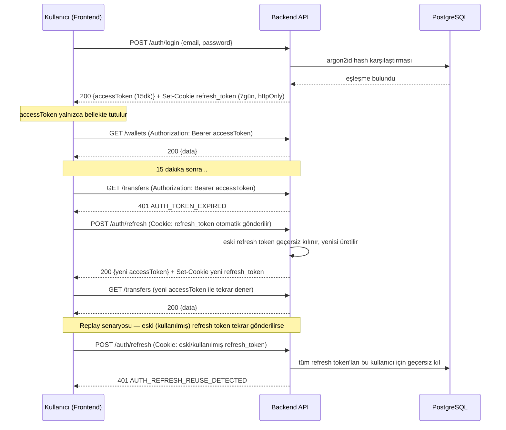
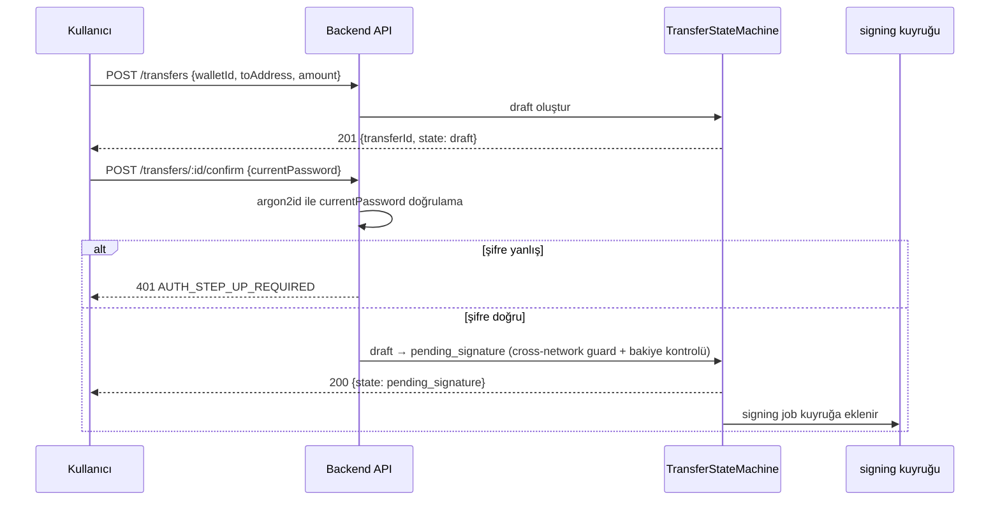

# 07. Güvenlik Implementasyonu — Vault

## İçindekiler

1. Güvenlik Hedef Seviyesi
2. Kimlik Doğrulama Akışı
3. Token/Session Yönetimi
4. Yetkilendirme Uygulaması
5. Veri Sınıflandırma ve Şifreleme
6. Input Validation ve Dosya Yükleme Güvenliği
7. HTTP Güvenlik Başlıkları
8. Rate Limiting ve Brute-force Koruması
9. Secrets Yönetimi
10. Audit Log
11. KVKK/GDPR Veri Hakları ve Saklama Süreleri
12. Incident Response ve Alarm Eşikleri
13. Güvenlik Checklist Özeti

---

## 1. Güvenlik Hedef Seviyesi

**Taban seviye: OWASP ASVS L1.** Gerekçe: Vault testnet-only, canlıya alınmayacak bir portföy/işe alım projesidir; gerçek kullanıcı verisi ve gerçek finansal değer taşımaz.

**Üç alanda L2'ye çıkılır:**
1. **Private key saklama ve kullanımı** — sistem kullanıcı adına imza atabildiği için taban seviye savunulamaz.
2. **Kimlik doğrulama ve session yönetimi** — bir hesabın ele geçirilmesi, o hesaba bağlı managed cüzdanların (ve dolayısıyla transfer yeteneğinin) ele geçirilmesi anlamına gelir.
3. **Transfer başlatma/yetkilendirme akışı** — zincire geri alınamaz bir işlem gönderen tek akıştır.

**Kapsam dışı bırakılanlar (bilinçli sınır):** Bankacılık seviyesi güvenlik, ISO 27001, SOC2 sertifikasyonu hedeflenmez; bu, agent'in ileride bu yönde kod/dokümantasyon üretmemesi için açık bir sınırdır.

**Threat model özeti:**
- **En kritik varlık:** Managed cüzdanların private key'leri (dolaylı olarak: bu key'leri şifreleyen `MASTER_ENCRYPTION_KEY` ve bu key'leri üreten `HD_WALLET_MNEMONIC` — bkz. §9).
- **En olası saldırı yüzeyi:** Çalıntı/ele geçirilmiş kullanıcı oturumu (XSS, token hırsızlığı) → step-up auth olmadan transfer denemesi; brute-force login denemesi; refresh token replay.
- **Kabul edilen risk:** Testnet varlıklarının gerçek parasal değeri olmadığından, bir cüzdanın ele geçirilmesinin somut maddi zararı yoktur — bu, üç L2 alanının seçilme gerekçesini zayıflatmaz (mimari olgunluk hedefi korunur) ama incident response'un neden hafif tutulduğunu açıklar (bkz. §12).
- **Kapsam dışı tehditler:** Mainnet'e yönelik saldırılar (sistem hiçbir koşulda mainnet'e bağlanmaz — bkz. §5), DDoS/yük saldırıları (deploy edilmediği için gerçekleşemez), üçüncü taraf tedarik zinciri saldırıları (bağımlılık taraması `pnpm audit` + Dependabot ile sınırlı, gelişmiş SAST MVP dışı).

---

## 2. Kimlik Doğrulama Akışı

**Login:** Kullanıcı email + şifre gönderir → backend `argon2id` ile hash karşılaştırması yapar → başarılıysa 15 dakikalık bir access token (JWT) ve `httpOnly`/`secure`/`SameSite=Strict` bir refresh cookie (7 gün) üretir → access token yanıt gövdesinde, refresh cookie `Set-Cookie` header'ında döner.

**Access token kullanımı:** Frontend, her isteğe `Authorization: Bearer <accessToken>` header'ı ekler; token yalnızca bellekte (React Context) tutulur, `localStorage`'a asla yazılmaz.

**Access token süresi dolduğunda:** İstemci `401 AUTH_TOKEN_EXPIRED` alır → otomatik olarak `POST /api/v1/auth/refresh`'i tetikler (refresh cookie tarayıcı tarafından otomatik gönderilir) → başarılıysa yeni bir access token alınır, orijinal istek otomatik tekrar denenir → refresh de başarısızsa kullanıcı oturum sonlandırılmış ekranına yönlendirilir.

**Refresh rotation:** Her başarılı `refresh` çağrısı, kullanılan refresh token'ı geçersiz kılar ve yenisini basar (rotating refresh token). Aynı (artık geçersiz) refresh token ikinci kez kullanılmaya çalışılırsa bu bir **replay saldırısı** olarak yorumlanır: o kullanıcıya ait **tüm** refresh token'lar geçersiz kılınır, kullanıcı tüm cihazlarda yeniden login olmaya zorlanır.

**Logout:** İstemci `POST /api/v1/auth/logout` çağırır → backend geçerli refresh token'ı geçersiz kılar → `Set-Cookie` ile cookie temizlenir → frontend bellekteki access token'ı ve tüm client-side cache'i (TanStack Query, AuthContext) temizler.

**Session sonlanması senaryoları:** (1) Kullanıcı bilinçli logout yapar, (2) refresh token 7 gün sonunda doğal olarak süresi dolar, (3) replay tespiti tüm oturumları zorla sonlandırır, (4) kullanıcı başka bir cihazdan logout yaparsa mevcut cihazdaki refresh token bir sonraki refresh denemesinde geçersiz bulunur (7 günlük TTL'in doğal sonucu, ayrı bir "diğer cihazları çıkış yaptır" özelliği MVP'de yoktur).

---

## 3. Token/Session Yönetimi

| Özellik | Access Token | Refresh Token |
| --- | --- | --- |
| Tip | JWT (imzalı, şifrelenmemiş payload) | Rastgele, yüksek entropili token (JWT olması gerekmez) |
| TTL | 15 dakika | 7 gün |
| Saklama yeri (istemci) | Bellek (React Context) — asla `localStorage`/`sessionStorage` | `httpOnly` + `secure` (varsayılan `true`; yalnızca `COOKIE_SECURE=false` ile yerel dev'de kapatılabilir, bkz. SEC-007) + `SameSite=Strict` cookie — JavaScript'ten erişilemez |
| Rotation | Yok (her 15 dakikada zaten yenilenir) | Var — her kullanımda eskisi geçersiz kılınır, yenisi basılır |
| Invalidation | Yapılamaz (stateless JWT, süresi dolana kadar geçerlidir) — bu nedenle TTL kısa tutulur | Veritabanında tutulan bir kayıt üzerinden anında geçersiz kılınabilir (logout, replay tespiti) |
| Payload içeriği | `userId`, `role`, `iat`, `exp` — hassas veri (email, private key referansı) taşımaz | Opak bir tanımlayıcı; payload içeriği istemciye anlam ifade etmez |

**Access token'ın kısa TTL'i bilinçli bir tasarımdır:** JWT stateless olduğundan sunucu tarafında tek tek iptal edilemez; bu riski sınırlamak için ömrü kısa tutulur — çalınan bir access token en fazla 15 dakika geçerlidir. Refresh token ise veritabanında (hash'lenmiş olarak) tutulduğundan anında iptal edilebilir; uzun ömürlü ama iptal edilebilir bir mekanizma olarak tasarlanmıştır. Bu şema `refresh_tokens` tablosudur (`docs/02_DATABASE_SCHEMA.md` §2.13; `mimari-kararlar.md` SEC-013) — `tokenHash`, `JWT_REFRESH_SECRET` anahtarıyla HMAC-SHA256 (argon2id değil, doğrudan lookup gerekir), rotation/logout/replay `revokedAt` alanını dolduran bir tombstone bırakır, satır silinmez.

**Neden `localStorage` değil bellek:** `localStorage`'a yazılan bir token, sayfadaki herhangi bir XSS açığı ile doğrudan okunabilir. Bellekte (React state/Context) tutulan bir token da XSS'e karşı mutlak korumalı değildir, ancak sayfa yenilendiğinde kaybolması ve doğrudan bir depolama API'siyle sorgulanamaması saldırı yüzeyini daraltır; asıl kalıcı oturum devamlılığı zaten `httpOnly` cookie üzerinden sağlandığından bellek kaybı kullanıcı deneyimini bozmaz (sayfa yenilendiğinde `refresh` otomatik tetiklenir).

---

## 4. Yetkilendirme Uygulaması

**Model:** Basit RBAC — yalnızca iki rol (`User`, `Admin`). ABAC gibi daha karmaşık bir model gerekmez; iki rol proje kapsamını tam karşılar.

**Zorlama katmanları (sırasıyla, her biri bir öncekini geçemeyeni durdurur):**
1. **Kimlik doğrulama guard'ı** — geçerli bir access token olmadan hiçbir korumalı endpoint'e erişilemez.
2. **Rol guard'ı** (`@Roles()` dekoratörü) — her endpoint'te zorunludur; endpoint'in gerektirdiği rol ile token'daki rol karşılaştırılır.
3. **Resource ownership kontrolü** — cüzdan ve transfer kaynaklarında, path'teki kaynağın `userId`'sinin token'daki `userId` ile eşleştiği ayrıca doğrulanır (bir `User`, doğru role sahip olsa da başkasının cüzdanına erişemez).
4. **İş kuralı seviyesi kontroller** — network/asset aktivasyon kontrolü, cross-network guard gibi domain'e özel yetki kuralları servis katmanında uygulanır.

**"Yalnızca backend'de zorlanır" ilkesi:** Cross-network guard ve network/asset aktivasyon kontrolü, frontend'de de UX amaçlı tekrarlanır (kullanıcı geçersiz bir seçenek göremez), ama bu **tek başına yeterli sayılmaz** — backend, frontend'in hiçbir doğrulaması olmadan gelen bir isteği varsayarak aynı kontrolleri sıfırdan uygular. Bu, defense-in-depth ilkesidir: UI kısıtı bir güvenlik sınırı değil, bir kullanılabilirlik iyileştirmesidir.

**Deny davranışı:** Yetkisiz bir erişim denemesinde her zaman `403` (kimliği doğrulanmış ama yetkisi olmayan istek) veya `401` (kimliği doğrulanmamış istek) döner; kaynağın var olup olmadığı bilgisi sızdırılmaz — bir kullanıcı başka birinin cüzdanına `GET /wallets/:id` ile eriştiğinde `404` değil `403 FORBIDDEN_NOT_OWNER` döner (kaynağın var olduğunu gizlemenin somut bir güvenlik faydası bu senaryoda yoktur — cüzdan id'leri zaten tahmin edilemez UUID'dir — ama tutarlı bir deny davranışı, hangi hata kodunun ne anlama geldiğini agent ve frontend için öngörülebilir kılar).

**Step-up authentication (transfer yetkilendirme akışı):** Bir transferin `draft`'tan `pending_signature`'a geçmesi, normal oturum yetkilendirmesinin ötesinde ek bir doğrulama gerektirir — kullanıcı mevcut şifresini tekrar girer, backend bu şifreyi doğrulamadan geçişe izin vermez. Bu, çalınmış bir access token'ın (oturum açık kalmış bir tarayıcı, XSS ile ele geçirilmiş bir token) tek başına gerçek bir transfer başlatmaya yetmemesini sağlar. Bu adım, MVP dışı bırakılan TOTP/SMS tabanlı gerçek 2FA'nın yerini tutmaz — yalnızca re-authentication'dır, ayrı bir ikinci faktör (telefon, authenticator app) gerektirmez.

---

## 5. Veri Sınıflandırma ve Şifreleme

| Veri sınıfı | Örnek | Koruma |
| --- | --- | --- |
| Kimlik bilgisi (yüksek hassasiyet) | `password_hash` | argon2id ile hash'lenir (tersine çevrilemez); API yanıtında hiçbir zaman döndürülmez |
| Private key materyali (en yüksek hassasiyet) | `wallets.encrypted_private_key`, `wallets.encrypted_dek` | Envelope encryption — bkz. aşağıdaki alt bölüm |
| Kişisel veri (düşük hassasiyet — sistemde gerçek PII yok) | `users.email` | Erişim, kimlik doğrulama + rol kontrolüyle sınırlanır; ayrıca şifrelenmez (login için gerekli, KVKK kapsamı zaten minimal) |
| İşlem verisi (hassas değil) | `transfers.amount`, `chain_movements` | Şifrelenmez; erişim RBAC + ownership ile sınırlanır |
| Denetim verisi (bütünlüğü önemli, gizliliği düşük) | `audit_logs` | Şifrelenmez; yalnızca `Admin` rolü okuyabilir |

**Envelope encryption tasarımı (private key koruması):** Her managed cüzdanın private key'i kendine özel bir DEK (Data Encryption Key) ile **AES-256-GCM** kullanılarak şifrelenir; bu ciphertext `wallets.encrypted_private_key` alanında saklanır. Bu DEK'in kendisi, uygulama dışında (env değişkeninde tutulan, hiçbir zaman log'a yazılmayan) tek bir **master key** (`MASTER_ENCRYPTION_KEY`) ile ayrıca şifrelenip `wallets.encrypted_dek` alanında saklanır — iki katman, iki kolon (`docs/02_DATABASE_SCHEMA.md` §6).

**Decrypt akışının sınırları:**
- Decrypt işlemi **yalnızca imzalama worker'ının bellek-içi akışında** gerçekleşir.
- Çözülmüş private key hiçbir veritabanı kolonunda, cache'te, log satırında veya API yanıtında persist edilmez.
- İmzalama işlemi bittiğinde bellekteki referans bırakılır; ayrıca bir "secure wipe" mekanizması (bellek sıfırlama) MVP'de yoktur — bu, Node.js'in çöp toplayıcısına bırakılan, kabul edilmiş bir kalıntı risktir ve proje ölçeğinde over-engineering sayılan bir HSM/güvenli enklav çözümü gerektirmez.
- Admin panelinden bu alana erişen hiçbir endpoint yoktur; Admin cüzdan sahiplik/bakiye bilgisini görür ama private key materyaline hiçbir yoldan ulaşamaz.

**Master key rotasyonu:** MVP'de manuel bir prosedürle yapılır (yeni master key üretilir, tüm `encrypted_dek` değerleri yeni master key ile yeniden şifrelenir, eski master key imha edilir). Otomatik zamanlanmış rotasyon MVP kapsamı dışıdır — bu, sistemin küçük ölçeği ve deploy edilmeyen doğası nedeniyle şu an gerçek bir operasyonel ihtiyaç yaratmaz; ileride gerçek bir üretim ortamına taşınırsa yeniden değerlendirilmesi gereken bir karardır.

**Cloud KMS/HSM kullanılmaz** — proje ölçeği için over-engineering olur; tek master key + envelope encryption, testnet-only bir demo sistemi için yeterli bir güvenlik/karmaşıklık dengesidir.

---

## 6. Input Validation ve Dosya Yükleme Güvenliği

**Input validation:** Her endpoint, `packages/types`'ta tanımlı `zod` şemalarını çalıştıran bir `ValidationPipe` arkasındadır; pipe `whitelist:true, forbidNonWhitelisted:true` ile yapılandırılır — şemada tanımlanmamış bir alan istekte gelirse tüm istek `400 VALIDATION_FAILED` ile reddedilir, sessizce yok sayılmaz (mass assignment saldırılarına karşı koruma). Adres alanları (cüzdan adresi, transfer hedef adresi) ayrıca ağa özel format doğrulamasından geçer (EIP-55 checksum veya base58check) — bu, hem veri bütünlüğü hem de yanlış ağa/adrese yanlışlıkla fon gönderilmesini önleyen bir güvenlik kontrolüdür.

**SQL injection:** Prisma ORM parametreli sorgular kullandığından ham SQL string birleştirme yapılmaz; herhangi bir endpoint'te raw SQL gerekiyorsa (yoktur, ama gelecekte eklenirse) yalnızca Prisma'nın parametreli `$queryRaw` template literal'i kullanılır, string interpolation yasaktır.

**Dosya yükleme güvenliği: uygulanmaz.** Sistemde hiçbir endpoint dosya yükleme kabul etmez (Doküman Yönetimi bölümü proje kapsamı dışıdır); bu nedenle dosya tipi doğrulama, boyut sınırlama, virüs tarama gibi kontroller tasarlanmaz — bu bir eksiklik değil, kapsamın doğal sonucudur.

---

## 7. HTTP Güvenlik Başlıkları

NestJS `helmet` middleware'i tüm yanıtlara aşağıdaki başlıkları ekler:

- **HSTS** (`Strict-Transport-Security`) — tarayıcıyı yalnızca HTTPS üzerinden bağlanmaya zorlar (lokal geliştirmede HTTP üzerinden çalışıldığından bu başlık `production`-benzeri bir ortamda anlam kazanır; yine de middleware her ortamda aktif bırakılır, davranışı ortama göre koşullu hale getirilmez).
- **CSP** (`Content-Security-Policy`) — script/style kaynaklarını `self` ile sınırlar, inline script'e izin vermez (XSS yüzeyini daraltır).
- **X-Content-Type-Options: nosniff** — tarayıcının MIME type'ı tahmin ederek yanlış yorumlamasını engeller.
- **X-Frame-Options: DENY** — sayfanın bir `iframe` içine gömülerek clickjacking saldırısına konu olmasını engeller.

**CORS:** Yalnızca frontend'in origin'ine (`CORS_ORIGIN` env değişkeni) izin verilir; diğer origin'lerden gelen istekler tarayıcı tarafından bloklanır. `credentials: true` ayarlanır (cookie tabanlı refresh akışı için gereklidir), bu nedenle `origin: '*'` asla kullanılmaz — spesifik bir origin whitelist'i zorunludur.

**CSRF koruması:** `SameSite=Strict` refresh cookie'si, cross-site isteklerin cookie'yi otomatik taşımasını zaten engeller. Buna ek olarak, state değiştiren tüm isteklerde (`POST`/`PATCH`/`DELETE`) `X-Requested-With: XMLHttpRequest` custom header'ı zorunludur; bu header'ı taşımayan istek, cookie geçerli olsa dahi reddedilir — tarayıcılar cross-origin form submit'lerinde custom header ekleyemediğinden bu, klasik CSRF saldırı vektörünü kapatır.

---

## 8. Rate Limiting ve Brute-force Koruması

NestJS `@nestjs/throttler` ile uygulanır. En kritik eşik login endpoint'idir: `IP + email` bileşik anahtarıyla 15 dakikada 5 deneme sınırı — yalnızca `IP` bazlı bir sınır, dağıtık (çoklu IP'den) bir brute-force denemesine karşı yetersiz kalırdı; `email` bileşeni eklenerek belirli bir hesabın hedef alınması da ayrıca sınırlanır. Eşik aşıldığında `429 RATE_LIMIT_EXCEEDED` döner ve bu durum `LOGIN_FAILED` audit kaydına `metadata: { reason: 'rate_limited' }` ile yansır.

Diğer endpoint grupları için de eşikler tanımlıdır (register, transfer oluşturma/onaylama, admin mint, genel authenticated istekler) — bunların tam listesi ve sayısal değerleri API sözleşmesinde tutulur; burada güvenlik açısından önemli olan ilke şudur: **her state değiştiren endpoint bir rate limit eşiğine sahiptir**, sınırsız bırakılan hiçbir yazma endpoint'i yoktur.

**Brute-force koruması yalnızca rate limit ile sınırlı değildir:** argon2id'nin kendisi hesaplama maliyeti yüksek bir hash algoritması olduğundan (brute-force'u yavaşlatır), rate limit ile birleştiğinde bir saldırganın makul sürede anlamlı sayıda şifre denemesi yapması pratikte engellenir. Hesap kilitleme (bir eşik sonrası hesabı geçici/kalıcı kilitleme) MVP'de ayrı bir mekanizma olarak yoktur — rate limit zaten aynı amacı, kullanıcıyı kalıcı olarak kilitleme riski taşımadan (bir saldırganın başkasının hesabını kasıtlı olarak kilitlemesi mümkün olmadan) karşılar.

---

## 9. Secrets Yönetimi

Tüm secret değerler (JWT imzalama anahtarları, master encryption key, RPC/Alchemy/TronGrid/CoinGecko API key'leri) `apps/api/.env` dosyasında tutulur; bu dosya `.gitignore`'dadır, versiyon kontrolüne asla eklenmez. Ayrı bir secret manager (Vault by HashiCorp, AWS Secrets Manager vb.) kurulmaz — sistem hiçbir ortama deploy edilmediğinden, bu tür bir merkezi secret dağıtım ihtiyacı gerçekleşmez; lokal/demo ortamı için `.env` yeterlidir.

**En kritik secret'lar:** `MASTER_ENCRYPTION_KEY` (envelope encryption'ın master key'i) ve `HD_WALLET_MNEMONIC` (managed cüzdan türetmesinin BIP-39 kök seed'i — bkz. `docs/04_BACKEND_SPEC.md` §10). İkisi de eşit hassasiyettedir: `HD_WALLET_MNEMONIC`'in sızması, henüz türetilmemiş dahil tüm managed cüzdanların private key'lerinin yeniden hesaplanabilmesi anlamına gelir; `MASTER_ENCRYPTION_KEY`'in sızması ise yalnızca zaten var olan `encrypted_dek` kayıtlarının çözülebilmesi anlamına gelir — ikisi birlikte tam bir custody ele geçirme senaryosu oluşturur, bu yüzden aynı koruma seviyesiyle ele alınır:
- Uygulama başlangıcında bir kez okunur, bellekte tutulur, hiçbir log satırına yazılmaz (pino `redact` konfigürasyonuyla path bazlı dışlanır).
- API yanıtlarının hiçbirinde döndürülmez.
- Geliştirici makineleri arasında paylaşılması gerekiyorsa (ör. seed edilmiş demo verisiyle çalışmak için) güvenli bir kanaldan (şifreli mesajlaşma, paylaşılan bir password manager) iletilir, asla düz metin olarak (email, chat, commit mesajı) paylaşılmaz — bu bir agent kuralı değil, ekip pratiğidir ve bu dokümanda not düşülür çünkü ihlali doğrudan tüm managed cüzdanların ele geçirilmesi anlamına gelir.

`.env.example` dosyası, gerçek değerler olmadan tüm değişken adlarını listeler ve versiyon kontrolüne eklenir; yeni bir geliştirici bu dosyayı kopyalayıp kendi değerlerini doldurur.

---

## 10. Audit Log

**Loglanan olaylar:** Kullanıcı login/login-failed; transfer durum geçişleri (asıl kaynak `transfer_state_events` tablosudur, audit'in bir alt-kümesi olarak burada da temsil edilir); admin network/asset aktivasyon değişiklikleri; admin mint işlemleri; managed cüzdan oluşturma.

**Şema:** `audit_logs { id, actorType ('user'|'admin'|'system'), actorId, action, entityType, entityId, metadata (json), createdAt }` — append-only, hiçbir satır güncellenmez veya silinmez.

**Kim görür:** Yalnızca `Admin` rolü, salt-okunur bir ekrandan; hiçbir `User` kendi veya başkasının audit kaydına erişemez (bu, kullanıcının kendi eylemlerini gizlemeye çalışmasını değil, denetim verisinin bütünlüğünü korumayı amaçlar).

**Tamper-evidence yoktur.** Chain-hash zinciri (her kaydın bir öncekinin hash'ini taşıdığı, geriye dönük değişikliği matematiksel olarak tespit edilebilir kılan bir yapı) MVP'de uygulanmaz. Gerekçe: bu, gerçek kullanıcı verisi taşımayan, yayına alınmayacak bir demo projesinde over-engineering olur — audit log'un temel amacı (kim ne yaptı sorusuna cevap vermek) append-only tasarımla zaten karşılanır; kriptografik değiştirilemezlik garantisi, gerçek bir düzenleyici denetim ihtiyacı olmadan eklenmez.

**Retention:** Otomatik silme yoktur; demo veri seti küçük kaldığından bir saklama süresi politikası tanımlanmaz.

---

## 11. KVKK/GDPR Veri Hakları ve Saklama Süreleri

**Kapsam minimaldir.** Sistemde gerçek kullanıcı ve gerçek kişisel veri (PII) bulunmaz; saklanan tek kişisel veri email adresi ve argon2id ile hash'lenmiş şifredir. Bu nedenle kurumsal ölçekte bir veri işleme envanteri, veri işleme sözleşmesi (DPA) veya aydınlatma metni süreci kurulmaz — bunlar gerçek kullanıcı verisi işleyen bir üretim sistemi için anlamlıdır, demo/portföy projesinde over-engineering olur.

**Veri hakları (asgari, iyi pratik olarak):**
- Kullanıcı kendi email adresini görüntüleyebilir (profil bilgisi olarak, ayrı bir "veri indir" akışı MVP'de yoktur).
- Hesap silme akışı MVP'de yoktur — sistemde hiçbir entity için soft-delete veya silme akışı tasarlanmamıştır; bu, projenin demo doğası ve silme akışının denetlenebilirlikle çelişmesi (bir kullanıcı silinirse transfer geçmişinin bütünlüğü bozulur) nedeniyle bilinçli bir sınırdır.

**Saklama süreleri:** Hiçbir tabloda otomatik silme/retention politikası yoktur (kullanıcı verisi, transfer geçmişi, audit log, bildirimler dahil); demo veri seti küçük kaldığından bu bir operasyonel yük yaratmaz. Gerçek bir üretim ortamına taşınması durumunda (kapsam dışı bir senaryo) bu politika yeniden değerlendirilmesi gereken ilk maddelerden biri olurdu.

---

## 12. Incident Response ve Alarm Eşikleri

Sistem hiçbir ortama deploy edilmediğinden (yalnızca lokal Docker Compose), 7/24 izleme, sayfalama (paging), formal bir incident response süreci veya SLA'ya bağlı alarm sistemi kurulmaz — bunlar bir üretim ortamı için anlamlıdır, bu projede karşılığı yoktur. Merkezi log toplama (ELK/Datadog vb.) ve monitoring/alerting altyapısı bilinçli olarak MVP kapsamı dışıdır.

Bunun yerine sistem, belirli tehdit senaryolarına **kod seviyesinde otomatik tepki** verecek şekilde tasarlanır — "insan operatörün alarm görüp müdahale etmesi" yerine "sistemin kendi kendini koruması" modeli benimsenir:

| Senaryo | Otomatik tepki |
| --- | --- |
| Brute-force login denemesi | Rate limiter `429` ile isteği durdurur, `LOGIN_FAILED` audit kaydı düşülür |
| Refresh token replay | Kullanıcının tüm oturumları anında geçersiz kılınır, yeniden login zorunlu kılınır |
| Mainnet chain ID'sine bağlanma denemesi | `IChainProvider` başlatılırken allowlist kontrolü bağlantıyı reddeder, uygulama bu bağlantıyı hiç kuramaz |
| Yetkisiz kaynak erişimi (rol veya sahiplik ihlali) | `403` ile istek durdurulur; tekrarlanan denemeler ayrıca rate limit'e takılır |
| Terminal durumdaki bir transfer üzerinde tekrar işlem denemesi | `TransferStateMachine` geçişi reddeder, state değişmez |

Structured log'lar (pino, stdout) geliştirme sürecinde manuel olarak incelenebilir hale getirilir; bu, otomatik bir alarm eşiği değil, geliştiricinin `docker-compose logs` ile erişebildiği bir gözlemlenebilirlik asgarisidir.

---

## 13. Güvenlik Checklist Özeti

Bu altı madde, her kod değişikliğinde geçerliliği kontrol edilmesi gereken, yukarıdaki bölümlerden distile edilmiş çekirdek kuraldır:

1. **Private key hiçbir zaman düz metin persist edilmez veya loglanmaz.** Decrypt yalnızca imzalama worker'ının bellek-içi akışında olur; `MASTER_ENCRYPTION_KEY`, `encrypted_dek`, çözülmüş key değeri hiçbir log satırına, API yanıtına veya cache'e yazılmaz.
2. **Access token yalnızca bellekte tutulur, `localStorage`'a asla yazılmaz.** Refresh token yalnızca `httpOnly`/`secure`/`SameSite=Strict` cookie'de taşınır ve her kullanımda rotate edilir.
3. **Transfer başlatma (`draft → pending_signature`) step-up authentication (şifre tekrarı) olmadan gerçekleşemez.**
4. **Cross-network guard ve network/asset aktivasyon kontrolü yalnızca backend'de zorlanır**; frontend kontrolü tek başına yeterli sayılmaz.
5. **Her state değiştiren endpoint bir rate limit eşiğine sahiptir**; login özelinde `IP + email` bileşik anahtarıyla brute-force koruması zorunludur.
6. **Mainnet'e bağlanan hiçbir kod yolu yoktur.** `IChainProvider` başlatılırken chain ID allowlist kontrolü zorunludur; bu allowlist genişletilmez.
