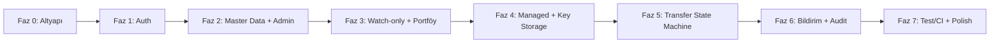

# 10. Uygulama Yol Haritası — Vault

## İçindekiler

1. Çalışma Modeli
2. Faz Listesi ve Bağımlılık Sırası
3. Faz Detayları
   - Faz 0 — Altyapı ve Monorepo Temeli
   - Faz 1 — Kimlik Doğrulama ve Roller
   - Faz 2 — Network/Asset Master Data ve Admin Temeli
   - Faz 3 — Watch-only Cüzdan ve Salt-okunur Portföy
   - Faz 4 — Managed Cüzdan ve Key Storage
   - Faz 5 — Transfer State Machine Uçtan Uca
   - Faz 6 — Bildirim, Audit ve Admin Görünürlüğü
   - Faz 7 — Test/CI Sıkılaştırma ve Polish
4. Human Gate Noktaları
5. Risk Kaydı
6. Teknik Borç Kaydı
7. Başarı Metrikleri
8. Doküman Yaşam Döngüsü

---

## 1. Çalışma Modeli

Geliştirme, **faz → alt madde → iterasyon** hiyerarşisiyle ilerler. Her faz (`Faz N`) bir işlevsel kilometre taşını temsil eder; her faz kendi içinde `§N.1, §N.2, …, §N.K` şeklinde numaralanmış alt maddelere bölünür. **Bir alt madde, tek bir agent oturumunun (1 chat) ürettiği, tek bir PR'a karşılık gelen en küçük teslim birimidir** — "1 chat ≈ 1 PR" ilkesi budur.

Bir alt madde şu döngüyü izler:
1. Agent oturumu başlar, ilgili alt maddenin kapsamını (bu dokümandaki tanımdan) okur.
2. Agent değişikliği yapar, kendi branch'inde commit'ler, lokal testleri çalıştırır.
3. Agent bir PR açar, değişikliği özetler.
4. Kullanıcı inceler ve açıkça onay verir.
5. PR, CI gate'i geçtikten sonra `main`'e merge edilir.

Bir alt madde tamamlanmadan bir sonrakine geçilmez; bir fazın tüm alt maddeleri tamamlanmadan bir sonraki faz başlatılmaz (bağımlılık sırası §2'de tanımlıdır). Bu disiplin, her PR'ın küçük ve incelenebilir kalmasını, ve bir sorunun kaynağının (hangi alt madde) her zaman net olmasını sağlar.

**Agent oturumu başına bağlam:** Her oturum, yalnızca üzerinde çalıştığı alt maddenin tanımını ve o alt maddenin bağımlı olduğu önceki alt maddelerin çıktısını (kod tabanının mevcut durumunu) bağlam olarak alır; tüm roadmap'i veya tüm önceki fazların tam detayını yeniden okumaz — bu, önceki dokümanlar için de geçerli olan bağlam disiplininin faz yürütme sürecindeki karşılığıdır.

---

## 2. Faz Listesi ve Bağımlılık Sırası

Sekiz faz vardır; sıra bağımlılık zoruyladır — bir faz, kendinden öncekinin ürettiği temel üzerine kurulur ve önceki tamamlanmadan başlatılamaz.

| Faz | Başlık | Bağımlı olduğu faz | Neden bu sırada |
| --- | --- | --- | --- |
| 0 | Altyapı ve Monorepo Temeli | — | Diğer her fazın üzerine kurulduğu iskelet (monorepo, Docker Compose, CI, temel şema). |
| 1 | Kimlik Doğrulama ve Roller | Faz 0 | Her sonraki endpoint auth guard'ına bağımlıdır; auth olmadan hiçbir korumalı akış test edilemez. |
| 2 | Network/Asset Master Data ve Admin Temeli | Faz 1 | Cüzdan ekleme, aktif bir `(network, asset)` çiftine bağımlıdır (§4 Yetkilendirme Mimarisi kuralı); admin rolü ve panel iskeleti burada kurulur. |
| 3 | Watch-only Cüzdan ve Salt-okunur Portföy | Faz 2 | En düşük riskli cüzdan tipiyle (private key yok) portföy okuma zincirini (worker → cache → UI) kurar; managed cüzdan ve transferden önce bu temel doğrulanmalıdır. |
| 4 | Managed Cüzdan ve Key Storage | Faz 3 | Managed cüzdan, watch-only'nin üzerine private key şifreleme katmanını ekler; watch-only akışı zaten çalışır durumda olmalı. |
| 5 | Transfer State Machine Uçtan Uca | Faz 4 | Transfer, yalnızca managed cüzdandan yapılabildiğinden Faz 4'ün private key altyapısına bağımlıdır; en yüksek riskli fazdır. |
| 6 | Bildirim, Audit ve Admin Görünürlüğü | Faz 5 | Bildirim tetikleyicileri (tx confirmed/failed) ve audit olaylarının çoğu (transfer geçişleri, mint) Faz 5'in ürettiği olaylara bağımlıdır. |
| 7 | Test/CI Sıkılaştırma ve Polish | Faz 0-6 (tümü) | Coverage hedefleri ve e2e senaryoları, test edilecek tüm işlevin var olmasını gerektirir; sistem hata ekranları (404/500/403) ve a11y geçişi tüm ekranlar üretildikten sonra bütünsel olarak ele alınır. |

Fazlar arasında paralelleştirme yapılmaz — her faz tek bir agent oturumu zincirinde sırayla ilerler; bir fazın alt maddeleri arasında da (örn. §3.1 tamamlanmadan §3.2 başlamaz) aynı sıralı disiplin geçerlidir, çünkü çoğu alt madde bir öncekinin ürettiği tablo/endpoint'e bağımlıdır.

---

## 3. Faz Detayları

### Faz 0 — Altyapı ve Monorepo Temeli ✅ Tamamlandı (2026-08-26)

**§0.1 — Monorepo iskeleti.** Turborepo kurulumu; `apps/web` (Next.js App Router), `apps/api` (NestJS), `packages/types`, `packages/chain-providers`, `packages/config` boş ama derlenebilir paketler olarak oluşturulur. Kök `pnpm-lock.yaml`, paylaşılan ESLint/TS config'leri.

**§0.2 — Docker Compose ve env iskeleti.** `docker-compose.yml` (Postgres 16, Redis 7, `apps/api`, `apps/web`); `apps/api/.env.example` tüm değişken adlarıyla (değersiz) oluşturulur; env şeması (zod) fail-fast doğrulamayla kurulur.

**§0.3 — Prisma şema iskeleti ve ilk migration.** `users`, `networks`, `assets`, `network_assets` tabloları (yalnızca bu dört tablo — diğerleri ilgili fazlarda eklenir); isimlendirme konvansiyonu (snake_case tablo/kolon, UUID PK) buradan itibaren tüm sonraki migration'larda korunur.

**§0.4 — CI pipeline.** GitHub Actions: lint → typecheck → test (henüz test yoksa boş geçer) → build; branch protection kuralı `main`'e doğrudan push'u engelleyecek şekilde kurulur.

**§0.5 — Seed script iskeleti.** `apps/api/prisma/seed.ts`, idempotent upsert kalıbıyla, şu an için boş bir yapı (Faz 2'de network/asset verisiyle doldurulacak).

**İnsan onay noktası:** Faz 0 sonunda `docker-compose up` ile tüm sistemin (henüz işlevsiz de olsa) ayağa kalktığı ve CI'ın yeşil olduğu doğrulanır. ✅ Doğrulandı — `feat/seed-script-skeleton` PR'ı (§0.5).

### Faz 1 — Kimlik Doğrulama ve Roller

**§1.1 — Kullanıcı modeli ve şifre hash'leme.** `users` tablosu tam alanlarıyla (`email`, `password_hash`, `role`); argon2id hash servisi.

**§1.2 — Register ve login endpoint'leri.** `POST /auth/register`, `POST /auth/login`; DTO validasyonu (zod, `packages/types`), email benzersizlik kontrolü.

**§1.3 — JWT access token ve refresh cookie.** Access token üretimi (15dk TTL), `httpOnly`/`secure`/`SameSite=Strict` refresh cookie (7 gün); `POST /auth/refresh` ile rotation.

**§1.4 — Refresh replay tespiti.** Kullanılmış bir refresh token'ın tekrar kullanılması durumunda kullanıcının tüm oturumlarının geçersiz kılınması.

**§1.5 — Auth guard ve role guard.** `JwtAuthGuard`, `RolesGuard` (`@Roles()` dekoratörü); `POST /auth/logout`.

**§1.6 — Login rate limiting.** `IP + email` bileşik anahtarıyla brute-force koruması (15 dakikada 5 deneme).

**§1.7 — Frontend auth akışı.** S-AUTH-LOGIN, S-AUTH-REGISTER ekranları; `AuthContext` (access token yalnızca bellekte); route middleware (korumalı route yönlendirmesi); S-SESSION-EXPIRED, S-LOGOUT-CONFIRM.

**İnsan onay noktası:** Faz 1 sonunda uçtan uca bir kullanıcı kayıt olup giriş yapabiliyor, access token süresi dolduğunda otomatik refresh çalışıyor, replay senaryosu integration testiyle doğrulanmış olmalı.

### Faz 2 — Network/Asset Master Data ve Admin Temeli

**§2.1 — Network/Asset şeması ve seed verisi.** `networks`, `assets`, `network_assets` tabloları tam alanlarıyla; seed script'i üç ağı (Sepolia, BSC Testnet, Tron Shasta), native varlıkları ve mock USDT'yi (her ağda ayrı `Asset` kaydı) `is_active = true` olarak yazacak şekilde genişletilir.

**§2.2 — Public okuma endpoint'leri.** `GET /networks`, `GET /networks/:networkId/assets`.

**§2.3 — Admin aktivasyon endpoint'i.** `PATCH /admin/network-assets/:networkId/:assetId`; bu alt maddede ayrıca `audit_logs` tablosu ilk kez oluşturulur ve bu endpoint'in yazdığı `NETWORK_ASSET_ACTIVATED`/`DEACTIVATED` kaydı, transaction içinde atomik yazım örneği olarak kurulur (sonraki tüm audit yazımları bu kalıbı tekrar kullanır).

**§2.4 — Admin layout ve S-ADMIN-NETWORK-ASSETS.** Admin nav bar'ı, admin route guard'ı (rol kontrolü); ağ/varlık aktivasyon ekranı.

**§2.5 — IChainProvider arayüzü ve chain ID allowlist.** `EvmProvider`/`TronProvider` sınıf iskeletleri (henüz gerçek RPC çağrısı yapmadan); provider başlatılırken `CHAIN_ID_ALLOWLIST` kontrolü — mainnet chain ID'siyle başlatma denemesi burada ilk kez reddedilir ve bir unit testle kanıtlanır.

**İnsan onay noktası:** Faz 2 sonunda Admin, bir `(network, asset)` çiftini pasif yapabiliyor ve bu değişiklik `audit_logs`'a yazılıyor; mainnet allowlist reddi testle doğrulanmış olmalı.

### Faz 3 — Watch-only Cüzdan ve Salt-okunur Portföy

**§3.1 — Wallets şeması ve watch-only oluşturma.** `wallets` tablosu tam alanlarıyla; `POST /wallets/watch-only` — ağa özel adres format doğrulama (EIP-55 checksum / base58check), `(network, asset)` aktiflik kontrolü.

**§3.2 — Balance-sync worker.** BullMQ `balance-sync` kuyruğu; her aktif cüzdan/varlık çifti için RPC/Alchemy/TronGrid'den bakiye okuyup `balance_caches`'e yazan periyodik worker.

**§3.3 — Price-sync worker.** CoinGecko entegrasyonu, mainnet sembolüne map (`packages/types`'ta statik tablo), 60 saniyelik Redis cache.

**§3.4 — Portföy ve cüzdan okuma endpoint'leri.** `GET /wallets`, `GET /wallets/:id`, `GET /portfolio/summary`, `GET /portfolio/history`; USDT karşılığı hesaplama (`ETH/USDT = (ETH/USD) ÷ (USDT/USD)`); periyodik `portfolio-snapshot` worker'ı, kullanıcı portföylerinin USDT toplamını hesaplayıp yeni `portfolio_snapshots` tablosuna (`docs/02_DATABASE_SCHEMA.md` §2.14) yazar — geçmiş grafiği bu snapshot'lardan okunur, sorgu anında yeniden hesaplanmaz (`mimari-kararlar.md` P-016). Kapsamın genişliği nedeniyle bu alt madde iki iterasyona bölünür: cüzdan okuma endpoint'leri (§3.4a) ve portföy özet/geçmiş endpoint'leri + `portfolio-snapshot` worker (§3.4b).

**§3.5 — Frontend: cüzdan ve dashboard ekranları.** S-DASHBOARD, S-WALLET-LIST, S-WALLET-DETAIL, S-WALLET-ADD-WATCHONLY; `UsdtValue`, `TestnetDisclaimer` ortak bileşenleri. `TestnetDisclaimer` Faz 2 §2.4'ten beri `(admin)` layout'unda kullanımdadır (dosyası o iterasyonda erken oluşturulmuştur); bu alt madde onu ilk kez `(authenticated)` layout'una bağlar, dosya henüz yoksa oluşturur. Kapsamın genişliği nedeniyle iki iterasyona bölünür: dashboard + cüzdan listesi (§3.5a) ve cüzdan detay + watch-only ekleme (§3.5b).

**§3.6 — Movement-index worker ve hareket geçmişi.** `chain_movements` tablosu; Alchemy webhook alıcı endpoint'i (EVM) + Tron polling worker; `GET /movements`; S-MOVEMENTS ekranı. `GET /movements` bu fazda yalnızca `source: 'chain'` döner — `transfers` tablosu henüz yoktur (Faz 5 §5.1), `source: 'system'` birleşimi ancak o fazdan sonra eklenir. Kapsamın genişliği (şema + webhook + worker + endpoint / ekran) nedeniyle backend (§3.6a) ve frontend (§3.6b) ayrı iterasyonlara bölünür.

**İnsan onay noktası:** Faz 3 sonunda bir watch-only cüzdan eklenip gerçek bir Sepolia testnet adresinin bakiyesi ve hareket geçmişi doğru şekilde görüntülenebiliyor olmalı — bu, ilk gerçek testnet entegrasyon doğrulamasıdır.

### Faz 4 — Managed Cüzdan ve Key Storage

**§4.1 — Envelope encryption servisi.** DEK üretimi, AES-256-GCM ile private key şifreleme, master key ile DEK şifreleme (`MASTER_ENCRYPTION_KEY` env değişkeni); bu alt madde, %80 coverage hedefine tabi kritik modüllerden biridir ve kendi unit test setiyle birlikte teslim edilir.

**§4.2 — HD wallet türetme ve managed cüzdan oluşturma.** `m/44'/<coinType>'/0'/0/<index>` türetme mantığı; `POST /wallets/managed`; private key'in hiçbir API yanıtında dönmediğinin testle doğrulanması.

**§4.3 — Frontend: S-WALLET-ADD-MANAGED.** Yönetilen cüzdan oluşturma formu ve akışı.

**§4.4 — Mock kontrat deploy ve admin mint.** Mock ERC-20/TRC-20 kontratlarının Sepolia/BSC Testnet/Tron Shasta'ya deploy edilmesi (deploy script'i, kontrat adreslerinin `assets.contract_address`'e yazılması); `mint_operations` tablosu; `POST /admin/mint`; S-ADMIN-MINT ekranı. Kapsamın genişliği (yeni bir `packages/contracts` workspace'i + backend endpoint'i + frontend ekranı — üç farklı katman) nedeniyle bu alt madde üç iterasyona bölünür: mock kontrat + deploy altyapısı (§4.4a — `docs/mimari-kararlar.md` TS-008), `mint_operations` + `POST /admin/mint` + `GET /admin/users` (kullanıcı arama, daha önce hiçbir fazda tanımlanmamıştı) (§4.4b), S-ADMIN-MINT ekranı (§4.4c). S-ADMIN-MINT'in kullanıcı/cüzdan seçim akışı, Faz 3 §3.4a'da zaten Admin-farkında (`?userId=`) olarak teslim edilmiş `GET /wallets` endpoint'ini kullanır (`docs/03_API_CONTRACTS.md` §5.2) — Faz 6 §6.4'ten hiçbir endpoint öne çekilmez, bkz. Faz 6 §6.4 notu.

**İnsan onay noktası:** Faz 4 sonunda bir yönetilen cüzdan oluşturulabiliyor, private key'in hiçbir katmanda düz metin olarak sızmadığı (log, API yanıtı, DB) manuel ve otomatik testle doğrulanmış olmalı — bu, projenin en hassas güvenlik kontrol noktasıdır ve kullanıcı onayı özellikle bu noktada beklenir.

### Faz 5 — Transfer State Machine Uçtan Uca

**§5.1 — Transfer şeması ve draft oluşturma.** `transfers`, `transfer_state_events` tabloları; `TransferStateMachine` servisi (yalnızca `draft` girişi); `POST /transfers` + `Idempotency-Key` desteği.

**§5.2 — Cross-network guard ve step-up auth.** `POST /transfers/:id/confirm` — şifre tekrar doğrulama, cross-network guard, bakiye yeterliliği kontrolü, `draft → pending_signature` geçişi.

**§5.3 — Signing worker.** BullMQ `signing` kuyruğu; private key'in yalnızca bellek-içi akışta decrypt edilip raw tx'in imzalanması; `pending_signature → signed`.

**§5.4 — Broadcast worker.** `IChainProvider.broadcastTransaction()`; `signed → broadcast`; RPC hata sınıflandırması (kalıcı → `failed`, geçici → exponential backoff retry).

**§5.5 — Confirmation worker.** Blok derinliği izleme, ağa özel N-blok eşiği (Sepolia 12, BSC Testnet 15, Tron Shasta 19); `broadcast → confirming → confirmed/dropped/failed`; reorg toleransı.

**§5.6 — Frontend: transfer akışı.** S-TRANSFER-NEW, S-TRANSFER-CONFIRM, S-TRANSFER-DETAIL (5 saniyelik polling, 8 durumun TR badge karşılığı); hareket geçmişinde tekilleştirme (`chain_movements` ile `txHash` eşleşmesi). Kapsamın genişliği (3 ekran, farklı alan listesi ve UX state'leri) nedeniyle bu alt madde iki iterasyona bölünür: draft oluşturma formu (§5.6a — S-TRANSFER-NEW) ve onay + izleme (§5.6b — aynı `/transfers/[id]` route'unun iki alt görünümü olan S-TRANSFER-CONFIRM ve S-TRANSFER-DETAIL, tekilleştirme dahil).

**§5.7 — Terminal durum ve idempotency testleri.** §5.1-5.5'te kurulan tüm geçişlerin, test stratejisindeki 12 zorunlu negatif senaryodan transfer'e özel olanlarının (cross-network mismatch, terminal state'ten geçiş denemesi, step-up başarısız, yetersiz bakiye, watch-only'den transfer denemesi) regresyon testi olarak eklenmesi.

**İnsan onay noktası:** Faz 5, projenin en yüksek riskli fazıdır. Sonunda bir transfer, `draft`'tan `confirmed`'e kadar gerçek bir testnet üzerinde uçtan uca izlenebiliyor olmalı; `TransferStateMachine` ve `packages/chain-providers` coverage hedefleri (%80) bu fazın sonunda karşılanmış olmalı. Kullanıcı, bu fazın PR'larını özellikle dikkatli inceler.

### Faz 6 — Bildirim, Audit ve Admin Görünürlüğü

**§6.1 — Bildirim şeması ve tetikleyiciler.** `notifications` tablosu; confirmation worker ve movement-index worker'a `tx confirmed`, `tx failed`, `incoming transfer detected` bildirim tetikleme mantığının eklenmesi.

**§6.2 — Bildirim endpoint'leri ve frontend.** `GET /notifications`, `PATCH /notifications/:id/read`; S-NOTIFICATIONS ekranı; 15 saniyelik polling. Kapsamın iki katmanı (backend + frontend) nedeniyle bu alt madde iki iterasyona bölünür: endpoint'ler (§6.2a — sahiplik kontrolü ve `unreadCount` dahil) ve S-NOTIFICATIONS ekranı + polling (§6.2b).

**§6.3 — Audit log okuma ve S-ADMIN-AUDIT-LOG.** `GET /admin/audit-logs` (filtrelenebilir); Faz 1-5'te üretilen tüm audit yazımlarının (login, wallet creation, network-asset activation, transfer geçişleri, mint) bu ekranda göründüğünün doğrulanması. Kapsamın iki katmanı nedeniyle bu alt madde iki iterasyona bölünür: filtrelenebilir okuma endpoint'i (§6.3a) ve S-ADMIN-AUDIT-LOG ekranı — filtre formu + `metadata` JSON genişletme görünümü (§6.3b).

**§6.4 — Admin kullanıcı detay görünümü.** `GET /admin/users/:userId/wallets`, `GET /admin/users/:userId/transfers`; S-ADMIN-USER-DETAIL — Admin'in bir kullanıcının verisini salt-okunur görebildiği, ama private key'e hiçbir yoldan erişemediğinin testle doğrulanması. Bu iki path-parametreli endpoint, sırasıyla Faz 3 §3.4a'nın `GET /wallets?userId=` ve Faz 5'in transfer listeleme endpoint'inin aynı işlevi path-parametreli biçimde sunan alternatifleridir (`docs/03_API_CONTRACTS.md` §5.8) — S-ADMIN-USER-DETAIL ekranının UX'i için ayrı bir route daha okunaklı olduğundan burada eklenir, ama alttaki servis mantığı yeniden kullanılır, sıfırdan yazılmaz. Kapsamın iki katmanı nedeniyle bu alt madde iki iterasyona bölünür: path-parametreli endpoint'ler (§6.4a) ve S-ADMIN-USER-DETAIL ekranı — cüzdan genişletme + transfer satırından S-TRANSFER-DETAIL admin görünümüne geçiş (§6.4b).

**İnsan onay noktası:** Faz 6 sonunda Admin, herhangi bir kullanıcının cüzdan/transfer geçmişini ve tüm sistemin audit izini görüntüleyebiliyor; bildirimler ilgili olaylar gerçekleştiğinde kullanıcıya ulaşıyor olmalı.

### Faz 7 — Test/CI Sıkılaştırma ve Polish

**§7.1 — Coverage tamamlama.** `packages/chain-providers` ve `TransferStateMachine`'de %80 eşiğin altında kalan yolların kapatılması; CI'a coverage gate'inin eklenmesi (eşik altına düşen PR'ın otomatik reddedilmesi).

**§7.2 — Kalan negatif/deny senaryoları.** Test stratejisindeki 12 zorunlu senaryodan Faz 5'te kapsanmayanların (yetkisiz erişim, rate limit aşımı, geçersiz adres formatı) tamamlanması.

**§7.3 — E2E testler.** Playwright ile iki senaryo: ana kullanıcı akışı (login → managed cüzdan → transfer → onay) ve watch-only cüzdan ekleme akışı.

**§7.4 — Sistem ekranları.** S-ERROR-404, S-ERROR-500, S-FORBIDDEN-403 — bu noktaya kadar tüm asıl ekranlar üretildiğinden, hata ekranlarının yönlendirme mantığı (role göre "panele dön" hedefi) artık tam bağlamla test edilebilir.

**§7.5 — a11y geçişi.** Tüm ekranlarda semantic HTML, klavye navigasyonu, form etiketleme, odak yönetimi, renk-bağımsız durum gösterimi kontrolü; WCAG 2.1 AA temel pratiklerinin manuel geçişi.

**§7.6 — Güvenlik checklist doğrulaması.** Güvenlik implementasyonu dokümanındaki 6 maddelik checklist'in tamamının kod tabanında karşılandığının son bir geçişle doğrulanması; bu geçiş, ileride her yeni PR'da tekrar kontrol edilecek kalıcı bir kalite kapısına dönüşür.

**İnsan onay noktası:** Faz 7 sonunda proje, §7 Başarı Metrikleri'nde bu dokümanda tanımlanan tüm kriterleri karşılıyor olmalı; bu, projenin MVP tamamlanma noktasıdır.

---

## 4. Human Gate Noktaları

Aşağıdaki durumlarda bir agent oturumu **her koşulda** kullanıcının açık onayını bekler; CI'ın yeşil olması bu onayın yerine geçmez:

1. **Her PR'ın `main`'e merge edilmesi** — istisnasız, her fazda, her alt maddede.
2. **Her migration** — özellikle mevcut veriyi etkileyen (kolon tipi değişikliği, zorunlu alan ekleme) migration'lar, PR açıklamasında geri alma etkisiyle birlikte açıkça belirtilir.
3. **Kritik modül değişiklikleri** — `TransferStateMachine`, `packages/chain-providers`, envelope encryption servisi, cross-network guard içeren her değişiklik.
4. **Faz 4 sonu** (managed cüzdan/key storage) — projenin en hassas güvenlik kontrol noktası; private key'in hiçbir katmanda sızmadığının doğrulanması özellikle onaylanır.
5. **Faz 5 sonu** (transfer state machine) — gerçek testnet üzerinde ilk uçtan uca transferin doğrulanması.
6. **Env/secret değerlerinin değişimi** — `MASTER_ENCRYPTION_KEY` gibi bir değerin rotasyonu veya yeniden üretilmesi.
7. **Bir fazdan bir sonrakine geçiş** — önceki fazın tüm alt maddelerinin tamamlandığı ve ilgili faz sonu doğrulamasının yapıldığı kullanıcıya özetlenir, bir sonraki faza kullanıcının "başlayalım" onayıyla geçilir.

Bunların dışındaki adımlar (lint düzeltmesi, küçük refactor, test ekleme) agent tarafından bağımsız yürütülebilir, ancak yine de merge onayı (madde 1) her zaman geçerlidir.

---

## 5. Risk Kaydı

| Risk | Etkilenen faz | Azaltım |
| --- | --- | --- |
| Testnet RPC sağlayıcılarının (Alchemy, TronGrid, public RPC) kararsızlığı veya rate limit'e takılması | Faz 3, 5 | Merkezi rate-limiter (bottleneck/BullMQ concurrency), exponential backoff retry; chain provider testleri gerçek RPC'ye karşı değil mock/stub yanıtlarla çalışır, bu da geliştirme/CI'ı sağlayıcı kesintisinden izole eder. |
| Private key'in yanlışlıkla loglanması veya API yanıtında dönmesi | Faz 4, 5 | pino `redact` konfigürasyonu + kod review'da kontrol edilen agent kısıtı (hiçbir servis decrypt edilmiş key'i log çağrısına argüman geçiremez); §4.2 ve §7.1'de bu özel olarak testle doğrulanır. |
| Cross-network guard'ın bir kod yolunda atlanması (yeni bir endpoint eklenirken unutulması) | Faz 5, gelecekteki her transfer-ilişkili değişiklik | "Gönderen cüzdanın ağı ile hedef adresin beklenen ağı uyuşmuyorsa transfer ilerlemez" zorunlu negatif senaryosu, `TransferStateMachine`'e her değişiklikte regresyon olarak çalıştırılır; CI coverage gate'i bu servisin test edilmeden değişmesini zorlaştırır. |
| Confirmation worker'ın reorg'u yanlış yorumlayıp bir transferi erken `confirmed` işaretlemesi | Faz 5 | Ağa özel N-blok eşiği (Sepolia 12, BSC Testnet 15, Tron Shasta 19) muhafazakâr seçilmiştir; reorg tespitinde sayaç sıfırlanmadan yeniden doğrulama yapılır. |
| Mock kontrat deploy adreslerinin ağ yeniden başlatıldığında (testnet reset) geçersiz kalması | Faz 4, sürekli | Testnet'lerin kendi kararsızlığı kabul edilen bir dış risktir; mock kontrat adresleri `assets.contract_address`'te merkezi tutulduğundan bir yeniden deploy sonrası tek noktadan güncellenebilir. |
| Bir agent oturumunun bağlam sınırlaması nedeniyle önceki bir fazın kararını çiğnemesi (ör. sayısal tip disiplinini unutup `number` kullanması) | Tüm fazlar | Her fazın alt maddesi, ilgili dokümanların (domain modeli, backend spec, güvenlik implementasyonu) somut kurallarına atıfla tanımlanır; CI'daki typecheck ve kritik modül testleri bu tür ihlalleri büyük ölçüde yakalar. |

**Kabul edilen kalıntı risk:** Node.js'in çöp toplayıcısına bırakılan, decrypt edilmiş private key'in bellekten "güvenli silinmesi" garantisi yoktur (HSM/güvenli enklav MVP kapsamı dışıdır); bu, projenin ölçeği ve testnet-only doğası göz önüne alındığında bilinçli olarak kabul edilen bir risktir.

---

## 6. Teknik Borç Kaydı

Aşağıdaki maddeler, MVP kapsamında bilinçli olarak ertelenmiş, gelecekte (bu proje gerçek bir üretim ortamına taşınırsa) yeniden değerlendirilmesi gereken kararlardır. Bunlar eksiklik değil, ölçeğe uygun bilinçli sınırlardır; hiçbir fazda bu maddelerin implementasyonu planlanmaz.

| Madde | Öncelik | Neden ertelendi | Ne zaman yeniden değerlendirilir |
| --- | --- | --- | --- |
| Transfer öncesi gerçek 2FA (TOTP/SMS) | 🟠 Orta | Step-up auth (şifre tekrarı) MVP için yeterli kabul edildi; gerçek 2FA ek bir cihaz/kanal (authenticator app, SMS sağlayıcısı) entegrasyonu gerektirir. | Sistem gerçek kullanıcı ve gerçek finansal değer taşıyan bir ortama taşınırsa. |
| BTC ve XRP ağ desteği | 🟢 Düşük | UTXO modeli ve ayrı SDK maliyeti; `IChainProvider` arayüzü bunları engellemeyecek şekilde tasarlanır ama implementasyon MVP'de yalnızca EVM + Tron'dur. | Yeni bir ağ desteği iş gereksinimi haline gelirse; arayüz zaten genişletilebilir olduğundan bu bir mimari değişiklik değil, yeni bir implementasyon ekleme işidir. |
| Otomatik master-key rotasyon zamanlayıcısı | 🟢 Düşük | MVP'de rotasyon manuel prosedürle yapılır; sistemin küçük ölçeği otomatik zamanlamayı gerektirmez. | Deploy edilen, sürekli çalışan bir ortama taşınırsa. |
| Gelişmiş SAST güvenlik tarama araçları (Snyk vb.) | 🟢 Düşük | `pnpm audit` + Dependabot MVP için yeterli kabul edildi. | Ekip büyürse veya kod tabanı üçüncü taraflarca denetlenecek bir olgunluğa ulaşırsa. |
| Audit log tamper-evidence (chain-hash zinciri) | 🟢 Düşük | Append-only tasarım, "kim ne yaptı" sorusunu zaten karşılıyor; kriptografik değiştirilemezlik gerçek bir düzenleyici denetim ihtiyacı olmadan eklenmiyor. | Gerçek bir denetim/uyumluluk gereksinimi ortaya çıkarsa. |
| Hesap silme / soft-delete akışı | 🟢 Düşük | Hiçbir entity için silme akışı tasarlanmadı; denetlenebilirlik önceliklidir. | KVKK/GDPR "unutulma hakkı" gerçek bir yükümlülük haline gelirse. |
| Node.js belleğinden decrypt edilmiş private key'in güvenli silinmesi (secure wipe) | 🟢 Düşük | HSM/güvenli enklav proje ölçeği için over-engineering; çöp toplayıcıya bırakılan kalıntı risk kabul edilmiştir. | Mainnet'e veya gerçek değer taşıyan bir ortama taşınırsa — bu noktada HSM/MPC gibi tamamen farklı bir custody mimarisi zaten gerekir. |

---

## 7. Başarı Metrikleri

Vault canlıya alınmayacağı için başarı, kullanıcı büyümesi veya gelir gibi ürün metrikleriyle değil, mimari ve fonksiyonel bütünlükle ölçülür. MVP tamamlanmış sayılır ancak ve ancak:

1. Bir kullanıcı en az bir watch-only ve en az bir managed cüzdan ekleyip her ikisinde de bakiyesini USDT eşdeğeriyle görebiliyor.
2. Bir transfer, `draft` durumundan `confirmed` veya `failed`/`dropped` durumuna kadar, ara adımların hiçbiri atlanmadan izlenebiliyor; her geçiş `transfer_state_events` tablosunda denetlenebilir durumda.
3. Cross-network guard'ın yalnızca frontend değil backend'de de zorunlu olduğu otomatik bir testle kanıtlanabiliyor.
4. Sistemde mainnet chain ID'sine bağlanmayı sağlayacak hiçbir kod yolu yok; allowlist dışı bir bağlantı denemesi testle reddedildiği kanıtlanmış durumda.
5. `packages/chain-providers` ve `TransferStateMachine` servisi için birim test kapsamı %80 ve üzerinde, CI bunu otomatik doğruluyor.
6. Admin, kendi rolünün izin verdiği eylemleri (network/asset aktivasyonu, mock mint, salt-okunur veri görüntüleme) yapabiliyor; private key'e admin panelinden hiçbir şekilde erişilemediği testle doğrulanmış durumda.
7. `docker-compose up` ile tüm sistem (Postgres, Redis, API, web) tek komutla, ek manuel adım gerektirmeden ayağa kalkıyor.
8. Cross-network mismatch, terminal state'ten geçiş denemesi, step-up auth başarısızlığı, yetkisiz erişim, watch-only'den transfer denemesi, yetersiz bakiye, refresh token replay, rate limit aşımı ve mainnet allowlist reddi dahil tüm kritik negatif/deny senaryoları otomatik test setinde mevcut ve geçiyor.
9. Private key'in hiçbir katmanda loglanmadığı/sızmadığı, access token'ın yalnızca bellekte tutulduğu, transfer başlatmanın step-up auth gerektirdiği, cross-network guard'ın yalnızca backend'de zorlandığı, her state değiştiren endpoint'in bir rate limit eşiğine sahip olduğu ve mainnet'e bağlanan hiçbir kod yolunun bulunmadığı — bu altı temel güvenlik kuralının tamamı kod tabanında karşılanıyor.
10. 21 ekranın tamamı üretilmiş, her biri kendi UX durumlarıyla (boş, yükleniyor, hata, yetkisiz, başarı) çalışır durumda.

Bu 10 kriter, aynı zamanda Faz 7'nin (§3'te tanımlı) kapanış tanımıdır — Faz 7 tamamlandığında bu liste tam olarak karşılanmış olmalıdır.

---

## 8. Doküman Yaşam Döngüsü

Mimari kararlar ve teknik dokümantasyon tek yönlü bir zincir izler; bu zincir yukarıdan aşağıya güncellenir, aşağıdan yukarıya değil:

1. **Karar dokümanı** — projenin tüm mimari ve iş kuralı kararlarının tek doğruluk kaynağı. Yeni bir karar veya mevcut bir kararda değişiklik önce burada işlenir.
2. **Teknik dokümantasyon seti** (bu doküman dahil 11 doküman) — karar dokümanından üretilir, kararları agent'ın tüketebileceği somut kurallara çevirir.
3. **Kod kuralları ve proje talimatları** — teknik dokümantasyon setinden üretilir, günlük agent oturumlarının uyacağı kısa/yoğunlaştırılmış kurallara indirger.
4. **Faz skill'leri** — bu roadmap dokümanındaki `§N.M` alt maddelerine birebir hizalanır; her faz skill'i kendi alt maddesini uygular.
5. **Denetim** — tamamlanan bir fazın, hem karar dokümanına hem teknik dokümantasyona hem kod kurallarına uygunluğunu bütünsel olarak kontrol eder.

**Güncelleme kuralı:** Bir spec değişikliği (ör. yeni bir ağ desteği kararı) ortaya çıktığında, değişiklik **önce** karar dokümanına işlenir, **sonra** etkilenen teknik dokümanlar yeniden üretilir, **sonra** kod kuralları güncellenir, **en son** varsa etkilenen faz tanımı bu roadmap'te revize edilir. Bu sıra asla tersine çevrilmez — kod kuralları veya faz tanımı, karar dokümanında karşılığı olmayan bir kural içeremez.

**Bu dokümanın kendisi yeniden üretildiğinde** (karar dokümanı önemli ölçüde değiştiğinde), önceki roadmap tamamen değiştirilir — kısmi/artımlı güncelleme desteklenmez; tamamlanmış fazların geçmişi git commit geçmişinden okunur, bu dokümanın kendisi her zaman güncel/hedef durumu yansıtır, tarihsel bir kayıt tutmaz.
